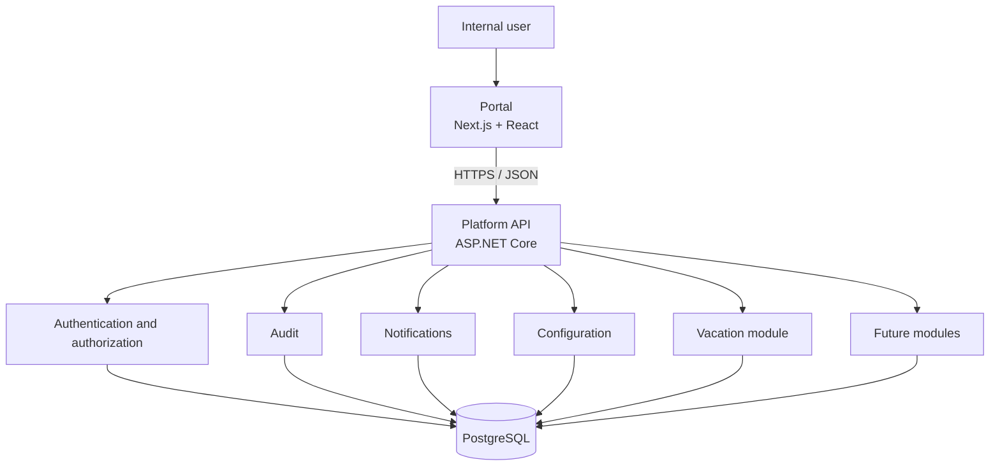
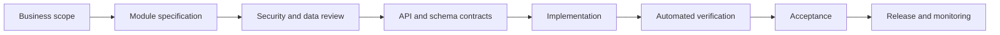

# Internal Apps Platform

## Project Instructions

| Document attribute | Value |
|---|---|
| Status | Canonical project standard |
| Classification | Internal |
| Applies to | All platform code, infrastructure, data, documentation, and delivery work |
| Technology baseline | .NET 8 LTS, ASP.NET Core, PostgreSQL, Next.js, React, TypeScript |
| Review cadence | At least quarterly and before every major architectural change |
| Owner | Platform architecture owner |

> **Normative language:** “MUST”, “MUST NOT”, “REQUIRED”, “SHALL”, “SHALL NOT”, “SHOULD”, “SHOULD NOT”, and “MAY” express requirement levels. A deviation from a MUST or MUST NOT requires a recorded Architecture Decision Record (ADR), security review when applicable, and explicit approval from the platform architecture owner.

---

## 1. Purpose and Authority

This document is the single source of truth for the **Internal Apps Platform**. It defines the rules by which the platform is designed, implemented, tested, secured, operated, and evolved. Implementation MUST conform to this document. When implementation and documentation disagree, the implementation is considered defective until either it is corrected or an approved documentation change records the new decision.

The platform digitalizes internal company processes through independently owned business modules within one shared application. The first module is Vacation Management. Expected future modules include Internal Requests, Assets, Fleet, Help Desk, Meeting Rooms, Visitors, Travel Orders, Company Documents, Expenses, and Approvals.

The platform is for internal company use. It is not a commercial product, public integration platform, or multi-tenant software-as-a-service offering. This constraint does not reduce requirements for security, accessibility, maintainability, recoverability, or auditability.

### 1.1 Precedence

Project decisions have the following precedence:

1. Applicable law, regulatory obligations, and company security policy.
2. This document and approved ADRs.
3. Approved module specifications and API contracts.
4. Repository-level standards and runbooks.
5. Implementation and tests.
6. Informal discussion, tickets, and generated suggestions.

Higher-precedence artifacts override lower-precedence artifacts. Conflicts MUST be escalated and resolved in documentation before conflicting implementation proceeds.

### 1.2 Scope

These rules apply to:

- the single web portal;
- the API;
- the PostgreSQL database;
- Docker Compose and runtime configuration;
- all shared platform capabilities;
- every current and future module;
- automated and manual tests;
- CI/CD, deployment, monitoring, and operational procedures;
- human-authored and AI-assisted changes.

### 1.3 Non-goals

The platform SHALL NOT:

- create separate administrator frontends;
- permit browser or user access directly to PostgreSQL;
- allow modules to create independent authentication systems;
- become a distributed microservice estate without an approved architectural change;
- expose database implementation details or internal identifiers as public contracts;
- optimize for hypothetical external customers at the expense of internal requirements;
- duplicate shared audit, notification, configuration, authorization, or identity capabilities.

---

## 2. Product and Engineering Principles

All decisions MUST follow these principles:

1. **One portal, one API boundary, one identity.** Users experience a coherent platform even when modules have different owners.
2. **Modular by design.** Business modules have explicit boundaries and minimal coupling.
3. **Server authority.** The API owns authorization, validation, business rules, and persisted state. The browser is never trusted.
4. **Documentation before implementation.** Contracts and consequential decisions are documented before code is changed.
5. **Secure by default.** Access is denied unless explicitly granted; sensitive data is minimized; writes are auditable.
6. **Boring technology is a feature.** Approved platform tools are preferred over novelty. New dependencies require justification and approval.
7. **Operational readiness is part of delivery.** Logging, migration, recovery, monitoring, and support are not post-release extras.
8. **Evolution without redesign.** A new module should normally be added through established extension points rather than platform-wide changes.
9. **Clarity over cleverness.** Code, schemas, contracts, and workflows must be understandable to the next maintainer.
10. **Quality is enforced.** Automated checks, review, acceptance criteria, and traceability are required, not aspirational.

---

## 3. Approved Technology Baseline

| Area | Approved technology | Rules |
|---|---|---|
| Backend | ASP.NET Core Web API on .NET 8 LTS | Minimal APIs MAY be used where they improve clarity. Business logic MUST NOT live in route handlers. |
| Data access | Dapper | SQL MUST be explicit, parameterized, reviewable, and covered by integration tests. |
| Database | PostgreSQL | PostgreSQL is the only system of record. Schema changes occur through migrations only. |
| Frontend | Next.js, React, TypeScript | TypeScript strict mode is REQUIRED. Server/client boundaries MUST be intentional. |
| Styling | Tailwind CSS | Shared design tokens and reusable components MUST be used. |
| Components | shadcn/ui | Components MAY be adapted within the shared design system; inaccessible customization is prohibited. |
| Icons | Lucide Icons | Use semantic labels where meaning is not visually obvious. |
| Data grids | TanStack Table | Sorting, filtering, and pagination semantics MUST align with API contracts. |
| Forms | React Hook Form and Zod | Client validation improves usability; equivalent server validation remains REQUIRED. |
| Calendar | FullCalendar | Date, time-zone, keyboard, and accessibility behavior MUST be specified per use case. |
| Hosting | Docker Compose | Runtime services, networks, volumes, health checks, and configuration MUST be declarative. |
| Development | Visual Studio Code and Git | Repository settings SHOULD provide consistent formatting, linting, and debugging. |

Package versions MUST be centrally controlled and kept within supported release lines. A library not listed above MAY be introduced only when:

- an existing approved capability cannot reasonably satisfy the requirement;
- licensing, maintenance health, security posture, bundle/runtime cost, and alternatives are documented;
- the architecture owner approves it;
- dependency locking and update ownership are defined.

Libraries MUST NOT be introduced merely to avoid writing small, stable platform code. Deprecated, unmaintained, copyleft-incompatible, or duplicate-purpose dependencies MUST NOT be added.

---

## 4. System Architecture

### 4.1 Logical architecture

The deployable baseline is a modular monolith: one portal, one API, and one PostgreSQL database. Logical module isolation MUST be strong even when deployment is shared. Moving a module to a separate process or service requires an ADR demonstrating operational and organizational need.

### 4.2 Layer boundaries

The API SHALL separate:

- **HTTP/presentation:** routing, transport models, authentication context, status codes, and serialization;
- **application:** use cases, transactions, orchestration, authorization decisions, and business workflows;
- **domain/module:** business rules, state transitions, policies, and module terminology;
- **infrastructure:** Dapper queries, PostgreSQL, token services, notifications, time, files, and external systems.

Route handlers MUST be thin. They MUST NOT contain SQL, multi-step business rules, or ad hoc authorization logic. Infrastructure concerns MUST be accessed through explicit interfaces where substitution is useful for testing or operation.

The portal SHALL separate:

- route and layout composition;
- feature/module components;
- shared UI components and design tokens;
- typed API access;
- form schemas and view models;
- permission-aware navigation and presentation.

Frontend code MUST NOT reproduce authoritative business rules. It MAY mirror validation for fast feedback, but server responses remain definitive.

### 4.3 Module boundaries

Each module MUST:

- own its business terminology, workflows, permission definitions, database objects, API endpoints, UI routes, tests, and documentation;
- expose behavior through documented application/API contracts;
- reference shared platform capabilities through stable abstractions;
- avoid reading or writing another module’s tables directly;
- avoid importing another module’s internal implementation;
- publish explicit in-process events or call approved application contracts when coordination is required;
- remain removable without breaking unrelated modules.

Cross-module joins require explicit documentation and architecture approval. Reporting requirements SHOULD use a documented reporting/query boundary rather than silently coupling transactional schemas.

### 4.4 Shared platform capabilities

Identity, authorization, audit, notifications, configuration, error handling, observability, and common UI infrastructure are shared. A module MUST NOT fork or locally reimplement them.

Shared code MUST represent genuinely stable, cross-cutting behavior. Similar-looking business logic from two modules is not automatically shared. Premature “common” abstractions that couple unrelated workflows SHOULD be avoided.

### 4.5 Transactions and consistency

A single application use case SHOULD complete in one database transaction when atomicity is required. Transaction boundaries belong in the application layer. Queries MUST NOT create hidden transactions.

Operations spanning modules MUST define:

- the owner of the workflow;
- atomicity requirements;
- retry and idempotency behavior;
- failure and compensation behavior;
- audit events;
- user-visible status.

Asynchronous processing MAY be introduced only with documented delivery guarantees, retry limits, dead-letter handling, observability, and idempotency. No workflow may rely on “fire and forget” execution.

---

## 5. Repository and Solution Organization

The repository SHOULD retain this top-level intent:

| Path | Responsibility |
|---|---|
| `apps/` | Portal and API application source |
| `database/` | Ordered migrations, seeds, and database tooling |
| `docker/` | Container definitions and runtime assets |
| `docs/` | Canonical project, architecture, module, and operational documentation |
| `tests/` | Cross-application, acceptance, and supporting tests where not colocated |
| `scripts/` | Repeatable development, validation, and operational scripts |
| `tools/` | Repository-owned development tooling |
| `.github/` | Pull request templates and CI/CD workflows |

New top-level directories require architecture approval. Generated output, secrets, developer-specific settings, build artifacts, and database dumps MUST NOT be committed.

Code ownership SHOULD identify reviewers for shared platform areas and each module. Cyclic project or package dependencies are prohibited. Dependency direction MUST point from delivery/infrastructure toward application contracts and domain rules, never the reverse.

---

## 6. Identity, Authentication, and Session Security

### 6.1 Authentication

All protected API operations require validated JWT authentication. The API MUST validate issuer, audience, signature, lifetime, and the expected signing algorithm. Tokens with missing, malformed, expired, or unverifiable claims MUST be rejected.

Access tokens MUST be short-lived. Refresh tokens MUST:

- be generated using a cryptographically secure random source;
- be stored only as a one-way hash at rest;
- be bound to a user/session record;
- have an absolute expiration;
- be rotated on every successful use;
- be revoked on logout, credential/security changes, account disablement, or detected reuse;
- support revocation of an individual session and all user sessions;
- record creation, use, revocation, and relevant client metadata for security investigation.

Raw refresh tokens, access tokens, passwords, secrets, and authentication headers MUST never appear in logs or audit payloads. Browser storage strategy MUST be documented and reviewed for XSS and CSRF risk. Secure, HttpOnly, SameSite cookies SHOULD be preferred when compatible with the selected authentication flow.

### 6.2 User lifecycle

Disabled, locked, or deleted users MUST immediately lose the ability to create new sessions. Existing session invalidation MUST occur within a documented bounded interval. Identity records referenced by business history MUST be retained or safely anonymized according to retention policy; historical audit integrity MUST not be destroyed.

Shared identity is the only source of platform user identity. Modules MAY maintain module-specific profiles but MUST reference the shared user identity and MUST NOT store credentials.

---

## 7. Authorization

The platform uses role-based and permission-based authorization:

- **roles** are manageable bundles of permissions;
- **permissions** are stable, granular capabilities enforced by the API;
- **resource rules** determine whether a permitted user may act on a specific record;
- **administration** is a permission set within the same portal, never a separate application.

Permission names MUST use a stable namespaced form such as `vacation.requests.read` or `assets.items.manage`. Permissions SHOULD describe capability, not UI location. Renaming or removing a permission is a compatibility and migration event.

Every protected endpoint MUST declare and enforce its required permission. Record-level checks MUST additionally enforce ownership, department, delegated authority, workflow state, or other scope rules. Possessing a broad role does not bypass resource rules unless an explicit permission grants that behavior.

Authorization rules:

- deny by default;
- evaluate on every request;
- never trust roles, permissions, owner IDs, prices, approval states, or similar authority supplied by the client;
- prevent insecure direct object reference through permission and resource checks;
- keep privileged operations separately permissioned;
- audit changes to roles, permissions, assignments, delegations, and privileged configuration;
- test both allowed and denied paths.

The portal MAY hide or disable controls based on permissions to improve usability. This is not a security control. The API decision always wins, and the portal MUST handle `401` and `403` responses correctly.

---

## 8. Security Engineering Standard

### 8.1 Trust boundaries and input

All input is untrusted, including URL values, headers, JWT claims not issued by the trusted authority, JSON, uploaded files, database content displayed in a browser, configuration, and external service responses.

The API MUST:

- validate structure, type, length, range, format, allowed values, and cross-field rules;
- reject unknown or forbidden fields where mass assignment could occur;
- normalize only when normalization is explicitly defined;
- use parameterized SQL exclusively;
- encode output for its destination context;
- apply upload size, content-type, extension, storage, malware-scanning, and retrieval controls where files are supported;
- limit request and collection sizes;
- produce safe client errors without stack traces or sensitive internals.

### 8.2 Identifiers

Database primary keys are internal implementation details. APIs MUST expose non-sequential opaque public identifiers, such as UUIDs generated according to the approved database standard. Internal numeric keys, sequence values, row locations, or identifiers that reveal volume MUST NOT be exposed.

Opaque identifiers do not replace authorization. Every resource lookup MUST still verify access.

### 8.3 Secrets and configuration

Secrets MUST be supplied through an approved secret mechanism or environment injection and MUST NOT be committed, baked into images, placed in frontend bundles, or copied into documentation. `.env.example` may contain names and safe placeholders only.

Startup MUST fail clearly when required secure configuration is absent or invalid. Production security controls MUST NOT silently downgrade. Key and secret rotation procedures MUST exist before production launch.

### 8.4 Web security

Production traffic MUST use TLS. The portal and API MUST define restrictive CORS, Content Security Policy, frame protection, MIME-sniffing protection, referrer policy, and secure cookie settings. State-changing cookie-authenticated requests MUST have CSRF protection.

User-provided rich text or HTML is prohibited unless a documented requirement exists and an approved sanitizer is applied. Dangerous rendering APIs require security review.

### 8.5 Abuse resistance

Authentication, token refresh, search, export, uploads, and other costly or sensitive endpoints MUST have appropriate rate and resource limits. Repeated authorization failures, token reuse, suspicious login behavior, and administrative security changes MUST generate security events.

### 8.6 Security review

Threat modeling is REQUIRED for authentication changes, authorization models, file handling, personally sensitive data, external integrations, privileged administration, and materially new trust boundaries. Critical and high severity findings block release unless an accountable security authority records a time-bounded exception.

---

## 9. Database Standard

### 9.1 Ownership and access

PostgreSQL is the sole transactional system of record. Only the API and approved migration/operational identities may access it. Human users and browser clients MUST NOT connect directly.

Runtime database credentials MUST use least privilege and MUST NOT own the database. Migration credentials SHOULD be separate from runtime credentials. Production data access by personnel MUST follow approved, auditable operational procedures.

### 9.2 Migrations

All schema and reference-data changes MUST be delivered as ordered, immutable migrations committed to Git. Manual schema changes are prohibited.

A migration MUST:

- have a unique ordered identifier and descriptive name;
- be deterministic and safe for its target environment;
- state compatibility and deployment-order assumptions;
- preserve data or provide an approved transformation;
- be tested from a clean database and from the previous supported schema;
- avoid long blocking operations or document a maintenance plan;
- include rollback or forward-recovery instructions.

Applied migrations MUST NOT be edited. Corrections require a new migration. Destructive migrations require backup verification, impact analysis, explicit approval, and a staged expand/migrate/contract approach when zero-downtime compatibility is needed.

### 9.3 Naming

Database names MUST use lowercase `snake_case`.

| Object | Convention | Example |
|---|---|---|
| Schema | module or platform capability | `vacation`, `identity`, `audit` |
| Table | plural noun | `vacation_requests` |
| Column | descriptive noun | `requested_by_user_id` |
| Primary key | `id` internally | `id` |
| Public identifier | `public_id` | `public_id` |
| Foreign key | singular target plus `_id` | `employee_id` |
| Timestamp | action plus `_at` | `approved_at` |
| Boolean | positive predicate | `is_active` |
| Index | `ix_<table>_<columns>` | `ix_vacation_requests_status` |
| Unique constraint | `uq_<table>_<columns>` | `uq_users_email` |
| Foreign key | `fk_<from>_<to>` | `fk_requests_users` |
| Check constraint | `ck_<table>_<rule>` | `ck_requests_date_range` |

Reserved words, unexplained abbreviations, quoted mixed-case identifiers, and generic names such as `data`, `value`, or `type` SHOULD be avoided.

### 9.4 Data types and integrity

- Use `timestamptz` for instants and store them in UTC.
- Use `date` for business dates without a time.
- Use explicit time-zone identifiers where local scheduling semantics matter.
- Use `numeric` with documented precision for money; never floating point.
- Store currency explicitly when more than one currency can occur.
- Prefer constrained text or reference tables over database enums when values must evolve operationally.
- Use `jsonb` only for genuinely variable data, not to avoid relational design.
- Define `NOT NULL` whenever absence is not meaningful.
- Enforce referential integrity with foreign keys.
- Enforce invariant ranges and states with check constraints where practical.
- Add unique constraints for business uniqueness, not application-only checks.

Every table MUST have a primary key. Business data exposed externally MUST have a unique opaque `public_id`. Foreign-key delete behavior MUST be explicit; cascading deletion of business or audit history is normally prohibited.

### 9.5 Indexes and queries

Indexes MUST be driven by demonstrated query patterns. Foreign keys used in joins and common filters SHOULD be indexed. Composite index column order MUST match filter and sort behavior. Every index adds write and storage cost and requires a documented purpose.

Before release, list endpoints and high-volume workflows MUST be assessed using realistic data volumes and query plans. Unbounded queries and `SELECT *` are prohibited. Dapper SQL MUST list required columns and map them explicitly.

### 9.6 Audit columns, concurrency, and soft deletion

Mutable business tables SHOULD include `created_at`, `created_by_user_id`, `updated_at`, and `updated_by_user_id`. A concurrency token or version column MUST be used where concurrent edits could overwrite one another. The API MUST surface conflicts rather than silently applying last-write-wins.

Soft delete is appropriate when records must remain recoverable, referenced, or auditable. A soft-deletable table SHOULD include `deleted_at` and `deleted_by_user_id`. Soft-deleted rows MUST be excluded by default and uniquely constrained with the intended active-row semantics. Soft deletion MUST NOT be used as a substitute for retention or anonymization policies.

### 9.7 Seeds, backups, and retention

Seeds MUST be deterministic and idempotent. Development/demo data MUST be clearly separated from production reference data. Production personally identifiable or confidential data MUST NOT be copied to lower environments without approved masking.

Backup frequency, retention, encryption, restore ownership, recovery point objective, and recovery time objective MUST be documented before production. Restore tests MUST occur periodically; the existence of a backup file is not proof of recoverability.

---

## 10. API Standard

### 10.1 Contract and versioning

The API uses REST-oriented HTTPS JSON contracts. Routes MUST be nouns, plural where representing collections, and scoped under `/api/v1`. Actions that do not map cleanly to CRUD MAY use explicit subordinate action routes when they represent a business command.

Examples of route shape:

- `GET /api/v1/vacation/requests`
- `POST /api/v1/vacation/requests`
- `GET /api/v1/vacation/requests/{publicId}`
- `POST /api/v1/vacation/requests/{publicId}/approve`

API contracts MUST be documented in OpenAPI and reviewed before implementation. Breaking changes require a new major API version and a deprecation/migration plan. Additive optional fields are normally non-breaking. Changing meaning, requiredness, type, authorization, or error behavior can be breaking even if JSON shape remains valid.

### 10.2 Request and response rules

Transport DTOs MUST be separate from database records. Clients MUST NOT set server-owned fields such as IDs, audit metadata, approval status, permission scope, calculated totals, or ownership unless the contract explicitly allows it.

Success responses SHOULD return the resource or a purpose-specific result directly. A mandatory generic success envelope is prohibited because it adds noise. Collection responses MUST use the standard pagination shape. Errors MUST use RFC 7807 Problem Details with stable extension fields.

Problem responses MUST include:

- `type`: stable documentation URI or stable problem identifier;
- `title`: safe summary;
- `status`: HTTP status;
- `detail`: safe, actionable explanation where appropriate;
- `instance`: request-specific path or correlation reference;
- `code`: stable machine-readable application code;
- `traceId`: correlation identifier;
- `errors`: field-level validation details when applicable.

Internal exceptions, SQL, stack traces, secret values, and sensitive existence details MUST NOT be returned.

### 10.3 HTTP semantics

| Status | Required use |
|---|---|
| `200 OK` | Successful read, update, command, or result with content |
| `201 Created` | Resource created; include a `Location` header |
| `204 No Content` | Successful operation with no response body |
| `400 Bad Request` | Malformed request or general request validation failure |
| `401 Unauthorized` | Missing, invalid, or expired authentication |
| `403 Forbidden` | Authenticated but not permitted |
| `404 Not Found` | Resource absent or intentionally concealed |
| `409 Conflict` | State transition, uniqueness, or concurrency conflict |
| `422 Unprocessable Content` | Well-formed request violating documented business validation when distinguished from `400` |
| `429 Too Many Requests` | Rate limit exceeded |
| `500 Internal Server Error` | Unexpected server failure with safe Problem Details |
| `503 Service Unavailable` | Temporary dependency or readiness failure |

`POST` creates resources or invokes non-idempotent commands. `PUT` replaces a complete resource where supported. `PATCH` performs documented partial updates. `DELETE` deletes or soft-deletes according to documented policy. Safe and idempotent HTTP semantics MUST be preserved.

### 10.4 Validation

Validation occurs at three levels:

1. transport validation: JSON shape, required fields, length, format;
2. business validation: workflow state, dates, balances, policies, cross-field rules;
3. persistence validation: constraints, uniqueness, references, concurrency.

Validation failures MUST be deterministic and use stable error codes. The API MUST not rely on frontend Zod schemas or database exceptions as its normal validation mechanism.

### 10.5 Pagination, filtering, and sorting

All potentially large collections MUST be paginated. Offset pagination MAY be used for bounded administrative lists; cursor pagination SHOULD be used for high-volume or frequently changing datasets.

Standard query parameters are:

- `page` and `pageSize` for offset pagination;
- `cursor` and `limit` for cursor pagination;
- `sort` with documented allowlisted field names and `-` for descending order;
- explicit, documented filter parameters.

Page size MUST have a conservative default and enforced maximum. Arbitrary SQL field names, operators, or expressions MUST NOT be accepted. Collection metadata MUST include enough information for navigation without requiring expensive totals unless totals are a real requirement.

### 10.6 Idempotency and concurrency

Endpoints susceptible to retry-created duplicates, including financially or operationally consequential commands, MUST support an idempotency strategy. Idempotency keys MUST be scoped, expire according to policy, and return consistent outcomes.

Updates to concurrently editable resources MUST accept and validate a version or ETag. Stale writes return `409` or `412` according to the documented contract.

### 10.7 Date, time, and localization

API instants MUST use ISO 8601 with UTC offset (`Z`). Date-only values MUST use `YYYY-MM-DD`. The API MUST not infer business time zones from server local time. User-facing formatting and language belong to the portal; persisted business semantics must remain unambiguous.

---

## 11. Frontend and User Experience Standard

### 11.1 Portal architecture

There is exactly one portal. Module routes and administrative experiences live within it and use the same navigation, identity, authorization context, design system, and deployment.

Server Components and Client Components MUST be chosen intentionally. Interactive state, browser APIs, and client hooks belong in client boundaries; data and secrets that do not need the browser SHOULD remain server-side. No server secret may be included in a client bundle.

API access MUST pass through a shared typed client that handles base URL, authentication/session behavior, Problem Details, correlation IDs, cancellation, and consistent parsing. Components MUST NOT scatter raw fetch logic and endpoint strings.

### 11.2 Design system

The application is a modern, desktop-first business tool that remains usable on tablets and mobile screens. Shared tokens MUST define colors, typography, spacing, radii, shadows, focus rings, and breakpoints.

Rules:

- use Tailwind utilities and approved shared variants;
- use shadcn/ui primitives before creating parallel primitives;
- use Lucide icons consistently and at standardized sizes;
- pair icon-only controls with accessible names and tooltips where useful;
- preserve clear visual hierarchy and predictable placement of primary actions;
- avoid one-off colors, arbitrary spacing, and module-specific typography;
- support dark mode through semantic tokens, not duplicated hard-coded palettes;
- represent loading, empty, error, success, disabled, and permission-denied states deliberately.

### 11.3 Accessibility

The target is WCAG 2.2 AA. New features MUST support:

- complete keyboard operation;
- visible focus;
- semantic HTML and logical heading order;
- programmatic labels, descriptions, errors, and status announcements;
- sufficient color contrast in light and dark modes;
- zoom and reflow without loss of essential function;
- reduced-motion preferences;
- non-color indicators for state;
- accessible dialogs, menus, tables, calendars, and notifications.

Automated accessibility testing is REQUIRED, but does not replace keyboard and screen-reader-oriented manual checks.

### 11.4 Forms

React Hook Form and Zod are the standard frontend form stack. Forms MUST:

- provide visible labels and clear required/optional status;
- validate on a user-friendly schedule;
- display field and form-level server errors;
- preserve user input after recoverable failures;
- prevent accidental duplicate submission;
- show submission progress;
- warn before discarding meaningful unsaved changes where appropriate;
- focus or summarize errors accessibly;
- never treat client validation as authorization or final business validation.

### 11.5 Tables and collections

TanStack Table is the standard for complex data tables. Tables MUST define:

- server- or client-side ownership of sorting, filtering, and pagination;
- stable column identifiers;
- accessible headers and sort state;
- empty, loading, and error states;
- responsive behavior for narrow screens;
- permission-controlled row actions;
- safe export limits when export exists.

Large datasets MUST use server-side operations. The UI MUST not fetch an unbounded dataset for local sorting or filtering.

### 11.6 Calendars

FullCalendar is used for calendar workflows. Calendar features MUST specify time zone, locale, week start, all-day semantics, overlap behavior, and daylight-saving behavior. Every calendar MUST have an accessible list or agenda alternative when the graphical view cannot expose equivalent information.

### 11.7 Error and permission experience

The portal MUST distinguish authentication expiration, access denial, not found, validation errors, conflicts, transient failures, and unexpected failures. It MUST provide a safe retry where appropriate and surface the trace ID for supportable server failures.

Controls unavailable because of permission SHOULD normally be hidden; disabled controls MAY be used when explaining how access is obtained benefits the user. Sensitive resource existence MUST not leak through navigation or error differences.

---

## 12. Shared Audit System

Every create, update, delete, restore, state transition, approval, rejection, role change, permission change, delegation, security-sensitive configuration change, and other consequential write MUST produce an audit event.

An audit event MUST record:

- event ID and UTC timestamp;
- actor user public identifier or system actor;
- action and module;
- target type and opaque target identifier;
- outcome;
- safe before/after changes or a structured change summary;
- request trace ID;
- source context appropriate to policy;
- reason/comment when the workflow requires one.

Audit records MUST be append-only to normal application identities. They MUST NOT contain passwords, tokens, secrets, full authentication headers, or unnecessary sensitive payloads. Sensitive field values SHOULD be redacted or represented as “changed.”

Audit creation and the business write SHOULD be committed atomically. If an operation is required to be audited and audit persistence fails, the operation MUST fail unless an approved resilience design provides equivalent guaranteed delivery.

Audit access requires dedicated permissions and is itself audited. Retention, export, legal hold, and access procedures MUST follow company policy.

---

## 13. Notifications

Notifications are a shared capability. Modules request notifications through documented templates and events; they MUST NOT embed channel-specific delivery logic throughout business code.

Each notification type MUST define:

- triggering business event;
- recipients and authorization/privacy rules;
- template owner and supported variables;
- channels;
- retry and failure behavior;
- deduplication/idempotency behavior;
- user preference behavior;
- link destination and expiration assumptions;
- whether delivery is informational or operationally required.

Notifications MUST not be the sole record of a business action. Sensitive content in subject lines, push previews, or email bodies MUST be minimized. Links MUST route users through authenticated, authorized portal pages.

Delivery attempts, outcomes, and retry state MUST be observable. Template changes MUST be reviewed like user-facing product changes.

---

## 14. Configuration and Feature Control

Configuration is shared, typed, validated, and environment-specific. Precedence MUST be documented. Invalid required configuration MUST fail startup or readiness checks with a clear operator-facing message.

Configuration values MUST NOT be used to bypass authorization or hide insecure defaults. Sensitive values are secrets and follow secret-management rules.

Feature flags MAY support controlled rollout or operational disablement. Every flag MUST have:

- an owner;
- a purpose;
- a safe default;
- intended scope;
- creation and planned removal date;
- test coverage for relevant states.

Long-lived flags that define business policy SHOULD become explicit configuration or domain data. Expired flags MUST be removed.

---

## 15. Logging, Observability, and Operations

### 15.1 Application logs

Application logs MUST be structured and machine-queryable. Each request SHOULD carry a trace/correlation ID across portal, API, database diagnostics, and notification processing.

Logs SHOULD include timestamp, severity, service, environment, module, event name, trace ID, and safe operational context. Logs MUST NOT include secrets, tokens, passwords, raw sensitive documents, or unnecessary personal data.

Exceptions MUST be logged once at the boundary that handles them. Expected validation and authorization outcomes SHOULD not flood error logs.

### 15.2 Log categories

| Category | Purpose | Examples |
|---|---|---|
| Application | Runtime behavior and failures | request failure, worker retry |
| Audit | Who changed business/security state | approval, role assignment |
| Security | Suspicious or security-relevant activity | token reuse, repeated denial |
| Performance | Latency and resource diagnosis | slow endpoint, slow query |

Audit logs are not substitutes for diagnostic logs, and diagnostic logs are not an audit trail.

### 15.3 Metrics and traces

The platform MUST measure request rate, error rate, latency percentiles, authentication failures, authorization denials, database connection health, slow queries, notification failures, background job backlog where applicable, and resource saturation.

Distributed tracing SHOULD cover HTTP and database activity without recording sensitive payloads. Alerts MUST be actionable, severity-classified, owned, and linked to a runbook.

### 15.4 Health checks

The API MUST expose distinct liveness and readiness signals. Liveness indicates the process can continue; readiness indicates it can safely receive traffic. Readiness MAY include critical dependency checks but MUST avoid creating dependency load.

Health endpoints MUST reveal minimal information publicly. Detailed health data requires operational authorization.

### 15.5 Operational readiness

Before production, the project MUST have:

- deployment and rollback procedures;
- backup and restore procedures;
- incident ownership and escalation;
- key/secret rotation procedures;
- migration failure recovery;
- monitoring dashboards and actionable alerts;
- capacity assumptions;
- data retention procedures;
- a support method using trace IDs and audit history.

---

## 16. Testing and Quality Strategy

Testing follows risk and business impact. A feature is incomplete until its required automated and manual evidence exists.

### 16.1 Backend tests

Backend coverage MUST include:

- unit tests for business rules, policies, and state transitions;
- integration tests against real PostgreSQL behavior for Dapper queries, constraints, transactions, and migrations;
- API contract tests for serialization, validation, Problem Details, status codes, pagination, and versioning;
- authorization tests for unauthenticated, unauthorized, permitted, and resource-scoped cases;
- concurrency, idempotency, and audit atomicity tests where applicable;
- security regression tests for previously fixed vulnerabilities.

Database behavior SHOULD NOT be validated solely with an in-memory substitute.

### 16.2 Frontend tests

Frontend coverage MUST include:

- unit tests for deterministic presentation and validation logic;
- component tests for forms, tables, permissions, loading, empty, and error states;
- integration tests for typed API behavior and session handling;
- end-to-end tests for critical user journeys;
- automated accessibility checks plus targeted manual accessibility review.

Tests SHOULD query elements by role, label, and user-visible meaning rather than fragile implementation details.

### 16.3 Manual and acceptance testing

Every feature MUST have testable acceptance criteria derived from its specification. Manual testing MUST cover:

- primary and alternate workflows;
- denied and invalid actions;
- supported browsers and responsive behavior;
- keyboard navigation and focus;
- light and dark modes where UI changes;
- realistic roles and data volumes;
- recoverable failures and concurrency conflicts.

Business acceptance is performed by an authorized product/process representative. Acceptance evidence MUST reference the requirement or issue and tested build.

### 16.4 Regression and release gates

CI MUST run formatting, static analysis, type checking, linting, unit tests, integration tests, migration checks, build verification, dependency/security scanning, and applicable end-to-end tests.

A release is blocked by:

- failing required checks;
- unreviewed schema changes;
- undocumented API or architecture changes;
- critical/high unresolved security defects without approved exception;
- missing acceptance for changed critical workflows;
- inability to deploy or recover migrations safely.

Flaky tests are defects. They MUST be fixed or quarantined with an owner, issue, and short expiration; silently retrying indefinitely is prohibited.

---

## 17. Module Development Standard

Every module MUST have a canonical document under `docs/modules/`. The document is approved before substantial implementation and updated in the same pull request as behavior changes.

### 17.1 Required module specification

| Section | Required content |
|---|---|
| Purpose | Business problem, users, value, scope, and non-goals |
| Terminology | Unambiguous domain terms and definitions |
| Roles and permissions | Permission catalog, role mappings, resource rules, separation of duties |
| Workflows | States, transitions, actors, guards, side effects, cancellation and failure behavior |
| Data classification | Personal, confidential, retention, masking, and export requirements |
| Database | Owned schemas/tables, relationships, constraints, indexes, public IDs, migrations |
| API | Endpoints, DTOs, validation, errors, pagination, idempotency, versioning |
| Frontend | Routes, navigation, screens, forms, tables, responsive and accessibility behavior |
| Audit | Events, actors, targets, safe change details |
| Notifications | Triggers, recipients, templates, channels, retries |
| Configuration | Typed settings, defaults, ownership, feature flags |
| Tests | Unit, integration, contract, UI, security, acceptance, regression |
| Operations | Metrics, alerts, support, migration, recovery, capacity assumptions |
| Future improvements | Explicitly deferred work; never implicit unfinished scope |

### 17.2 Module onboarding sequence

Implementation MAY begin incrementally once the relevant specification sections are approved. Undocumented architectural invention during implementation is prohibited.

### 17.3 Vacation Management baseline

Vacation Management is the first module and MUST establish reusable patterns without embedding vacation-specific behavior in shared platform code. Its documentation MUST explicitly define leave types, entitlement/balance ownership, date and partial-day semantics, holidays, overlaps, approval chains, delegation, cancellation, adjustments, visibility, notifications, and audit history before those behaviors are implemented.

Patterns extracted from this module become shared only after a second concrete use case demonstrates that the abstraction is stable and domain-neutral.

---

## 18. Documentation and Decision Governance

Documentation is versioned with code and reviewed with the same rigor.

Required artifacts include:

- this project standard;
- architecture, security, database, API, and UI standards;
- one specification per module;
- ADRs for consequential decisions;
- OpenAPI contracts;
- operational runbooks;
- roadmap and changelog;
- setup and contribution instructions.

### 18.1 Architecture Decision Records

An ADR is REQUIRED when a decision:

- changes system boundaries or dependency direction;
- introduces a library, service, protocol, or persistence pattern;
- changes authentication, authorization, encryption, or sensitive-data handling;
- changes API versioning or compatibility policy;
- creates cross-module coupling;
- accepts a significant tradeoff or exception;
- is costly to reverse.

Each ADR MUST contain status, date, context, decision, alternatives, consequences, security/operational impact, and owners. Superseded ADRs remain in history and link to their replacement.

### 18.2 Change discipline

Documentation changes MUST be included in the same pull request as the behavior they govern. Reviewers MUST reject implementation that creates undocumented contracts or contradicts approved standards.

Examples, diagrams, and tables are normative only when the surrounding text says so; otherwise they clarify the rule. Links MUST be repository-relative and periodically checked. Stale TODOs without an owner and issue are prohibited.

---

## 19. AI-Assisted Development Workflow

AI assistance accelerates work but does not own accountability. All AI output is untrusted until reviewed and validated.

### 19.1 Responsibilities

| Participant | Primary responsibilities |
|---|---|
| ChatGPT | Architecture, design, database design, API contracts, security analysis, documentation, and code review |
| Codex | Implementation, refactoring, and tests within approved documentation and scope |
| Developer | Requirements confirmation, testing, validation, Git operations, deployment, approvals, and final accountability |

These assignments describe collaboration, not authority. The developer and designated project owners remain accountable for accepted changes.

### 19.2 Mandatory rules for AI work

AI tools MUST:

- read applicable project and module documentation before proposing changes;
- remain within the explicit task scope;
- state assumptions when requirements are incomplete;
- preserve existing user changes and avoid destructive operations;
- implement documented architecture rather than inventing a new one;
- avoid introducing libraries without approval;
- avoid schema changes unless required by approved documentation;
- add or update tests and documentation with behavior changes;
- report validation performed and unresolved risks;
- never expose repository secrets, production data, credentials, or confidential content to unapproved services.

AI tools MUST NOT:

- approve their own architecture exceptions;
- bypass tests, authorization, migrations, or review to make a change pass;
- fabricate test results, command output, citations, or completion;
- silently broaden scope;
- replace human acceptance or security accountability.

### 19.3 Required task handoff

An implementation request SHOULD identify the governing documentation, acceptance criteria, files/modules in scope, prohibited changes, and required checks. Codex MUST stop and request direction when completion requires a materially different architecture, new dependency, destructive migration, or external authority.

AI-generated code receives the same review, scanning, testing, and ownership requirements as human-authored code.

---

## 20. Git and Pull Request Workflow

All work occurs on feature branches. Direct commits to protected branches are prohibited.

Branch names SHOULD be short and traceable, for example:

- `feat/vacation-approval`
- `fix/refresh-token-reuse`
- `docs/api-pagination`
- `chore/update-dotnet`

Commits MUST follow Conventional Commits:

`<type>(<optional-scope>): <imperative summary>`

Approved common types are `feat`, `fix`, `docs`, `test`, `refactor`, `perf`, `build`, `ci`, `chore`, and `revert`.

Commits MUST be small, atomic, buildable where practical, and free of unrelated formatting or generated noise. Commit messages explain intent; issue references do not replace useful summaries.

### 20.1 Pull requests

Every change to a protected branch requires a pull request with:

- problem and intended outcome;
- scope and explicit non-scope;
- linked requirement, issue, module specification, and ADR where applicable;
- security and data impact;
- schema/migration and deployment impact;
- API compatibility impact;
- screenshots or recordings for meaningful UI changes;
- tests performed and acceptance evidence;
- rollback or forward-recovery notes;
- known limitations and follow-up issues.

At least one qualified reviewer is REQUIRED. Changes to authentication, authorization, shared architecture, database foundations, or sensitive data require an appropriate owner review. Authors MUST resolve comments transparently; approval MUST be renewed after material changes.

Secrets, unexplained binaries, disabled checks, temporary debug paths, and commented-out production code block merge.

---

## 21. Delivery, Environments, and Docker

Development and deployment topology is declared through Docker Compose. Images MUST be reproducible, minimally privileged, and based on supported pinned versions. Containers MUST run as non-root where feasible, expose only required ports, define health checks, and use persistent volumes only for state that requires them.

Environment names and promotion flow MUST be documented. The same built artifact SHOULD be promoted across environments with environment-specific configuration injected at runtime.

Deployment order MUST account for schema compatibility:

1. verify backup/recovery readiness;
2. apply backward-compatible expansion migrations;
3. deploy compatible API and portal;
4. perform controlled data migration if needed;
5. verify health, metrics, logs, and critical journeys;
6. remove obsolete structures only in a later approved contraction.

Production deployments require a traceable version, approved change, migration plan, verification checklist, and recovery path. Rollback MUST never assume a destructive database migration can simply be reversed.

---

## 22. Performance and Scalability

The architecture MUST support dozens of modules without fundamental redesign. This means preserving module boundaries, shared capability contracts, predictable navigation, permission namespaces, database schema ownership, and operational visibility.

Performance targets MUST be defined per critical workflow before optimization. Measurement uses realistic data, network conditions, and concurrency. Performance work MUST preserve correctness and authorization.

Baseline rules:

- paginate all unbounded collections;
- avoid N+1 API and database access;
- select only required columns;
- limit payload and upload sizes;
- cancel abandoned requests where supported;
- use caching only with explicit ownership, invalidation, authorization isolation, and staleness policy;
- move expensive work off the request path only through a reliable, observable processing design;
- load portal features by route/module where beneficial;
- monitor bundle size and API/database latency trends.

Scaling the modular monolith vertically or horizontally is preferred before service extraction. A module MAY become a separate service only when measured scaling, isolation, release cadence, or ownership needs justify the operational complexity. The extraction requires an ADR covering data ownership, consistency, security, deployment, observability, and failure modes.

---

## 23. Data Protection and Lifecycle

Every module MUST classify the data it owns and document collection purpose, authorized users, retention, deletion/anonymization, export, and lower-environment handling.

The platform MUST practice data minimization. Data SHALL be collected only when required for a documented business purpose. Sensitive fields MUST have purpose-based access controls and SHOULD be excluded from general list endpoints.

Exports require explicit permission, bounded scope, audit, safe file handling, and expiry where stored temporarily. Bulk access and reports MUST not bypass row-level authorization.

Retention jobs MUST be deterministic, observable, auditable, and tested. Legal or business holds override normal deletion according to company policy. Soft-deleted data remains protected and retained data remains subject to access control.

---

## 24. Definition of Ready and Definition of Done

### 24.1 Definition of Ready

Work is ready for implementation when:

- the business outcome, scope, and acceptance criteria are clear;
- the governing module documentation exists;
- UI behavior and API/data contracts are defined to the required depth;
- permissions, validation, audit, and data classification are specified;
- dependencies and architectural decisions are approved;
- migration and compatibility impacts are understood;
- open questions do not materially change implementation.

### 24.2 Definition of Done

Work is done only when:

- implementation conforms to approved documentation;
- backend and frontend authorization are correctly applied;
- inputs and business rules are validated server-side;
- required writes are audited;
- migrations are reviewed and tested;
- automated tests cover success, failure, and denied paths;
- accessibility and responsive behavior are verified;
- logs, metrics, errors, and supportability are adequate;
- API/OpenAPI and module documentation are updated;
- CI passes without unjustified exclusions;
- security and dependency findings are resolved or formally accepted;
- acceptance criteria are validated;
- deployment and recovery implications are documented;
- no unowned TODOs, temporary bypasses, or known silent failures remain.

---

## 25. Exceptions, Compliance, and Maintenance

Exceptions are rare, explicit, and time-bounded. An exception request MUST document:

- the exact rule being waived;
- business and technical justification;
- alternatives considered;
- security, data, operational, and maintenance risk;
- compensating controls;
- accountable owner;
- expiration date and remediation plan.

Approval must come from the architecture owner and, for security or data rules, the responsible security/data authority. An expired exception blocks affected releases until renewed or remediated.

This document MUST be reviewed at least quarterly, after significant incidents, before major platform expansion, and when a technology baseline approaches end of support. Reviews MUST verify that rules still match operational reality without silently lowering standards.

Changes to this document require a pull request, impact assessment, and appropriate owner approval. Material changes MUST be recorded in the changelog and may require an ADR. Module teams are responsible for tracking and adopting approved changes.

---

## 26. Final Authority

No ticket, deadline, prototype, AI suggestion, local convention, or convenience overrides this standard. When a rule prevents a legitimate requirement, the correct response is to document and approve an intentional change—not to create an undocumented exception in implementation.

The Internal Apps Platform succeeds when modules can be added confidently, users receive a coherent and accessible experience, business actions are secure and traceable, and maintainers can understand why the system works as it does. Every contribution SHALL preserve those properties.
