# Internal Apps Platform — Architecture

| Attribute | Value |
|---|---|
| Status | Canonical architecture reference |
| Scope | Portal, API, Core Platform, business modules, PostgreSQL, and supporting processes |
| Governing document | [`../PROJECT_INSTRUCTIONS.md`](../PROJECT_INSTRUCTIONS.md) |
| Canonical structural guide | [`PLATFORM_ARCHITECTURE.md`](PLATFORM_ARCHITECTURE.md) |
| Architecture style | Modular monolith |
| Deployment units | One Next.js Portal, one ASP.NET Core API, one PostgreSQL database |
| Initial business module | Vacation Management |

> This document describes **how** the Internal Apps Platform is structured and how its parts collaborate. [`PROJECT_INSTRUCTIONS.md`](../PROJECT_INSTRUCTIONS.md) remains the governing source for project-wide policy, security, delivery, database, API, UI, testing, and documentation requirements. If the documents conflict, `PROJECT_INSTRUCTIONS.md` takes precedence.

---

## 1. Architecture Overview

The Internal Apps Platform is a modular monolith with three primary runtime components:

1. **Portal** — the single Next.js and React user interface.
2. **API** — the single ASP.NET Core HTTP boundary and application host.
3. **PostgreSQL** — the single transactional database, divided into schemas owned by Core Platform capabilities and business modules.

Inside the API process, **Core Platform services** provide shared technical and cross-cutting capabilities. **Business modules** implement business workflows and use those services through stable interfaces. The Portal follows the same division: one application shell and shared UI infrastructure host feature-specific module routes and components.

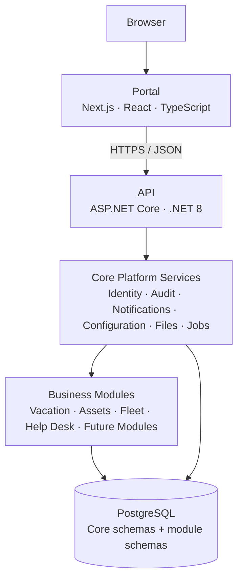

The vertical order illustrates request flow and capability use, not source-code dependency in every case. Modules call Core service contracts; Core does not call module business logic except through explicit extension registrations or events. Both Core and modules persist through infrastructure adapters into PostgreSQL.

### 1.1 Runtime topology

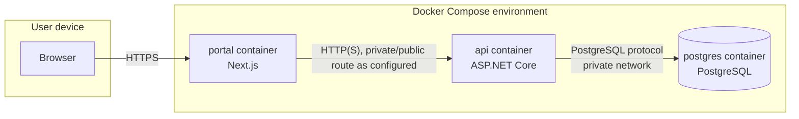

The browser never connects to PostgreSQL. The Portal communicates only with the API for platform data and commands. The API is the authentication, authorization, validation, transaction, and audit boundary.

Docker Compose describes the development and initial hosting topology. Additional infrastructure may be represented later only after its use is approved and documented; this architecture does not assume an undeclared message broker, cache, search engine, object store, or orchestration platform.

### 1.2 Structural decomposition

| Area | Structural unit | Owns |
|---|---|---|
| Portal | Application shell | Root layout, global navigation, session context, themes, error boundaries |
| Portal | Feature module | Routes, screens, forms, tables, module UI behavior |
| Portal | Shared UI | Design-system components, hooks, typed API access, common types |
| API | Presentation | Endpoints, request/response DTOs, HTTP mapping |
| API | Application | Use cases, orchestration, transaction boundaries |
| API | Domain | Business state, rules, policies, transitions |
| API | Infrastructure | Dapper repositories, PostgreSQL, providers and adapters |
| API | Core Platform | Shared capability contracts and implementations |
| Database | Core schema | Shared identity, audit, notifications, configuration, jobs and related data |
| Database | Module schema | Data exclusively owned by one business module |

### 1.3 Architectural boundaries

The following are hard boundaries:

- The Portal cannot access the database.
- HTTP endpoints cannot execute SQL directly.
- Business modules cannot read or write another module’s tables.
- Core Platform cannot contain vacation, asset, fleet, help-desk, or other module rules.
- Frontend visibility is not authorization; the API makes the authoritative decision.
- A module cannot create a parallel authentication, audit, notification, attachment, or scheduling subsystem.
- Adding a module does not create a new deployable Portal or API.

---

## 2. Repository Structure

### 2.1 Current physical structure

The repository currently contains the following scaffold. Empty directories are intentional placeholders for the architecture described later in this document.

```text
internal-apps/
├── .devcontainer/
├── .github/
├── .vscode/
├── apps/
│   ├── api/
│   └── portal/
├── database/
│   ├── migrations/
│   ├── schema/
│   ├── scripts/
│   └── seed/
├── docker/
├── docs/
│   ├── adr/
│   ├── architecture/
│   │   ├── API_GUIDELINES.md
│   │   ├── ARCHITECTURE.md
│   │   ├── DATABASE.md
│   │   └── SECURITY.md
│   ├── decisions/
│   ├── modules/
│   │   └── vacation.md
│   ├── standards/
│   │   ├── CODING_STANDARDS.md
│   │   └── UI_GUIDELINES.md
│   ├── templates/
│   ├── CHANGELOG.md
│   ├── PROJECT_INSTRUCTIONS.md
│   └── ROADMAP.md
├── scripts/
├── tests/
│   ├── api/
│   └── portal/
├── tools/
├── .editorconfig
├── .env.example
├── .gitattributes
├── .gitignore
├── docker-compose.yml
├── LICENSE
└── README.md
```

### 2.2 Top-level responsibilities

| Path | Purpose |
|---|---|
| `.devcontainer/` | Reproducible Visual Studio Code development-container configuration. |
| `.github/` | Pull request templates, ownership rules, and CI/CD workflows. |
| `.vscode/` | Shared editor settings, recommended extensions, launch profiles, and tasks. |
| `apps/api/` | ASP.NET Core API host, Core Platform, and backend business modules. |
| `apps/portal/` | Next.js Portal, shared frontend infrastructure, and frontend business modules. |
| `database/migrations/` | Ordered, immutable PostgreSQL migrations. |
| `database/schema/` | Reference representation of intended schemas; it does not replace migrations. |
| `database/scripts/` | Reviewed database validation and operational scripts. |
| `database/seed/` | Deterministic reference and permitted development seed data. |
| `docker/` | Dockerfiles, container configuration, and container-specific assets. |
| `docs/architecture/` | Architecture views and specialized API, database, and security references. |
| `docs/adr/` | Architecture Decision Records. This is the canonical ADR location. |
| `docs/decisions/` | Non-architectural product or implementation decision records when needed. |
| `docs/modules/` | One canonical specification per business module. |
| `docs/standards/` | Coding and UI standards subordinate to the project instructions. |
| `docs/templates/` | Templates for modules, ADRs, runbooks, and other controlled documents. |
| `scripts/` | Cross-platform repository workflows such as setup, verification, and migration commands. |
| `tests/api/` | API integration, contract, architecture, and cross-module tests not colocated with source. |
| `tests/portal/` | Portal integration, end-to-end, accessibility, and cross-feature tests. |
| `tools/` | Repository-owned tooling and configuration helpers. |

`docs/adr/` and `docs/decisions/` are not interchangeable. Architecture choices belong in `docs/adr/`; narrower decisions that do not change architecture may use `docs/decisions/`. A decision is never recorded in both.

### 2.3 Expected target structure

The following target layout is established before implementation begins. Exact .NET project filenames may follow the solution name, but architectural folders and dependency direction remain as shown.

```text
apps/
├── api/
│   ├── src/
│   │   ├── Api/
│   │   ├── Shared/
│   │   ├── Core/
│   │   │   ├── Authentication/
│   │   │   ├── Authorization/
│   │   │   ├── Users/
│   │   │   ├── Audit/
│   │   │   ├── Notifications/
│   │   │   ├── Configuration/
│   │   │   ├── Attachments/
│   │   │   ├── Comments/
│   │   │   ├── History/
│   │   │   ├── BackgroundJobs/
│   │   │   ├── Localization/
│   │   │   ├── Search/
│   │   │   ├── Dashboard/
│   │   │   └── AiServices/
│   │   └── Modules/
│   │       └── Vacation/
│   │           ├── Presentation/
│   │           ├── Application/
│   │           ├── Domain/
│   │           └── Infrastructure/
│   └── tests/
│       ├── Unit/
│       ├── Integration/
│       └── Architecture/
└── portal/
    ├── src/
    │   ├── app/
    │   ├── features/
    │   ├── components/
    │   ├── hooks/
    │   ├── services/
    │   ├── types/
    │   ├── lib/
    │   ├── config/
    │   └── styles/
    ├── public/
    └── tests/
```

Only folders needed by actual behavior should be materialized. The target structure is a placement map, not an instruction to create empty abstraction layers.

---

## 3. Backend Architecture

The backend uses a layered modular architecture inside one ASP.NET Core host. Each business module has Presentation, Application, Domain, and Infrastructure areas. Core Platform capabilities follow the same separation where their complexity warrants it.

### 3.1 Layer model

```mermaid
flowchart TB
    Host["API Host / Composition Root"]
    Presentation["Presentation Layer"]
    Application["Application Layer"]
    Domain["Domain Layer"]
    Infrastructure["Infrastructure Layer"]
    Shared["Shared Kernel"]
    Core["Core Platform Contracts"]
    DB[("PostgreSQL")]

    Host --> Presentation
    Host --> Infrastructure
    Host --> Core
    Presentation --> Application
    Application --> Domain
    Application --> Shared
    Application --> Core
    Infrastructure --> Application
    Infrastructure --> Domain
    Infrastructure --> Shared
    Infrastructure --> DB
    Domain --> Shared
```

The API host is the composition root. It registers endpoint groups, module services, Core services, repositories, options, middleware, health checks, and background processes. Dependency injection wiring belongs here; business behavior does not.

### 3.2 Presentation Layer

The Presentation Layer translates HTTP into application calls and application results back into HTTP.

It contains:

- Minimal API endpoint groups;
- route and query parameter binding;
- request and response DTOs;
- transport-level validation;
- authentication requirements and permission metadata;
- API version and OpenAPI metadata;
- HTTP status and Problem Details mapping.

It does not contain:

- Dapper or SQL;
- transaction management;
- workflow state transitions;
- business calculations;
- direct notification or audit persistence;
- module-to-module coordination.

A typical endpoint flow is: bind request → reject malformed transport input → invoke application use case → map typed result to HTTP. Endpoint groups are organized by module and resource, for example `/api/v1/vacation/requests`.

### 3.3 Application Layer

The Application Layer implements use cases. One application operation corresponds to one user or system intent, such as `SubmitVacationRequest`, `ApproveVacationRequest`, or `ListVacationRequests`.

It owns:

- use-case input and output models;
- orchestration of domain objects and policies;
- authoritative permission and resource-scope checks;
- transaction boundaries;
- repository and Core service contracts used by the use case;
- idempotency and concurrency coordination;
- audit and notification intent;
- mapping between domain concepts and transport-neutral results.

Application services may depend on Domain, Shared primitives, and Core contracts. They may not depend on HTTP types, concrete database connections, or frontend concepts.

Commands change state. Queries return views without changing business state. This distinction is organizational and behavioral; it does not introduce an unapproved CQRS framework or separate data store.

### 3.4 Domain Layer

The Domain Layer contains module-specific business meaning:

- entities and value objects;
- state and transition rules;
- policies and calculations;
- domain errors;
- domain events that describe completed business facts.

The Domain Layer is independent of ASP.NET Core, Dapper, PostgreSQL, JSON, email, and Next.js. It accepts explicit values such as the current instant or actor context rather than reaching into runtime globals.

Not every record requires a rich entity. Straightforward read models and simple reference-data operations can remain application-level. Domain types are used where they protect invariants or make business behavior explicit.

### 3.5 Infrastructure Layer

The Infrastructure Layer implements technical contracts:

- Dapper repositories and SQL;
- database connection and transaction adapters;
- token generation and persistence adapters;
- notification delivery adapters;
- attachment storage adapters;
- clock and identifier adapters where required;
- background job persistence and execution adapters;
- integration clients approved for future systems.

Infrastructure depends inward on Application contracts and Domain types. Application never depends on concrete Infrastructure types. Dapper queries are grouped with the repository or query object that owns them; SQL is not stored in endpoint files or generic helper classes.

### 3.6 Shared Layer

`Shared` is a deliberately small backend kernel. It may contain:

- result and error primitives;
- pagination primitives;
- public identifier abstractions;
- transaction contract;
- common time/actor abstractions;
- domain-event base contracts;
- safe, domain-neutral validation primitives.

It must not become a dumping ground. A type belongs in `Shared` only when it is stable, has no business-module meaning, and is used by multiple architecture areas. Authentication, audit, notifications, files, search, and jobs are Core Platform capabilities, not anonymous shared utilities.

### 3.7 Backend dependency matrix

| From | May depend on | Must not depend on |
|---|---|---|
| API Host | All areas for composition only | Business rules |
| Presentation | Application, transport-neutral Shared primitives | Infrastructure, SQL, another module |
| Application | Its Domain, Shared, Core contracts | Presentation, concrete Infrastructure, another module internals |
| Domain | Minimal Shared primitives | ASP.NET Core, Dapper, Core implementations, Infrastructure |
| Infrastructure | Its Application contracts, Domain, Shared, approved Core contracts | Presentation, another module’s tables |
| Core capability | Shared and its own layers | Business module logic |

### 3.8 Registration and discovery

Every backend module exposes one composition entry point to the API host. That entry point registers:

- application services;
- repository implementations;
- endpoint groups;
- permissions contributed by the module;
- validation and mapping;
- background handlers owned by the module;
- health or diagnostics contributions when needed.

Registration is explicit. Runtime reflection scanning across arbitrary assemblies is avoided unless an approved convention documents its scope and failure behavior. The host remains able to list which modules are active from its composition code and configuration.

---

## 4. Frontend Architecture

The Portal is one Next.js application using the App Router. It contains a platform shell plus module feature areas. Administrative pages use the same shell and are exposed by permissions.

### 4.1 Portal composition

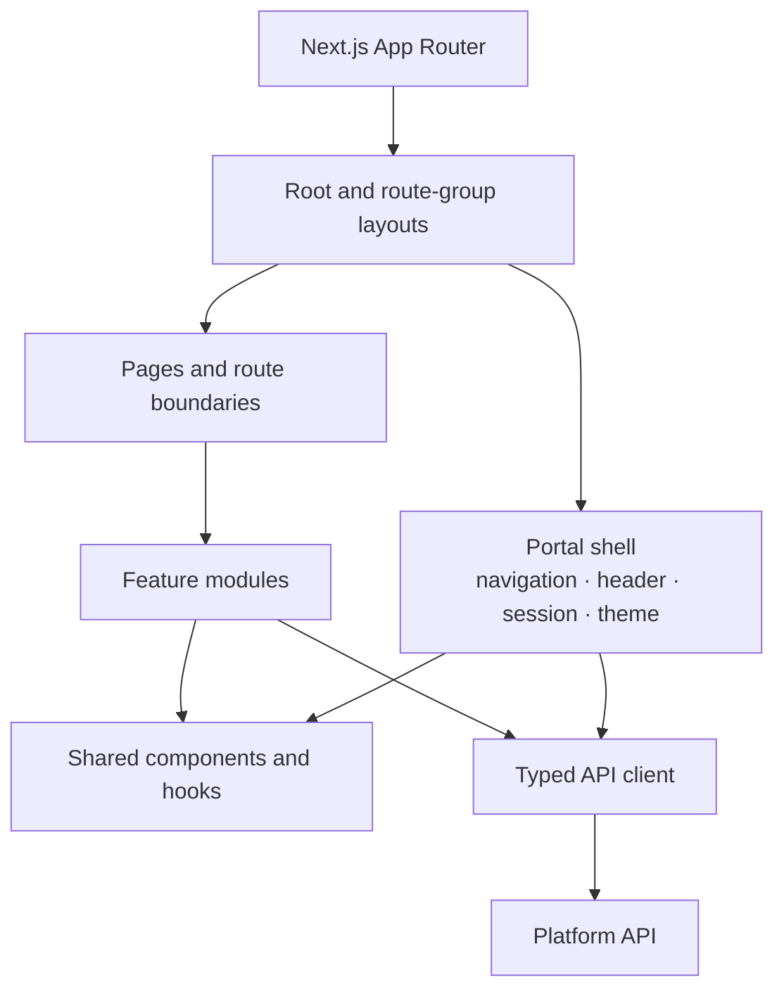

### 4.2 App Router, layouts, and pages

`src/app/` owns URL structure and route composition. It contains:

- the root layout;
- authenticated and public route groups;
- module route segments;
- loading, error, not-found, and access-denied boundaries;
- page entry points;
- route-specific metadata.

Pages compose feature components and obtain route-level data. They should remain thin. A page does not become the permanent home of complex form logic, table configuration, API parsing, or reusable module behavior.

Layouts provide stable structure and context. The authenticated layout hosts the Portal shell, navigation, identity context, theme, and global notification surface. Nested module layouts may add breadcrumbs or module-level navigation without replacing the shell.

### 4.3 Feature modules

`src/features/<module>/` owns frontend business features. A feature may contain:

```text
features/vacation/
├── components/
├── hooks/
├── services/
├── schemas/
├── types/
├── utils/
└── index.ts
```

Feature components can import shared components, hooks, services, and types. They cannot import another feature’s internal files. A feature’s public exports are explicit through its entry point. Cross-feature workflows are composed at the route/application-shell level or moved behind an approved Core contract.

### 4.4 Shared components

`src/components/` contains:

- adapted shadcn/ui primitives under `components/ui/`;
- application-shell components;
- reusable business-neutral patterns such as `DataTable`, `PageHeader`, `EmptyState`, and confirmation dialogs;
- accessibility helpers.

A shared component accepts data and behavior through typed props. It must not call a module endpoint, know a module permission, or encode a module workflow.

Lucide icons, Tailwind CSS, shared tokens, typography, and spacing are applied here so modules produce a coherent interface.

### 4.5 Hooks

`src/hooks/` contains business-neutral hooks such as session access, current permissions, media queries, and shared interaction behavior. Module hooks remain under their feature.

Hooks do not hide arbitrary global mutable state. A hook that communicates with the API delegates transport behavior to the API client or a feature service and exposes explicit loading, success, empty, and error states.

### 4.6 Services and API client

`src/services/` owns shared browser/server service boundaries:

- the base typed API client;
- authentication/session integration;
- Problem Details parsing;
- request correlation handling;
- request cancellation;
- common pagination serialization;
- attachment transfer support when defined.

Feature services define endpoint-specific calls and types. They use the shared client and do not reimplement token, error, or base-URL handling.

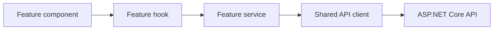

The client never treats a successful HTTP transport as successful business behavior without validating the expected response shape. Server-side and browser-side calls share contract types where safe, but server-only credentials or headers cannot cross into client bundles.

### 4.7 Types and validation

`src/types/` contains business-neutral Portal types. Module types stay in `features/<module>/types`. API DTO types are distinct from component view models when screen needs differ.

Zod schemas validate form input and, where appropriate, untrusted API payload boundaries. React Hook Form owns form state. The API remains authoritative for business validation and authorization.

### 4.8 State management

State is placed at the narrowest correct scope:

| State kind | Location |
|---|---|
| Input, dialog, selection | Local React component state |
| Shareable filters, page, sort | URL search parameters |
| Form values and errors | React Hook Form |
| Authenticated identity and permissions | Portal session context |
| Remote server data | Route loading or feature data hook/service |
| Theme and shell preferences | Narrow shared provider and persisted preference where required |

The architecture does not assume an additional global-state library. Such a library requires approval under the dependency rules in `PROJECT_INSTRUCTIONS.md`. API data must not be copied into a broad global store without a concrete consistency design.

### 4.9 Permission-aware navigation

Each module contributes navigation descriptors containing label, route, Lucide icon, required permission, and ordering metadata. The Portal shell builds navigation from the authenticated user’s effective permissions.

```text
Module navigation contribution
  → platform navigation registry
  → filter by effective permission
  → group and order
  → render in the shared shell
```

Route-level guards improve user experience but do not provide security. Direct navigation and every resulting API request are still authorized by the API. Administration is a navigation group in this same registry, filtered by administrative permissions.

---

## 5. Core Platform

Core Platform is the shared capability layer used by every business module. A capability belongs in Core when it is business-domain-neutral, has a stable platform-wide contract, and requires one consistent implementation.

> **Boundary:** Core provides mechanisms. Modules provide business policy. “Send a notification using a template” is Core; “notify a manager when vacation exceeds ten days” is Vacation business logic.

### 5.1 Capability map

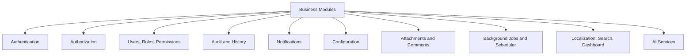

### 5.2 Shared service catalog

| Capability | Core owns | Modules provide |
|---|---|---|
| Authentication | JWT validation/issuance flow, refresh sessions, current actor | Whether a module operation requires authentication |
| Authorization | Role and permission evaluation, policy interfaces, effective permission set | Permission definitions and resource-scope rules |
| Users | User identity, status, common profile, lookup contract | Optional module-specific profile data |
| Roles | Role lifecycle and role-permission assignments | Suggested role mappings where documented |
| Permissions | Registry, assignment, evaluation, namespacing | Namespaced permission catalog |
| Audit | Append-only writer, query access, redaction structure | Event name, target, safe change summary |
| Notifications | Templates, recipient addressing, delivery state and retries | Trigger, recipient rule, template variables |
| Configuration | Typed value access, scope, validation, administration | Module setting definitions and defaults |
| Attachments | Metadata, upload/download mediation, access callbacks | Which records accept files and who may access them |
| Comments | Common comment model, author/time/edit controls | Which records support comments and visibility policy |
| History | Timeline projection over audit, comments, and events | Module event descriptions and display metadata |
| Background Jobs | Durable job registration, execution, retry, status | Idempotent job handlers |
| Scheduler | Time-based trigger definitions and dispatch | Schedules and commands to run |
| Localization | Locale selection, shared message catalogs, formatting contracts | Translated module resources |
| Search | Search request contract, result model, permission-filter pipeline | Search projection and result authorization |
| Dashboard | Widget registry, layout contract, common shell | Widget definitions, data providers, permissions |
| AI Services | Approved model gateway contract, prompt/use-case registry, safety and audit hooks | Explicit domain use case, context, validation and human review |

### 5.3 Authentication

Authentication runs at the API boundary. It resolves a validated token into a platform actor context containing the shared user identity and session metadata needed downstream. Modules consume the actor context; they do not parse JWTs or access refresh-token storage.

The Portal consumes a session representation from shared authentication services. Feature modules do not create their own login, token refresh, or logout behavior.

### 5.4 Authorization, users, roles, and permissions

Authorization exposes capability checks and resource-policy contracts. The permission registry combines Core permissions and module-contributed permissions at startup or controlled synchronization.

Users and roles are managed through permission-protected Portal pages in the same application. Role membership accelerates permission assignment; application use cases evaluate effective permissions and resource scope, not role names hard-coded into module logic.

### 5.5 Audit and history

The Audit service records immutable business and security events in the same transaction as required writes. A module supplies a structured event; Core adds actor, timestamp, trace, and platform metadata.

History is a read-oriented Core capability that composes authorized timeline entries from audit events, comments, and module events. It does not infer business status or define which state changes are legal.

### 5.6 Notifications

Core owns delivery mechanics, template rendering boundaries, delivery attempts, retry state, and channel adapters. Modules request notifications only after their business rules determine that a notification is required.

Notification dispatch is normally asynchronous after a durable request is recorded. Business transactions do not wait for an email provider, but the handoff to background processing cannot be lost.

### 5.7 Configuration

Core Configuration exposes typed, validated values at supported scopes, such as platform, environment, or module. Modules define their configuration keys near their application contracts and retrieve them through the shared configuration interface.

Business records do not become arbitrary key-value configuration. Values requiring relational integrity, history, workflow, or rich querying remain module data.

### 5.8 Attachments, comments, and history

Attachments store shared metadata and lifecycle state. A target reference includes module, target type, and opaque target identifier. Before upload, download, listing, or deletion, Core invokes the owning module’s access-policy contract. Core never assumes that possession of an attachment ID grants access.

Comments use the same target-reference approach. A module declares whether a target supports comments, which comment visibility modes are allowed, and who may read or write them.

The target reference is a logical reference, not a cross-schema foreign key to every possible module table. Modules validate target existence and access through registered resolvers.

### 5.9 Background Jobs and Scheduler

Core Background Jobs owns durable job records, claiming, attempt counts, leases, outcome, retry timing, and diagnostics. Scheduler owns time-based trigger calculation and submits durable jobs. Job payloads carry opaque public references and minimal required data.

Modules own handlers and ensure idempotency. Core does not understand why vacation balances are recalculated or visitor access expires.

### 5.10 Localization

Localization provides locale discovery, shared translations, date/number formatting conventions, and fallback behavior. Module translations stay with the module and use namespaced keys. Persisted business data is not translated by replacing its canonical meaning; display labels are localized at presentation boundaries.

### 5.11 Search

Search provides one Portal search experience and one result contract. Modules contribute searchable projections and authorization filters. Search results contain an authorized route, title, type, safe summary, and module identity.

Search cannot query module tables without the module’s registered provider. It cannot return a record and rely on the destination page to hide unauthorized data.

### 5.12 Dashboard

Dashboard provides the shared layout, widget registry, loading/error behavior, and permission filtering. Modules contribute widgets with stable identifiers, data providers, routes, and required permissions.

Dashboard widgets summarize module behavior; they do not become alternate command handlers or bypass module application services.

### 5.13 AI Services

AI Services is an optional Core gateway for approved AI-backed use cases. It centralizes provider configuration, prompt/use-case identification, redaction hooks, audit metadata, usage limits, and response handling.

Modules own the domain request and decide how an AI suggestion is validated and presented. AI output is never treated as an authorized command or trusted persisted fact. No provider, model, vector database, or retrieval technology is implied by this document; introducing one requires the approval process defined by the governing instructions.

---

## 6. Business Modules

A business module is a vertical slice of one coherent business capability. Vacation Management is the first module. Assets, Fleet, Help Desk, Meeting Rooms, Visitors, Travel Orders, Company Documents, Expenses, and Approvals are expected to follow the same integration model.

### 6.1 Module ownership

Every module owns:

| Area | Owned artifact |
|---|---|
| Database | PostgreSQL schema, tables, constraints, indexes, migrations, query SQL |
| API | Versioned routes, DTOs, application use cases, domain behavior |
| UI | App Router pages, feature components, forms, tables, navigation contribution |
| Permissions | Namespaced permission definitions and resource policies |
| Documentation | `docs/modules/<module>.md` and relevant API/schema references |
| Tests | Domain, application, database, API, authorization, UI, and acceptance tests |
| Operations | Module metrics, logs, job diagnostics, support and migration notes |

### 6.2 Module integration contract

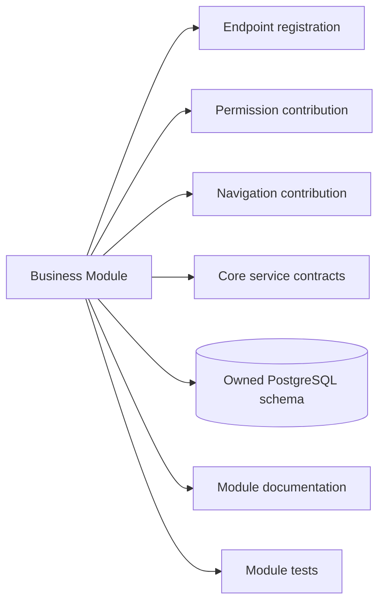

Adding a module consists of registering these contributions with existing extension points. It does not require changing authentication, the root Portal shell, audit storage, or another module.

### 6.3 Isolation

Module isolation is enforced in source, database naming, contracts, tests, and review:

- Backend code for one module cannot import another module’s internal namespace.
- Frontend features cannot import another feature’s internal files.
- Each module uses its own PostgreSQL schema.
- A module’s repositories query only its schema and documented Core schemas exposed for that purpose.
- A module invokes Core through interfaces, not database shortcuts.
- Architecture tests should verify forbidden project/namespace dependencies.

### 6.4 Cross-module scenarios

When a workflow appears to span modules, choose in this order:

1. Keep the workflow in the module that owns the business outcome and use opaque references to another module where sufficient.
2. Use a stable Core identity or capability contract.
3. Publish an explicit business event and let another module react idempotently.
4. Introduce a documented application-level contract owned by the providing module.
5. Record an ADR if synchronous cross-module coordination is unavoidable.

Direct table access and direct internal class imports are never shortcuts for integration.

Example: an Expense record may reference an approved Travel Order by public ID. Expense does not query `travel` tables. It asks a documented Travel Orders contract for the minimal authorized verification result or reacts to a published approval event.

---

## 7. Request Lifecycle

### 7.1 Synchronous request path

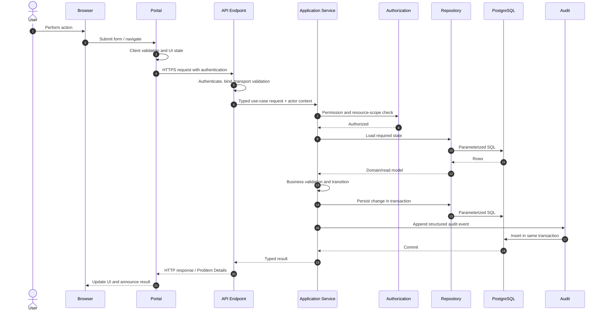

### 7.2 Lifecycle stages

| Stage | Architectural responsibility |
|---|---|
| Browser interaction | Collect input, prevent accidental duplicate submission, present progress |
| Portal validation | Validate form shape and provide immediate feedback |
| API authentication | Validate the session/token and create actor context |
| Transport validation | Validate JSON, route/query values, lengths, formats and required fields |
| Authorization | Check capability and record-specific access in the application use case |
| Repository read | Execute explicit parameterized SQL and map only required columns |
| Business validation | Enforce state, policy, concurrency, and cross-field rules |
| Transaction | Persist business state and required audit/job handoff atomically |
| Logging | Add trace-scoped operational events without sensitive payloads |
| Response | Return typed success or RFC 7807 Problem Details |
| Portal rendering | Reconcile UI state, display field/general errors, refresh affected data |

Validation can fail at multiple stages. Earlier validation improves feedback; later validation remains authoritative. An authorization denial occurs before sensitive business data is returned or modified.

### 7.3 Query lifecycle

Read requests follow the same authentication, authorization, logging, and response path but normally omit a write transaction and audit event. Access to sensitive reports, exports, or audit data may itself produce a security or audit event as specified by its module.

### 7.4 Failure behavior

- Authentication failure returns `401` before a module use case.
- Permission failure returns `403`, or `404` when existence must be concealed.
- Input and business validation return the documented Problem Details response.
- Concurrency conflicts return the documented conflict response without overwriting data.
- Unexpected exceptions are handled at the API boundary, logged with trace ID, and returned without internal details.
- Failed transactions persist neither the business write nor its required audit event.
- Portal error boundaries prevent one failing feature from replacing the entire authenticated shell where a narrower boundary is possible.

---

## 8. Dependency Rules

### 8.1 Mandatory rules

1. Business modules cannot directly depend on other business modules.
2. Core Platform cannot depend on business module implementations.
3. Shared code contains only domain-neutral, stable primitives.
4. No project, package, namespace, or frontend import cycle is permitted.
5. Presentation depends inward on Application; it never calls Infrastructure directly.
6. Domain has no dependency on HTTP, database, delivery, or provider frameworks.
7. Infrastructure implements inward-facing contracts and is wired only at the composition root.
8. The Portal cannot import backend runtime code. Shared contract generation, if introduced, must produce safe frontend artifacts.
9. No module duplicates authentication, authorization, audit, notifications, configuration, attachments, comments, jobs, or other Core mechanisms.
10. No repository reads or writes another module’s database schema.
11. Core services cannot encode module state names, calculations, or workflow decisions.
12. Integration occurs through explicit contracts, registered providers, or events.

### 8.2 Dependency decision table

| Need | Correct location |
|---|---|
| Used by one business module | That module |
| Same-looking code in two modules but different semantics | Keep separate |
| Stable technical capability used by modules | Core Platform |
| Tiny stable primitive used across layers | Shared |
| Module A needs a fact owned by Module B | Documented contract or event |
| UI pattern with no business meaning | Shared Portal component |
| UI component tied to a module endpoint or permission | Module feature |
| Query spanning modules for analytics | Documented reporting projection, not transactional coupling |

### 8.3 Circular dependency prevention

Architecture tests must inspect .NET project/assembly dependencies and defined namespace rules. Frontend linting or repository checks must reject cross-feature internal imports. Database review must reject foreign keys or views that create undocumented module ownership cycles.

When two modules appear to require each other, the model is incomplete. Extract a genuinely neutral Core contract, choose one workflow owner, or communicate through events; do not create reciprocal references.

---

## 9. Folder Standards

### 9.1 Backend module folder

```text
Modules/<ModuleName>/
├── Presentation/
│   ├── Endpoints/
│   ├── Contracts/
│   └── Mapping/
├── Application/
│   ├── Commands/
│   ├── Queries/
│   ├── Services/
│   ├── Policies/
│   └── Contracts/
├── Domain/
│   ├── Entities/
│   ├── ValueObjects/
│   ├── Events/
│   └── Errors/
├── Infrastructure/
│   ├── Persistence/
│   ├── Repositories/
│   └── Integrations/
└── ModuleRegistration
```

Folders are created when populated. Use singular PascalCase module names in .NET namespaces and code, such as `Vacation`. Use business capability names, not team names.

Commands and queries should be grouped by feature once flat folders become crowded. Avoid generic files named `Helpers`, `Utils`, `Manager`, or `Common` when a specific responsibility exists.

### 9.2 Frontend feature folder

```text
features/<module>/
├── components/
├── hooks/
├── services/
├── schemas/
├── types/
├── utils/
└── index.ts
```

Frontend folder names use lowercase kebab-case. React component files and exported components use PascalCase. Hooks use `use...`. Zod schemas and API/view types stay with the feature that owns their meaning.

`index.ts` defines the feature’s supported public imports. Deep imports from another feature are prohibited.

### 9.3 Tests

Unit tests may be colocated with the owning project or under `apps/api/tests` and `apps/portal/tests` according to repository tooling. Cross-cutting suites remain under top-level `tests/`.

```text
tests/
├── api/
│   ├── contract/
│   ├── integration/
│   ├── architecture/
│   └── security/
└── portal/
    ├── integration/
    ├── e2e/
    ├── accessibility/
    └── visual/
```

Test names describe observable behavior. Folder layout mirrors the source capability or user journey sufficiently to locate ownership.

### 9.4 Database

```text
database/
├── migrations/
│   ├── core/
│   └── modules/
│       └── vacation/
├── schema/
│   ├── core/
│   └── modules/
├── seed/
│   ├── reference/
│   └── development/
└── scripts/
    ├── validation/
    └── operations/
```

Migration ordering remains globally deterministic even when files are grouped by owner. Module schema names use lowercase `snake_case`. Core capabilities may use distinct schemas such as `identity`, `audit`, and `notifications` rather than one undifferentiated `public` schema.

### 9.5 Documentation

```text
docs/
├── PROJECT_INSTRUCTIONS.md
├── architecture/
├── adr/
├── decisions/
├── modules/
├── standards/
├── templates/
├── operations/        # expected when runbooks are introduced
├── integrations/      # expected when external integrations are introduced
├── CHANGELOG.md
└── ROADMAP.md
```

Module filenames use lowercase kebab-case. ADR filenames use a stable numeric prefix and concise kebab-case title. Links are relative so documentation works in Git hosting and local Markdown tools.

---

## 10. Extension Strategy

The platform grows through predefined contribution points rather than architecture changes.

### 10.1 Adding a module

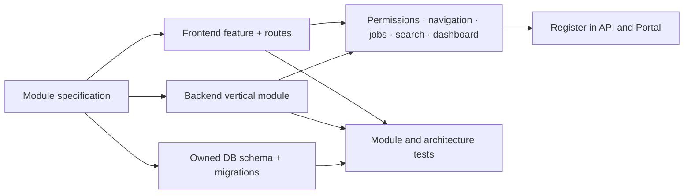

The sequence for a new module is:

1. Create and approve `docs/modules/<module>.md`.
2. Allocate a module name, route prefix, PostgreSQL schema, and permission namespace.
3. Add migrations for the owned schema.
4. Add backend Presentation, Application, Domain, and Infrastructure behavior.
5. Add App Router pages and a feature folder in the Portal.
6. Contribute permissions, navigation, and optional Core integrations.
7. Add tests, operational visibility, and acceptance evidence.
8. Register the module with the existing API and Portal composition points.

Authentication schema, audit infrastructure, root navigation implementation, API error handling, and deployment topology are unchanged.

### 10.2 Extension points

| Extension point | Module contribution |
|---|---|
| API endpoints | Versioned module endpoint group |
| Permissions | Namespaced descriptors |
| Navigation | Permission-filtered route descriptors |
| Audit | Structured module event descriptors |
| Notifications | Template definitions and trigger requests |
| Attachments/comments | Target resolver and access policy |
| Jobs/scheduler | Idempotent handler and optional schedule |
| Search | Authorized search provider/projection |
| Dashboard | Permission-aware widget descriptor |
| Localization | Namespaced resource catalogs |
| AI | Approved use-case adapter and validation policy |

Extension registries must detect duplicate identifiers and fail startup or validation clearly. A module cannot override another module’s contribution.

---

## 11. Background Processing

Background processing runs within the API deployment initially. It uses a durable PostgreSQL-backed job model so process restarts do not lose accepted work. This is an architectural pattern, not approval of a new job library.

### 11.1 Processing flow

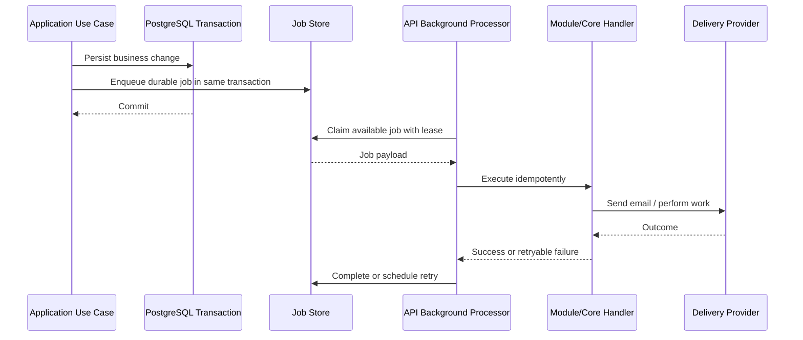

### 11.2 Scheduler

The Scheduler calculates due work and enqueues jobs. It does not execute module business logic directly. Examples include:

- daily vacation entitlement maintenance;
- scheduled notification reminders;
- expiration of temporary visitor or attachment state;
- future periodic synchronization tasks.

Schedules use explicit time-zone semantics. When multiple API instances run, claiming or leadership logic prevents duplicate schedule emission. Handlers still remain idempotent.

### 11.3 Email and notifications

Modules create a durable notification request through Core. A background handler renders the approved template and invokes the configured delivery adapter. Delivery state records attempts, provider-safe references, and final outcome.

Business success is distinct from delivery success unless a module specification explicitly defines otherwise. A submitted vacation request remains submitted if an informational email temporarily fails; the failure is retried and observable.

### 11.4 Future workers

If background load later requires a separate worker process, the existing job contracts and handlers can be hosted in a new deployable without changing module behavior. That extraction requires an ADR and deployment update, but not a redesign of business modules.

Future processing must preserve:

- durable acceptance;
- exclusive or safe concurrent claiming;
- bounded retries and backoff;
- idempotent handlers;
- dead-letter or terminal-failure visibility;
- trace and audit correlation;
- graceful shutdown and lease recovery;
- authorization-safe payloads and logging.

---

## 12. AI Development Architecture

Development is documentation-driven. AI participants operate against approved artifacts rather than creating undocumented architecture during implementation.

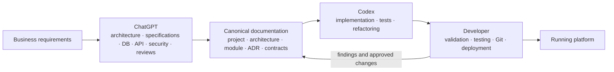

### 12.1 Responsibility boundaries

| Participant | Architecture interaction |
|---|---|
| ChatGPT | Produces and reviews architecture, module specifications, schemas, API contracts, security designs, and documented decisions. |
| Codex | Implements approved structure, adds tests, performs scoped refactoring, and reports discrepancies. It does not invent architecture or dependencies. |
| Developer | Confirms requirements, validates generated work, runs acceptance and regression testing, controls Git, and deploys approved artifacts. |

### 12.2 Documentation-to-change flow

1. The requirement is reflected in a module specification or governing architecture artifact.
2. Database and API contracts are made explicit.
3. Security, permissions, audit, and failure behavior are reviewed.
4. Codex receives the governing documents and bounded acceptance criteria.
5. Implementation and tests are produced without changing architecture implicitly.
6. The developer validates behavior and repository changes.
7. Documentation and implementation are merged together.

If implementation reveals that the documented architecture cannot support the requirement, work returns to the documentation step. Codex does not create an unreviewed library, table, Core service, module dependency, or deployment unit to work around the gap.

---

## 13. Architecture Principles

### 13.1 One Portal

All users, module screens, and administrative screens run in one Next.js application shell. Modules contribute routes and navigation; they do not create separate frontend deployments. Shared layout, identity, accessibility behavior, and design components remain consistent.

### 13.2 One API

All Portal data and commands cross one ASP.NET Core API boundary. The API hosts Core and module endpoints, applies common middleware, and presents one versioned contract surface. A module is not a separately deployed API.

### 13.3 One Database

PostgreSQL is the single transactional store. Isolation is achieved with schema ownership, repository boundaries, permissions, and migrations—not separate uncoordinated databases. Only the API and approved operational tooling connect to it.

### 13.4 Shared Core

Authentication, authorization, users, roles, permissions, audit, notifications, configuration, attachments, comments, history, jobs, scheduling, localization, search, dashboards, and approved AI access use one Core implementation. Modules extend these capabilities through contracts.

### 13.5 Modular Business Logic

Every business rule belongs to the module that owns its outcome. Core remains business-neutral. Module boundaries exist in backend code, frontend features, database schemas, documentation, permissions, and tests.

### 13.6 API First

Business capabilities are defined as API contracts and application use cases before screens depend on them. Portal behavior cannot rely on direct persistence knowledge or undocumented response shapes. This also leaves a stable path for future mobile or approved integration clients.

### 13.7 Documentation First

Architecture, module behavior, schema ownership, permissions, and API contracts are documented before implementation. Code realizes a reviewed model; it is not the first place where consequential design appears.

### 13.8 Security First

Trust boundaries are structural: the browser is untrusted, the API authorizes every operation, modules receive a validated actor, and repositories never accept client-created authority. Security services are centralized and resource rules remain with the owning module.

### 13.9 Audit Everything

Consequential writes create structured audit events through the shared Audit service. Audit handoff is part of the application transaction. Modules describe the business event while Core guarantees consistent metadata and storage.

### 13.10 Reusable Components

Stable, business-neutral UI and technical patterns are implemented once in shared Portal components or Core. Similar business behavior is not generalized prematurely. Reuse follows semantic identity, not visual or textual coincidence.

### 13.11 Loose Coupling

Modules know Core contracts and their own internals. They do not know another module’s tables or classes. Events, opaque references, and narrow contracts carry cross-capability information without spreading implementation knowledge.

### 13.12 High Cohesion

A module owns the complete vertical behavior of its capability: persistence, use cases, domain rules, endpoints, UI, permissions, tests, and documentation. Changes to one business workflow are concentrated in one module.

### 13.13 Convention over Configuration

Modules follow standard locations, route naming, permission namespaces, schemas, registration points, error behavior, audit shape, and test organization. Configuration is used for genuine environment or business variation, not to assemble arbitrary architecture at runtime.

---

## 14. Future Evolution

The modular monolith is the stable base for the next five to ten years. Evolution occurs by adding adapters, projections, clients, and modules around established application contracts.

### 14.1 Module growth

Dozens of modules can be added by allocating a schema, permission namespace, route prefix, backend module, frontend feature, documentation, and tests. Portal navigation groups modules without changing identity or shell behavior. API registration composes modules into the existing host.

As the number of modules grows:

- module ownership metadata becomes explicit;
- architecture tests protect boundaries;
- navigation and search become primary discovery mechanisms;
- migrations remain globally ordered but grouped by owner;
- Core capability contracts are versioned carefully;
- operational dashboards segment data by module.

### 14.2 Integrations

Future HR, directory, finance, email, document, or fleet integrations attach through Infrastructure adapters behind Application/Core contracts. External payloads are translated at the boundary and do not become module domain models.

Inbound integration calls use versioned API endpoints and dedicated authorization. Outbound integration work uses durable background processing when immediate completion is not required. Each integration receives documentation under `docs/integrations/`.

### 14.3 AI capabilities

Approved AI features use the Core AI Services gateway. Potential module use cases include classification, summarization, drafting, search assistance, or anomaly review. Each use case defines allowed data, prompt ownership, validation, human review, audit, retention, failure behavior, and a non-AI fallback where required.

AI remains an adapter behind module application logic. Replacing a provider or model does not change module routes, database ownership, or authorization.

### 14.4 Mobile clients

A future mobile client consumes the same versioned API. Mobile-specific presentation does not move business logic out of the API and does not receive broader permissions than the Portal. Authentication flow, offline behavior, push notifications, and device security require dedicated documented design.

The existing API-first structure provides the contract boundary; no mobile backend is assumed until a real requirement justifies one.

### 14.5 External APIs

Approved external APIs can be exposed as a separately versioned surface within the API host or, if justified later, through a dedicated gateway. External contracts use scoped credentials, explicit rate limits, narrower DTOs, and independent lifecycle documentation.

Internal Portal DTOs are not automatically safe or stable external contracts. Application use cases can be reused while Presentation contracts differ.

### 14.6 Reporting and analytics

Operational module screens continue to use owned transactional queries. Cross-module reporting evolves through documented read projections, views, or export pipelines that preserve source ownership and authorization.

Reporting does not authorize direct user access to PostgreSQL or introduce ad hoc cross-module writes. If a future analytics store is approved, it receives data through controlled, observable projections; PostgreSQL remains the transactional source of truth.

### 14.7 Deployment evolution

The Portal, API, and PostgreSQL can scale within their existing boundaries. API instances remain stateless apart from PostgreSQL-backed sessions/jobs and injected configuration. Background handlers may move to a worker host while retaining existing contracts.

A business module is extracted into a service only after measured operational or ownership pressure justifies it. Because module contracts, schema ownership, and frontend/API boundaries are already explicit, extraction can be incremental. It is an evolution of deployment, not a prerequisite for modularity.

### 14.8 Architectural continuity

Future change must preserve these stable seams:

- Portal routes and feature boundaries;
- versioned HTTP contracts;
- application use cases;
- module-owned data;
- Core service interfaces;
- explicit module contributions;
- durable jobs and events;
- documentation and ADR traceability.

Technologies may be upgraded within approved support policies, and deployment may become more sophisticated, but modules should continue to plug into the same conceptual architecture. A proposed evolution that requires every existing module to be rewritten is evidence of a broken boundary and requires architecture review before adoption.

---

## Architecture Conformance Checklist

Use this checklist in module and architecture reviews:

- [ ] The change complies with [`PROJECT_INSTRUCTIONS.md`](../PROJECT_INSTRUCTIONS.md).
- [ ] The owning Core capability or business module is unambiguous.
- [ ] Presentation, Application, Domain, and Infrastructure responsibilities are separated.
- [ ] No business logic has moved into Core, endpoints, repositories, or frontend components.
- [ ] No module imports another module’s internals or queries its schema.
- [ ] Shared code is genuinely domain-neutral and used across boundaries.
- [ ] The Portal uses the shared shell, API client, components, and permission navigation.
- [ ] The API remains the authoritative validation and authorization boundary.
- [ ] Data, API, permissions, audit, UI, tests, and documentation have one owner.
- [ ] Background work is durable, idempotent, observable, and bounded.
- [ ] A new module uses existing extension points without architecture changes.
- [ ] Any new architectural decision is captured in an ADR.
