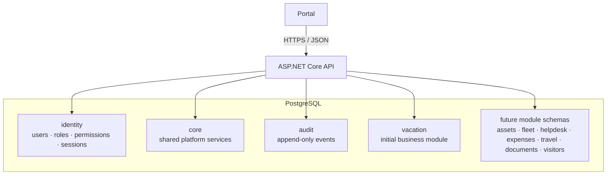
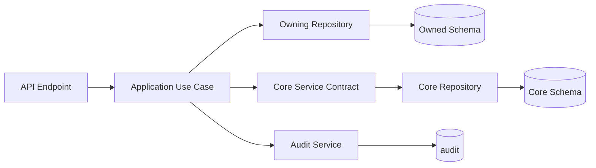
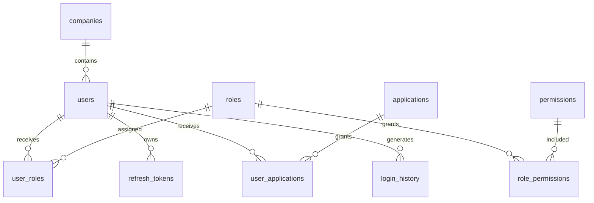
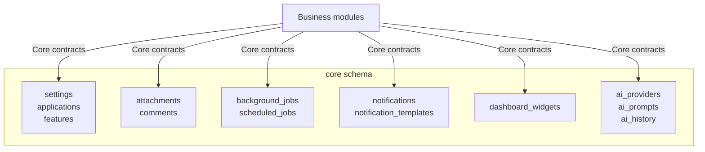
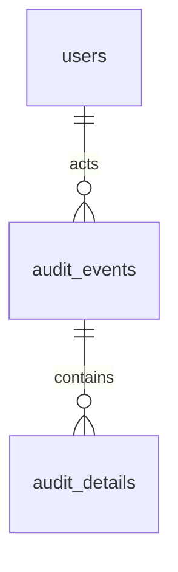
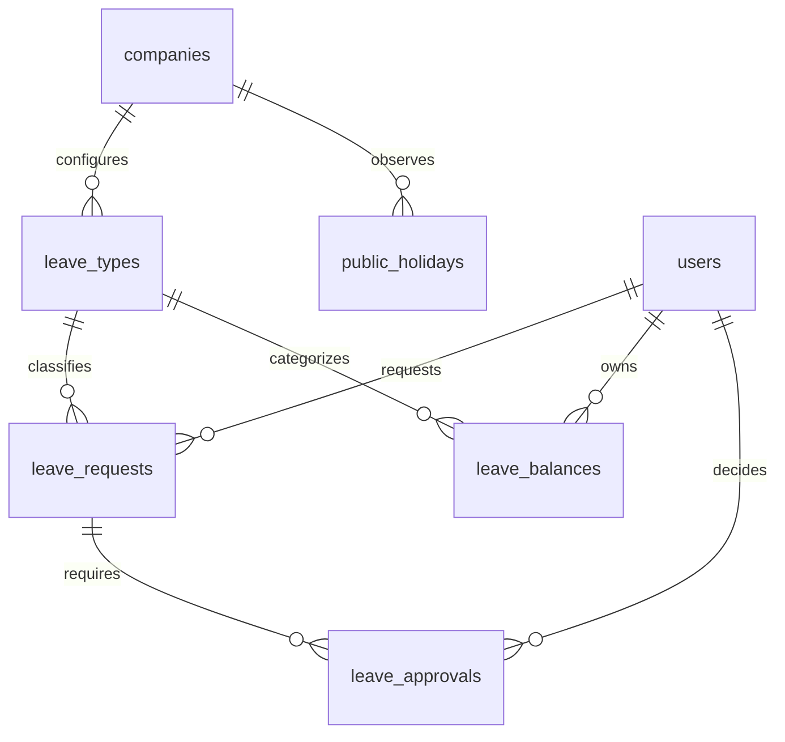
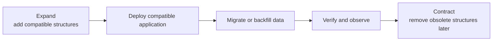
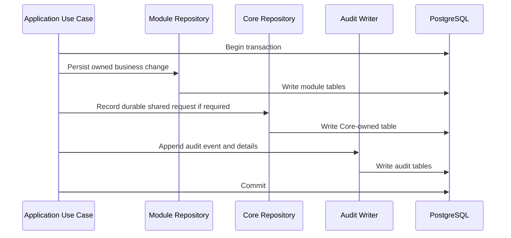
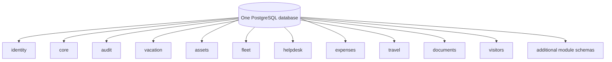

# Internal Apps Platform — Logical Database Architecture

| Attribute | Value |
|---|---|
| Status | Canonical logical database reference |
| Database platform | PostgreSQL |
| Architecture | One database, Core schemas, isolated business-module schemas |
| Governing document | [`../PROJECT_INSTRUCTIONS.md`](../PROJECT_INSTRUCTIONS.md) |
| Parent architecture | [`ARCHITECTURE.md`](ARCHITECTURE.md) |
| Scope | Logical data ownership, entities, relationships, lifecycle, versioning, and scalability |

> This document describes the logical database architecture. It does not define physical DDL, SQL queries, migration scripts, or exact column types. [`PROJECT_INSTRUCTIONS.md`](../PROJECT_INSTRUCTIONS.md) governs project-wide database rules; [`ARCHITECTURE.md`](ARCHITECTURE.md) governs system and module boundaries. Both take precedence over this document.

---

## 1. Database Context

The Internal Apps Platform uses one PostgreSQL database as its transactional system of record. Logical isolation is provided through named schemas:

- `identity` for authentication and authorization;
- `core` for shared platform services;
- `audit` for append-only audit records;
- one schema for each business module, beginning with `vacation`.

The API is the only application data-access boundary. Portal users, browsers, business modules in the frontend, and other human users do not connect directly to PostgreSQL.

Schemas organize ownership; they do not create separate databases or independent deployment units. One API process coordinates authorized use cases and transactions across the schemas when a documented workflow requires it.

### 1.1 Logical versus physical design

This document specifies:

- what each schema and logical entity represents;
- which capability owns each entity;
- permitted relationship directions;
- identity, audit, lifecycle, and versioning conventions;
- how modules extend the database without changing its architecture.

The following belong to reviewed migrations and implementation documentation, not this reference:

- concrete data types and lengths;
- physical table definitions;
- index access methods and storage parameters;
- generated expressions;
- partition definitions;
- database functions and triggers;
- executable seed or migration logic.

### 1.2 Data-access model

A module repository accesses its own schema. Shared data is accessed through Core application contracts and Core repositories, not by copying SQL into the module. Audit writes are submitted through the shared Audit service.

---

## 2. Schema and Table Ownership

Every table has exactly one owner. Ownership means that one Core capability or business module controls:

- the table’s meaning and lifecycle;
- its migrations;
- write operations;
- integrity rules;
- supported read models;
- retention and deletion behavior;
- documentation and tests;
- compatibility impact when it changes.

Ownership is not shared. Multiple modules may consume a Core service, but they do not jointly own Core tables.

### 2.1 Ownership catalog

| Schema | Owner | Classification | Write access |
|---|---|---|---|
| `identity` | Core Identity and Access capability | Core | Identity/authorization repositories only |
| `core` | Named Core Platform capability per table | Core | Owning Core repository only |
| `audit` | Core Audit capability | Core, append-only | Audit writer only |
| `vacation` | Vacation Management module | Business module | Vacation repositories only |
| `assets` | Future Assets module | Business module | Assets repositories only |
| `fleet` | Future Fleet module | Business module | Fleet repositories only |
| `helpdesk` | Future Help Desk module | Business module | Help Desk repositories only |
| `expenses` | Future Expenses module | Business module | Expenses repositories only |
| `travel` | Future Travel Orders module | Business module | Travel repositories only |
| `documents` | Future Company Documents module | Business module | Documents repositories only |
| `visitors` | Future Visitors module | Business module | Visitors repositories only |

### 2.2 Ownership rules

1. A module may create and modify tables only in its own schema.
2. A module may not directly insert, update, soft-delete, restore, or delete rows owned by another module.
3. A module may not update Core tables directly; it calls the owning Core service.
4. A Core capability may not modify module tables.
5. Shared transactions are coordinated by the Application Layer while each repository remains responsible for its owned tables.
6. Cross-module state changes use documented application contracts or events, never direct table writes.
7. Database ownership boundaries apply equally to maintenance scripts, imports, scheduled jobs, reporting processes, and AI-assisted changes.
8. A table cannot be placed in `core` merely because more than one module wants similar business behavior.

### 2.3 Shared Core schemas

`identity`, `core`, and `audit` are shared in the sense that every module may use their capabilities. They are not shared write surfaces.

Examples:

- Vacation asks Authorization whether an actor has `vacation.requests.approve`; it does not query role tables.
- Assets requests an attachment through the Attachments service; it does not insert attachment metadata.
- Help Desk submits an audit event through the Audit service; it does not append audit details itself.
- Travel schedules a reminder through Background Jobs; it does not manipulate job attempts.

Core services expose stable, purpose-specific contracts. They protect schema details from becoming dependencies in every module.

---

## 3. Cross-Schema Relationship Strategy

Relationships fall into three categories.

| Category | Example | Representation |
|---|---|---|
| Within one owner | `vacation.leave_approvals` belongs to a leave request | Database foreign key inside the owned schema |
| Module to stable Core identity | Leave request requested by an identity user | Cross-schema foreign key may reference `identity.users` |
| Module to another module | Expense associated with a travel order | Opaque public reference plus application contract or event |

### 3.1 Permitted cross-schema foreign keys

Business modules may reference stable Core identity records where referential integrity is essential, primarily:

- users who create, own, approve, or modify records;
- companies when records are company-scoped.

Core generic-target entities such as attachments and comments do not create foreign keys to every possible module table. They store a logical target descriptor containing the owning module, target kind, and opaque target identifier. The owning module validates existence and access through a registered resolver.

### 3.2 Prohibited module coupling

Direct foreign keys from one business-module schema to another are prohibited by default. They turn independent lifecycle decisions into database coupling and let one owner constrain another owner’s migrations.

When one module needs to refer to another:

- store the other resource’s public identifier when a durable reference is required;
- validate it through the owner’s application contract;
- capture an immutable snapshot of required display facts if historical interpretation must survive future changes;
- react to an owner-published event when eventual consistency is acceptable;
- document the relationship in both module specifications.

An exception requires an ADR under `PROJECT_INSTRUCTIONS.md`.

### 3.3 Delete behavior across boundaries

Core identity and company records referenced by business history are normally disabled, anonymized, or soft-deleted rather than physically removed. Their removal must not orphan approvals, audit actors, or historical requests.

Generic Core records pointing at module targets do not determine module deletion behavior. The module owns cleanup, retention, detachment, or preservation policy and invokes the Core service accordingly.

---

## 4. Identity Schema

The `identity` schema is owned by the Core Identity and Access capability. It contains the shared authentication, user, company, role, permission, and session model used by all modules.

The diagram shows logical cardinality. Exact optionality and physical columns are defined by approved identity specifications and migrations.

### 4.1 Entity catalog

| Entity | Purpose | Principal relationships | Lifecycle notes |
|---|---|---|---|
| `companies` | Represents the company boundary used to scope users and company-owned data. | Has users; referenced by company-scoped module records. | Usually retained while referenced; inactive status is preferred to deletion. |
| `users` | Canonical platform identity and common account profile. | Belongs to a company; has roles, refresh tokens, and login history; referenced by platform records. | Disablement blocks access; history remains attributable under retention policy. |
| `roles` | Named bundles of permissions for manageable assignment. | Has permissions through `role_permissions`; assigned to users through `user_roles`. | Role changes are audited; deprecated roles are retired without rewriting historical audit. |
| `permissions` | Stable namespaced platform capabilities. | Included in roles through `role_permissions`. | Permission key is a durable contract; removal or rename is versioned. |
| `role_permissions` | Association between roles and permissions. | References one role and one permission. | Duplicate assignments are not meaningful; changes are security-sensitive and audited. |
| `user_roles` | Association between users and roles. | References one user and one role. | May carry assignment context or validity when documented; changes are audited. |
| `user_applications` | Assignment of Portal applications to users. | References one user and one `core.applications` entry; optionally records the assigning user. | The current runtime API reads assignments but cannot create or change them. |
| `refresh_tokens` | Server-side session record for refresh-token rotation and revocation. | Belongs to one user and session lineage. | Raw token value is never stored; expired/revoked records follow security retention policy. |
| `login_history` | Records authentication attempts and outcomes for security review. | References a user when one can be safely resolved; may represent an unidentified attempt. | Append-oriented security record with bounded retention and sensitive metadata controls. |

### 4.2 Companies

`companies` provides the organizational root for company-scoped records. The initial platform may operate for one company, but company identity remains explicit so records are not implicitly tied to a deployment.

This does not make the platform a commercial multi-tenant system. Company scope exists for internal organizational structure and future company-group requirements. Cross-company visibility and administration are authorized application behavior, not a consequence of sharing the same database.

### 4.3 Users

`users` is the only canonical user identity. Business schemas reference it for actors such as requester, approver, assignee, creator, and modifier. A module may own additional module-specific user attributes, but it must not duplicate credentials, account status, or common identity.

A user’s internal primary key is not returned through the API. The public UUID is used in contracts and generic references. Display names and contact values are not copied into every business record unless an immutable historical snapshot is explicitly required.

### 4.4 Roles and permissions

Roles provide assignment convenience. Permissions provide authorization capability. Module code refers to permission keys, not role names.

The many-to-many relationships are resolved by `role_permissions` and `user_roles`. The logical uniqueness of each pair prevents duplicate grants. Role and permission assignments are effective security state and must be represented in the audit schema through the shared Audit service.

### 4.5 Refresh tokens

`refresh_tokens` represents refresh sessions, rotation lineage, expiry, use, and revocation. It stores only a secure one-way representation of token material. A rotated token remains traceable for reuse detection but cannot be used after rotation.

Logical lookup patterns include:

- validation by secure token representation;
- active sessions for one user;
- token family or rotation lineage;
- expired/revoked records eligible for retention cleanup.

### 4.6 Login history

`login_history` captures successful and failed authentication activity needed for investigation and user security views. It is distinct from application logs and business audit events. Sensitive network or client metadata is minimized, protected, and retained only as policy requires.

---

## 5. Core Schema

The `core` schema contains persistence for shared platform mechanisms. Each table is owned by one named Core capability even though all reside in the same schema.

### 5.1 Entity catalog

| Entity | Core owner | Purpose |
|---|---|---|
| `settings` | Configuration | Typed platform and module configuration values and scope metadata |
| `applications` | Application Access | Portal application identity, route, active status, and display order |
| `features` | Feature Control | Registered feature definitions and controlled availability |
| `attachments` | Attachments | File metadata, logical target, lifecycle, and safe storage reference |
| `comments` | Comments | Shared comments attached to authorized logical targets |
| `background_jobs` | Background Jobs | Durable queued work, attempts, leases, status, and result metadata |
| `scheduled_jobs` | Scheduler | Recurring or scheduled trigger definitions and next-run state |
| `notifications` | Notifications | Requested notifications, recipients, rendering/delivery status, retries |
| `notification_templates` | Notifications | Versioned templates and channel/locale variants |
| `dashboard_widgets` | Dashboard | Registered widget definitions and display metadata |
| `ai_providers` | AI Services | Approved provider configuration metadata and operational state |
| `ai_prompts` | AI Services | Versioned prompt/use-case definitions and governance metadata |
| `ai_history` | AI Services | Auditable invocation metadata, outcomes, and safe usage history |

### 5.2 Settings

`settings` stores values that are genuinely configurable rather than structural business data. Each setting is identified by a stable namespaced key and an explicit scope. The Configuration service interprets and validates values against definitions in code or approved documentation.

Settings are not an untyped escape hatch. Data requiring relationships, workflow, ownership history, or frequent business querying belongs in an owned business table. Secret values are not stored as ordinary settings unless an approved secure mechanism and encryption model explicitly supports them.

Logical access patterns include retrieval by key and scope, listing settings manageable by an authorized administrator, and tracking changes through audit events.

### 5.3 Applications and features

`applications` is the Portal launcher catalog. It records a stable application code, public identifier, display metadata, Portal route, active status, and ordering. Access is determined through `identity.user_applications`; only active applications assigned to the authenticated user are returned. The table does not contain module-specific configuration or business state.

`features` identifies controlled capabilities within Core or a module. A feature belongs logically to an application module or to the platform. Feature availability is not authorization: permission checks remain mandatory even when a feature is enabled.

Module and feature keys are stable contracts used by navigation, dashboards, configuration, and administration. Runtime registration must agree with persisted registry entries; conflicting or duplicate identities are invalid.

### 5.4 Attachments

`attachments` stores metadata, not module business rules. Its logical model includes:

- public identifier;
- owning module and target kind;
- opaque target public identifier;
- original safe display name and media metadata;
- size and storage reference;
- uploader identity and creation time;
- lifecycle and scanning/availability state where required;
- deletion or retention metadata.

Binary content storage is an infrastructure decision outside this logical model. The database record remains the authoritative attachment metadata and access reference.

Attachments do not foreign-key every possible module target. Access is resolved through the owning module’s registered target policy. A module determines whether its record can receive attachments and who can list, upload, download, or remove them.

### 5.5 Comments

`comments` provides a shared collaboration record attached to a logical module target. Its model includes author, target descriptor, body in the approved safe format, visibility, creation time, and edit/deletion history indicators where policy permits.

Comments do not determine workflow state. A comment on a leave request cannot approve or reject it. The owning module controls whether comments are enabled and their record-level access policy.

### 5.6 Background jobs and scheduled jobs

`background_jobs` is the durable work queue. A job logically records:

- job type and owning capability;
- minimal versioned payload;
- status and priority where supported;
- availability time;
- attempt count and next retry;
- claim/lease state;
- trace/correlation context;
- completion or terminal-failure metadata.

Payloads use public identifiers and avoid copied sensitive data. Job handlers are idempotent because delivery may be retried after ambiguous failures.

`scheduled_jobs` records time-based trigger definitions: owner, schedule, time zone, enabled state, last/next evaluation, and concurrency behavior. A scheduled job produces a background job; it does not execute business logic inside the scheduler.

### 5.7 Notifications and templates

`notifications` represents notification intent and delivery lifecycle. It connects a triggering module event to authorized recipients, a template version, channel, and delivery status. Delivery attempts and terminal outcomes remain observable.

`notification_templates` contains versioned, namespaced template definitions. A template can have channel and locale variants. Existing notification history retains the template version or rendered snapshot needed to explain what was delivered.

Notification content is not a substitute for the business record. Module-owned state remains authoritative.

### 5.8 Dashboard widgets

`dashboard_widgets` is a registry of widget definitions or controlled display metadata. The module owns the data provider and business meaning; Core owns widget discovery, layout metadata, and permission-filtered presentation.

User-specific layout persistence, if required later, may be added as a separately owned Core entity after its behavior is specified. It is not implicitly part of `dashboard_widgets`.

### 5.9 AI providers, prompts, and history

`ai_providers` stores approved provider configuration metadata, provider identity, supported state, and safe operational settings. Credentials remain in the approved secret mechanism rather than ordinary table values.

`ai_prompts` stores versioned prompt and AI use-case definitions. A record identifies the owning Core capability or module, intended task, version, status, and governance metadata. Prompt versions are immutable once used when reproducibility or auditability requires it.

`ai_history` records safe invocation history:

- use case and prompt version;
- requesting user or system actor;
- owning module and optional target reference;
- provider/model metadata permitted by policy;
- timing, token/usage measures where available;
- outcome, validation, and review status;
- trace and audit correlation.

Raw sensitive prompts and model responses are not automatically retained. Any content retention is use-case-specific, minimized, documented, and access-controlled. AI history does not make model output authoritative business data.

---

## 6. Audit Schema

The `audit` schema is owned by the Core Audit capability. It is independent of diagnostic application logs and login history.

### 6.1 Audit events

`audit_events` is the event header. It identifies:

- a unique event and occurrence time;
- actor or system actor;
- module and action;
- target kind and opaque target public identifier;
- outcome;
- request trace/correlation identifier;
- safe source and reason metadata;
- applicable company scope.

The event is designed for chronological investigation, target history, actor history, security review, and support.

### 6.2 Audit details

`audit_details` contains structured details associated with one audit event. Details may represent changed field names, safe before/after values, or a redacted change summary.

Sensitive values are excluded or represented as changed/redacted. Passwords, tokens, secrets, raw authentication headers, attachment contents, and unrestricted request payloads are never audit details.

Separating event headers from details supports:

- efficient event-list queries without loading change payloads;
- multiple field changes per event;
- field-level redaction;
- controlled detail access;
- stable event metadata when detail formats evolve.

### 6.3 Append-only strategy

Audit data is append-only:

- normal application operations insert events and details;
- existing events and details are not updated to reflect later business state;
- business deletion does not cascade into audit deletion;
- corrections are represented by a new event that references or explains the correction;
- retention or legally required anonymization runs only through a separately authorized, auditable operational process.

The database runtime identity used for ordinary module writes must not have general update or delete capability over audit records. The Audit service is the sole application writer.

Required audit and business writes are committed atomically. If the audit record cannot be persisted, the business write fails unless the governing documents approve an equivalent durable pattern.

### 6.4 Actor preservation

An audit event retains meaningful actor attribution even when the user later becomes inactive or is anonymized. The event may reference `identity.users` while also retaining a safe historical actor label or system-actor descriptor when required by policy. Audit must not rely on a mutable display name alone.

---

## 7. Vacation Schema

The `vacation` schema is owned exclusively by the Vacation Management module. It establishes the module pattern for business data without moving vacation rules into Core.

### 7.1 Entity catalog

| Entity | Purpose | Principal relationships | Ownership notes |
|---|---|---|---|
| `leave_types` | Defines available categories of leave and their configurable characteristics. | Company-scoped; referenced by requests and balances. | Vacation owns meaning and lifecycle. |
| `leave_requests` | Represents an employee request and its workflow state. | Requester, leave type, company context; has approvals. | Aggregate/workflow root for request processing. |
| `leave_balances` | Represents leave entitlement, consumption, and remaining balance for a user, type, and period. | User, leave type, balance period. | Vacation owns calculations and concurrency. |
| `leave_approvals` | Records approval steps, assignees, decisions, and sequence. | Belongs to one leave request; references an approver. | Preserves workflow decision history. |
| `public_holidays` | Defines company/jurisdiction holidays used in leave calculations. | Company and calendar context. | Reference data owned by Vacation unless later generalized by ADR. |

### 7.2 Leave types

`leave_types` defines module-owned leave categories such as annual or other approved types. Logical attributes include stable identity, company scope, display name/code, active status, and policy-related classification required by the Vacation specification.

Historical requests retain their meaning when a leave type is retired. Retirement prevents new use but does not erase old relationships. Policy changes that alter historical interpretation require versioning or a snapshot strategy documented by the module.

### 7.3 Leave requests

`leave_requests` is the central Vacation workflow record. It relates a requesting user to a leave type, requested date/partial-day interval, workflow status, and version for concurrency.

The record stores authoritative requested facts and current state. State changes occur through application use cases, not arbitrary repository updates. Comments, attachments, notifications, and audit events remain in Core schemas and refer to the request by public identifier.

### 7.4 Leave balances

`leave_balances` represents a user’s entitlement and usage for a leave type and defined balance period. The logical key must prevent duplicate active balances for the same user, leave type, and period.

Balance updates are concurrency-sensitive. The module defines whether values are stored as totals, components, or derived projections; that physical decision must preserve an explainable relationship to approved, pending, used, adjusted, and remaining amounts.

Adjustments that require independent business history should not be hidden as unexplained overwrites. If adjustment records become a requirement, they must be introduced as a documented Vacation-owned entity rather than encoded in audit details alone.

### 7.5 Leave approvals

`leave_approvals` models approval steps for one request. It preserves approver assignment, sequence or stage, decision, decision time, and required comment/reason according to workflow rules.

Approval history is business data, not merely audit data. The current request state may summarize the workflow, while approval records explain which step produced it. Reassignment and delegation must remain reconstructable according to the module specification.

### 7.6 Public holidays

`public_holidays` represents dates excluded or specially treated in leave calculations for a company or applicable calendar. Logical uniqueness prevents duplicate definitions for the same calendar context and date.

Holiday records are date-based, not timestamp-based. A change to the holiday calendar may affect future calculations; whether it recalculates existing requests is a documented Vacation business rule.

---

## 8. Future Business Schemas

Every future module receives one owned schema. Names are reserved conceptually, but tables are introduced only after the module specification is approved.

| Schema | Expected responsibility | Example logical areas, not committed tables |
|---|---|---|
| `assets` | Company asset inventory and assignment | asset catalog, assignment, maintenance, lifecycle |
| `fleet` | Vehicles and fleet operations | vehicles, drivers, service, usage, registrations |
| `helpdesk` | Internal support requests | tickets, queues, assignment, status, service activity |
| `expenses` | Employee expense capture and review | expense claims, items, review, reimbursement state |
| `travel` | Travel orders and approvals | trip requests, itinerary, approval, travel status |
| `documents` | Company document catalog and governance | documents, versions, acknowledgements, classifications |
| `visitors` | Visitor registration and visit lifecycle | visitors, hosts, visits, access periods |

The examples describe scope only. They do not authorize entity creation, physical schema changes, or business behavior.

### 8.1 Module schema onboarding

```mermaid
flowchart LR
    Spec["Approved module specification"]
    Ownership["Assign schema and owner"]
    Model["Document logical entities and relationships"]
    Review["Architecture, security, and data review"]
    Migration["Create reviewed migrations"]
    Module["Register module repositories and services"]
    Verify["Integration and ownership tests"]

    Spec --> Ownership --> Model --> Review --> Migration --> Module --> Verify
```

A future schema must document:

- its single owning module;
- data classification and retention;
- entity and aggregate boundaries;
- references to identity or Core capabilities;
- any reference to another module by public identifier;
- uniqueness and integrity expectations;
- expected query and index patterns;
- audit events;
- migration and recovery impact.

Adding a schema does not require changes to existing module schemas. Core schemas change only when a genuinely shared capability evolves.

---

## 9. Identifiers and Keys

### 9.1 Internal primary keys

Every table has one primary key. The primary key is the database’s internal row identity and may be optimized for storage and joins. Its exact physical type is selected in the migration design.

Internal primary keys:

- never appear in public API contracts;
- are not accepted from the Portal;
- are not used as cross-module integration identifiers;
- are not logged or exposed where they reveal internal implementation;
- can be used for owned-schema foreign keys and controlled Core references.

### 9.2 Public UUID identifiers

Any business or Core resource addressable outside its repository has a unique opaque `public_id` represented as a UUID. Public identifiers are stable for the resource lifetime.

Public UUIDs are used for:

- API route identifiers;
- Portal links;
- attachment/comment target references;
- background job payload references;
- cross-module logical references;
- audit target identifiers;
- integration contracts.

A public UUID does not grant access. Every lookup still applies authorization and resource-scope rules.

Not every associative or internal detail table needs public identity. A public identifier is required when the row is independently addressed, audited as a target, referenced across a boundary, or included in an API contract.

### 9.3 Foreign keys

Foreign keys express real, durable relationships and enforce referential integrity. They are mandatory for owned relational links unless a documented logical-reference pattern applies.

Each foreign key has:

- one clear semantic name;
- explicit required or optional cardinality;
- explicit delete behavior;
- an index decision based on access patterns;
- an owner responsible for migration compatibility.

Cascading deletion of business, identity, approval, notification, or audit history is normally prohibited. Restriction, soft deletion, or controlled lifecycle operations are preferred.

---

## 10. Common Record Metadata

### 10.1 Audit columns

Mutable operational tables normally carry:

- creation timestamp;
- creating user or system actor;
- last-update timestamp;
- last-updating user or system actor.

These columns answer who last changed the current row and when. They do not replace the append-only Audit schema, which records the sequence and business meaning of changes.

Immutable association or event-detail records may require only creation metadata. The owning entity specification documents exceptions.

### 10.2 Time

Instants are stored and interpreted as UTC. Business dates without a time, including leave dates and public holidays, remain date-only concepts. A time zone is stored explicitly when local scheduling or recurrence semantics depend on it.

Database server local time is not a business rule. Background jobs, approvals, and notifications use explicit clock and time-zone semantics provided by the application.

### 10.3 Concurrency

Mutable aggregates that may be edited concurrently carry a version or equivalent concurrency marker. The API uses it to detect stale changes.

Concurrency control is especially important for:

- leave request transitions;
- leave balance updates;
- role and permission assignments;
- job claiming;
- settings and scheduled jobs;
- administrative configuration.

Conflicts are surfaced to the application rather than silently applying last-write-wins.

### 10.4 Company scope

Company-scoped tables represent their company relationship explicitly. The API derives allowed company scope from the authenticated actor and authorization policy; it does not trust a client-supplied company identifier as authority.

Company scope is included in uniqueness and lookup rules where two companies may legitimately use the same business code or name.

---

## 11. Soft Delete, Retention, and History

Soft deletion is used when a record must disappear from normal operation while remaining referenced, recoverable, or auditable. It logically records deletion time and deleting actor.

### 11.1 Appropriate use

Soft deletion is generally appropriate for:

- users that must remain attributable;
- roles, leave types, templates, and settings retained for history;
- business records with regulatory or workflow history;
- attachments or comments requiring recovery/retention behavior.

Soft deletion may be inappropriate for:

- immutable audit events;
- transient job attempts after their approved retention expires;
- join rows where removal itself is fully audited and no historical reference is required;
- data that policy requires to be permanently erased or anonymized.

### 11.2 Operational behavior

- Normal queries exclude soft-deleted records.
- Administrative recovery requires explicit permission and audit.
- Unique business values define whether they may be reused after deletion.
- Child records are not silently soft-deleted unless the owner specifies aggregate behavior.
- Soft-deleted data remains subject to authorization, backup, retention, and privacy rules.
- Soft delete does not satisfy a legal deletion requirement by itself.

### 11.3 History models

Different forms of history have different owners:

| History need | Logical owner |
|---|---|
| Who changed a business record and why | `audit.audit_events` and `audit.audit_details` |
| Approval decisions and sequence | Module-owned approval records |
| Authentication attempts | `identity.login_history` |
| Notification delivery lifecycle | `core.notifications` |
| Background execution lifecycle | `core.background_jobs` |
| AI invocation governance | `core.ai_history` |
| Current row creator/updater | Common audit columns |

Audit details must not be used as a substitute for module data that the business needs to query, reason about, or enforce.

---

## 12. Reference Data

Reference tables represent controlled values with identity, lifecycle, or metadata. Examples include leave types, application modules, features, permissions, and notification templates.

Use a reference table when values:

- are managed or activated independently;
- are referenced by business records;
- require labels or metadata;
- evolve without application deployment;
- require audit history;
- are scoped by company or module.

A constrained code value may be sufficient when the set is small, stable, owned by code, and has no independent lifecycle. The choice is documented in the owning module specification.

Reference records use stable machine identifiers distinct from mutable display labels. Deactivating a reference prevents new selection but preserves historical relationships.

Seeded reference data has a named owner and deterministic versioned lifecycle. Development/demo data is separate from production reference data.

---

## 13. Index and Query Architecture

Indexes are part of logical access design even though their physical definitions live in migrations.

### 13.1 Required access-pattern review

Every entity specification identifies expected access patterns:

- lookup by public identifier;
- lookup by foreign key;
- active records within company or module scope;
- status and workflow queues;
- date or time ranges;
- scheduled/available background work;
- actor, target, and time-based audit history;
- uniqueness checks;
- pagination order.

Index proposals follow these patterns rather than indexing every column.

### 13.2 Core index expectations

| Entity group | Important logical access patterns |
|---|---|
| Identity | user login identifier, user public ID, active roles/permissions, active refresh token/session, login time |
| Core registry | stable module/feature/setting key and scope |
| Attachments/comments | module + target kind + target public ID; creator and time where needed |
| Jobs | status + availability; lease expiry; owner/type; terminal retention |
| Notifications | recipient + status/time; delivery status; triggering target |
| Audit | target + time; actor + time; module/action + time; trace ID |
| Vacation | requester + date/status; approval assignee + state; balance user/type/period; holiday calendar/date |

Every public identifier has a uniqueness guarantee. Business uniqueness is enforced at the database level, including the intended semantics for active versus soft-deleted rows.

### 13.3 Pagination and ordering

Large entity sets use deterministic ordering with a unique tie-breaker. Cursor-based access patterns use stable indexed order. Expensive totals or arbitrary sorting are not assumed; supported filters and sort fields are part of the owning API contract.

### 13.4 Index governance

An index has one documented purpose and an owning capability. Indexes are reviewed against realistic data volume and query plans. Redundant or unused indexes are removed through migrations after operational evidence and compatibility review.

---

## 14. Naming Conventions

All database identifiers use lowercase `snake_case`.

| Object | Convention | Example |
|---|---|---|
| Schema | Capability or module noun | `identity`, `vacation` |
| Table | Plural business noun | `leave_requests` |
| Primary key | `id` | `id` |
| Public identifier | `public_id` | `public_id` |
| Foreign key | Singular relationship plus `_id` | `requested_by_user_id` |
| Public logical reference | Descriptive relationship plus `_public_id` | `target_public_id` |
| Boolean | Positive predicate beginning with `is_`, `has_`, or `can_` | `is_active` |
| Instant | Action/state plus `_at` | `approved_at` |
| Date-only value | Descriptive noun plus `_date` where useful | `holiday_date` |
| Version | `version` or explicit version purpose | `version` |
| Index | `ix_<table>_<purpose/columns>` | `ix_leave_requests_requester_status` |
| Unique constraint | `uq_<table>_<purpose/columns>` | `uq_permissions_key` |
| Foreign key constraint | `fk_<from>_<to>` | `fk_leave_requests_users` |
| Check constraint | `ck_<table>_<rule>` | `ck_leave_requests_date_order` |

Names use platform terminology from module documentation. Avoid unexplained abbreviations, reserved words, mixed-case quoted names, and ambiguous columns such as `type`, `value`, `data`, `status_id`, or `user_id` when the relationship has a more precise role.

Permission keys, module keys, setting keys, feature keys, job types, notification template keys, and AI use-case keys are namespaced stable identifiers. They are not generated from mutable display names.

---

## 15. Migration and Database Versioning Strategy

All database change occurs through ordered, immutable migrations under `database/migrations/`. No manual environment changes are part of the architecture.

### 15.1 Migration ownership

Each migration declares one primary owner:

- Identity/Core migration;
- Audit migration;
- named business-module migration;
- approved cross-cutting migration coordinated by the platform owner.

A migration should normally affect one owner’s objects. A change spanning owners is split into compatible stages when possible and requires joint review.

### 15.2 Version model

Database version is the ordered set of successfully applied migrations, not a manually edited version string. The migration history records each applied identifier and enough integrity metadata to detect drift according to the selected migration tooling.

The repository defines the expected database version for each application release. Startup or deployment verification identifies:

- missing migrations;
- unexpected applied migrations;
- failed or partially applied migrations;
- application/schema incompatibility.

### 15.3 Compatibility sequence

Breaking changes use expand–migrate–contract:

1. add structures that both old and new application versions can tolerate;
2. deploy code capable of using the new model;
3. migrate or backfill data in controlled batches;
4. verify correctness and operational behavior;
5. remove obsolete structures in a later migration after no supported code depends on them.

Migration rollback is not assumed to be safe for destructive or data-transforming changes. Forward recovery and restore strategy are documented before release.

### 15.4 Migration validation

Migration review verifies:

- clean-database application;
- upgrade from the previous supported version;
- ownership and naming;
- data preservation;
- referential integrity;
- realistic duration and locking impact;
- compatibility with rolling or staged deployment where applicable;
- backup and recovery requirements;
- updated logical documentation.

Applied migrations are never edited. A correction is a new migration.

---

## 16. Transaction Boundaries and Consistency

Application use cases define transaction boundaries. Repositories participate in the transaction provided by the Application Layer; they do not commit hidden partial work.

### 16.1 Standard write transaction

Examples of durable shared requests include a queued notification or background job. The module does not write those Core tables itself; their repositories participate in the same transaction.

### 16.2 Consistency rules

- Invariants within one aggregate are enforced in one transaction.
- Required audit is atomic with the business write.
- Notification delivery occurs after commit, while notification intent is durable.
- Background job acceptance is atomic with the state that requires the job.
- Reads used for authorization and state transition are protected against stale writes through concurrency control.
- Cross-module eventual consistency uses idempotent events/jobs and observable failure states.

No workflow depends on an untracked “fire and forget” task.

---

## 17. Data Classification, Access, and Reporting

Each table inherits the data classification and retention rules of its owning capability or module. Classification can differ by field; identity, login, attachments, comments, audit, vacation, and AI history may contain personal or sensitive information.

### 17.1 Access paths

| Access need | Approved path |
|---|---|
| Portal user operation | Portal → API → application service → owning repository |
| Module use of Core capability | Module application service → Core contract |
| Operational database work | Approved, least-privileged, auditable procedure |
| Migration | Approved migration identity and pipeline |
| Cross-module report | Documented reporting projection/read model |
| Data export | Authorized API/application workflow with audit |

Ad hoc reporting must not grant business users direct database access. Reporting queries do not bypass row-level authorization or module ownership.

### 17.2 Cross-module reporting

Cross-module reporting is implemented through documented read projections or controlled reporting views owned by a designated reporting capability. Transactional modules remain the source owners.

A reporting projection:

- identifies every source owner;
- is read-only to consumers;
- has documented refresh/consistency semantics;
- preserves company and permission scope;
- does not become a route for modifying source tables;
- can be rebuilt from authoritative data where practical.

Analytics storage outside PostgreSQL is not part of the current architecture and requires an ADR if introduced.

---

## 18. Backup, Restore, and Recovery Philosophy

Backups protect the complete PostgreSQL system of record. A valid recovery point includes Core and module schemas together so cross-schema transactions remain consistent.

### 18.1 Backup principles

- Backups are automated, encrypted, access-controlled, and monitored.
- Retention includes multiple recovery points appropriate to company requirements.
- Backup storage is isolated from the primary database failure domain.
- Restore procedures recreate the database, migration state, ownership, and required configuration references.
- Recovery point objective and recovery time objective are documented before production.
- Backup failures create actionable operational alerts.
- Production backups are never used as casual development seed data.

### 18.2 Restore verification

A backup is not considered reliable until restored and verified. Periodic restore tests confirm:

- the database can be recovered into an isolated environment;
- migration history is intact;
- Core and module schemas are mutually consistent;
- representative identity, audit, Core, and module records are readable;
- application health and critical queries work against the restored state;
- documented recovery time is realistic.

Restore tests protect sensitive data with the same controls as production. Any masking or restricted-access procedure must preserve the ability to validate relationships.

### 18.3 Recovery and migrations

Before a high-risk migration, recovery prerequisites are explicitly verified. If a migration transforms or removes data, its recovery plan states whether restoration, forward correction, or both are supported.

Partial restoration of an individual module schema is not the default because shared identity, Core records, audit, and cross-schema transaction history may no longer align. Module-level recovery requires a designed reconciliation procedure.

---

## 19. Future Scalability

The database architecture scales by adding owned schemas and controlling access patterns, not by placing all module data in generic tables.

### 19.1 Growth model

Dozens of modules can coexist because:

- every table has one owner;
- schema names prevent accidental namespace collisions;
- modules use Core contracts rather than duplicating shared tables;
- cross-module relationships avoid physical coupling;
- migration ownership remains traceable;
- query and index design is module-specific;
- public UUIDs provide stable integration references;
- audit and background processing follow common patterns.

### 19.2 Scaling within PostgreSQL

The order of response to growth is:

1. measure actual query, storage, and concurrency behavior;
2. correct access patterns and missing/ineffective indexes;
3. optimize Dapper queries and pagination;
4. archive or retain data according to approved lifecycle rules;
5. tune PostgreSQL and deployment resources;
6. introduce read projections for expensive reporting;
7. consider partitioning for specific high-volume tables after measured need;
8. consider architectural extraction only through an ADR.

Partitioning, replicas, external search, caching, and separate analytics stores are possible future physical evolutions, not current assumptions.

### 19.3 Module extraction readiness

Schema ownership and public-reference boundaries make a future module extraction possible without requiring it. If a module later moves to a separate service or database:

- its owned schema identifies the data boundary;
- other modules do not directly query its tables;
- API/application contracts already mediate behavior;
- public identifiers survive the move;
- events and background processing can carry integration changes.

Extraction still requires an ADR covering transactions, consistency, operations, security, and migration. The current design favors a single database until evidence justifies otherwise.

---

## 20. Logical Model Review Checklist

Use this checklist for every new entity or schema change:

- [ ] The change is required by approved documentation.
- [ ] The schema and single table owner are explicit.
- [ ] The entity represents business or Core state rather than an implementation shortcut.
- [ ] The primary key remains internal.
- [ ] A public UUID exists when the resource crosses a boundary.
- [ ] Every relationship has defined cardinality and lifecycle behavior.
- [ ] Business-module tables do not directly depend on another module’s tables.
- [ ] Core data is accessed through the owning Core service.
- [ ] Required foreign keys, uniqueness, and reference-data behavior are defined.
- [ ] Audit columns and concurrency behavior are appropriate.
- [ ] Soft delete, retention, anonymization, and physical deletion are distinguished.
- [ ] Expected lookup, filtering, ordering, and index patterns are documented.
- [ ] Sensitive data and company scope are identified.
- [ ] Audit events and shared-service side effects are specified.
- [ ] Migration compatibility and recovery have been reviewed.
- [ ] Backup and restore implications are understood.
- [ ] Module and architecture documentation will change in the same pull request.
