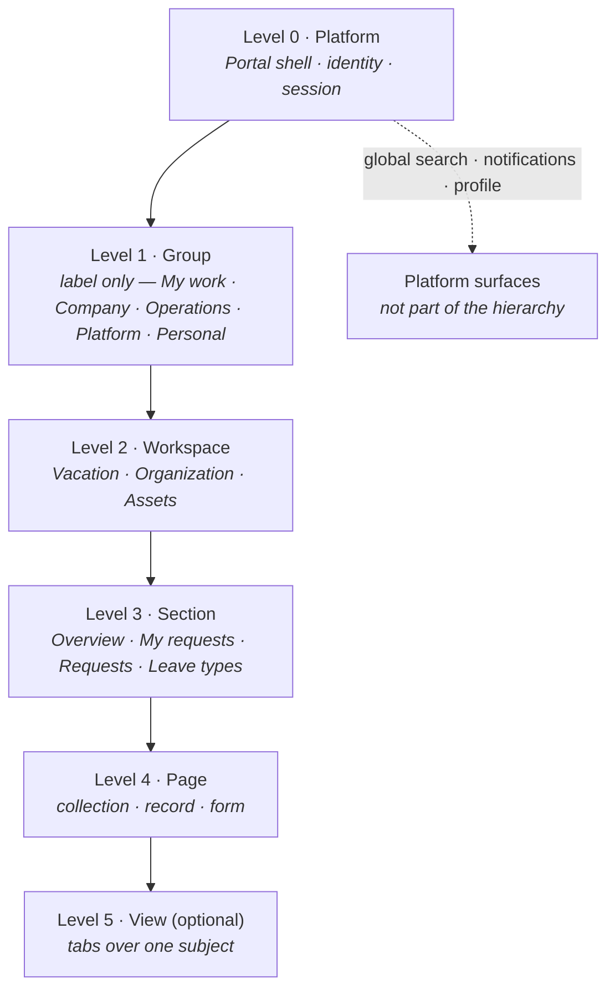
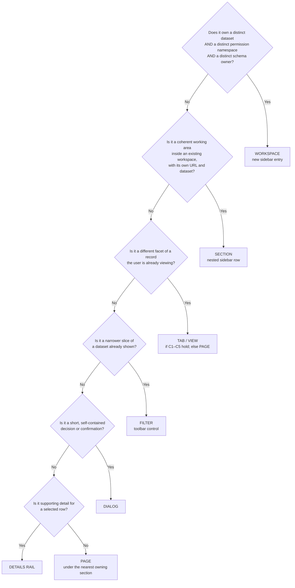

# Internal Apps Platform — Portal Information Architecture

| Attribute | Value |
|---|---|
| Status | **Draft v1 — Vacation and Organization living pilot implemented; platform-wide adoption pending** |
| Canonical? | **No.** Portal v2 is the default direction for new workspace work, but legacy modules may retain the established shell/navigation pattern until separately migrated. |
| Approved scope | The implemented Vacation workspace and shared Company workspace pilot (Organization plus Business Calendar Non-working days) |
| Governing document | [`../PROJECT_INSTRUCTIONS.md`](../PROJECT_INSTRUCTIONS.md) |
| Architecture | [`ARCHITECTURE.md`](ARCHITECTURE.md), [`PLATFORM_ARCHITECTURE.md`](PLATFORM_ARCHITECTURE.md) |
| Design system | [`../standards/UI_GUIDELINES.md`](../standards/UI_GUIDELINES.md) |
| Applies to | The single Next.js Portal; **implemented today for Vacation and the bounded Company workspace pilot** |
| Supersedes | **Nothing platform-wide.** `ARCHITECTURE.md` is not amended to claim universal adoption; `UI_GUIDELINES.md` records the living-pilot and legacy coexistence rules. |

> **Draft status, stated plainly.** This document records an approved *pilot*
> decision, not a universal platform rule. Vacation and the bounded Company
> workspace are the implemented living-pilot consumers. Legacy modules may
> continue to follow the established `UI_GUIDELINES.md` shell/navigation pattern
> until a separately approved migration. Platform-wide promotion still requires
> a separate architecture decision.

> **Normative language:** “MUST”, “MUST NOT”, “SHOULD”, “SHOULD NOT”, and “MAY”
> carry the meaning defined in [`PROJECT_INSTRUCTIONS.md`](../PROJECT_INSTRUCTIONS.md).
> Within this draft they are normative **for the pilot scope only**.
>
> **Precedence while this document is a draft:** `PROJECT_INSTRUCTIONS.md` →
> `ARCHITECTURE.md` / `PLATFORM_ARCHITECTURE.md` → `UI_GUIDELINES.md` → this
> document. On validated adoption, this document moves above `UI_GUIDELINES.md`
> for structural questions only. This document defines *where things live*;
> `UI_GUIDELINES.md` defines *what they look like and how they behave* (§11).

---

## 1. Purpose, Scope, and Problem Statement

### 1.1 Purpose

This document defines a proposed **Information Architecture (IA)** for the
Portal: the fixed set of navigation levels, the rules for placing any feature at
exactly one of those levels, and the structural regions of every authenticated
screen.

Its goal is that a maintainer can answer, without a design discussion:

- Where does this new feature go?
- Does it deserve a sidebar entry, a section, a page, a tab, a panel, or a dialog?
- What does the user see at the top of the screen, and who owns each element?
- How does this remain coherent at 20 modules instead of 2?

### 1.2 Scope

In scope: navigation hierarchy, sidebar, headers, breadcrumbs, toolbars, content
archetypes, tabs, placement rules, scalability, and the bounded Vacation pilot
plan (§14).

Out of scope: component APIs, tokens, colors, spacing, typography, focus
treatment, notification behavior, and control registries. Those remain owned by
`UI_GUIDELINES.md` and are explicitly frozen for the pilot (§14.8).

### 1.3 Problems this document solves

| # | Observed problem | Structural cause | Resolution |
|---|---|---|---|
| P1 | Too many horizontal tabs | Sections are rendered as tabs, and tab count grows with permissions | §2, §3: sections move into the sidebar; tabs are restricted to views of one subject (§7) |
| P2 | Tabs are used as module navigation | No navigable level exists between “sidebar entry” and “page” | §2: **Section** is introduced as a first-class, sidebar-resident level |
| P3 | Weak workspace hierarchy | Administration routes are siblings of module routes in the sidebar, not children of the owning workspace | §2.4, §3.3: administration is a *section group inside the owning workspace*, never a peer of it |
| P4 | Page context is not immediately obvious | Module header shows the module, section header shows the section, and neither states the full location | §4: a permanent breadcrumb states the full path; a distinct page header names the current page |
| P5 | Scalability to dozens of modules | Flat sidebar with hardcoded groups; per-module tab strips | §9: fixed group taxonomy, accordion expansion, and global search as the primary discovery mechanism at scale |
| P6 | Administration feels disconnected | `Leave Types`, `Leave Policies`, `Leave Balances` are tabs beside `Requests`; `Business Calendar` and `Identity` are loose sidebar rows | §2.4, §3.3, §10: administration is placed by *data ownership*, not by *audience* |

### 1.4 Current-state evidence

This draft is grounded in the repository as of branch `main`, commit `29a0342`:

- [`apps/portal/src/components/app-shell.tsx`](../../apps/portal/src/components/app-shell.tsx)
  renders one hardcoded sidebar with the groups `Dashboard`, `Applications`
  (from `GET /api/v1/me/applications`), `Company administration`, `Development`,
  and `Settings`. Administration rows (`Departments`, `Employees`,
  `Business Calendar`, `Users`, `User–Employee links`) are flat peers.
- [`apps/portal/src/features/vacation/components/vacation-workspace.tsx`](../../apps/portal/src/features/vacation/components/vacation-workspace.tsx)
  builds a horizontal tab strip of up to **five** tabs (`Requests`,
  `Leave types`, `Request administration`, `Annual leave entitlements`,
  `Leave balances`), of which three are permission-conditional. A full
  administrator sees five tabs; an ordinary employee sees two. Confirms P1, P2,
  P3.
- Routes `/vacation/employees` and `/vacation/departments` exist alongside the
  canonical `/organization/employees` and `/organization/departments`.
  [`docs/domain/vacation.md`](../domain/vacation.md) states Vacation does not
  own that data. Confirms P6 and motivates the ownership rule in §8.3.
- `docs/standards/UI_GUIDELINES.md` §2.5 already fixes the *vertical* hierarchy
  (module header → tabs → section header → filters → content). This document
  keeps that discipline and its page-title level, and proposes replacing the
  tab strip with a sidebar-resident section level.
- [`ARCHITECTURE.md`](ARCHITECTURE.md) §4.9 already specifies a permission-aware
  navigation registry built from module-contributed descriptors. The current
  hardcoded shell does not yet honor it. This document does not invent that
  registry; it specifies its shape (§14.1).

---

## 2. Canonical Navigation Hierarchy

### 2.1 The evaluation

An earlier proposal was `Platform → Business Area → Module → Section → Page →
Tab`. That model is close but has two defects for this platform:

**Defect 1 — “Business Area” as a routed level.** A routed business area
produces a landing page that is either an empty menu of modules (a click users
must pay for on every navigation) or a duplicate dashboard. For an internal
platform of this size, the business area carries real *grouping* value but no
*destination* value.
→ **Resolution:** keep the concept, demote it to a non-navigable label. It
organizes the sidebar; it is never a route, never clickable, never a breadcrumb
node.

**Defect 2 — “Module” overloaded.** `ARCHITECTURE.md` §6.1 defines “module” as a
vertical ownership unit spanning schema, API, permissions, and UI. Reusing the
same word for the navigation unit blurs the boundary — for example the Business
Calendar is a *Core Platform capability*, not a business module, but it still
needs exactly one navigation home.
→ **Resolution:** introduce **Workspace** as the navigation term. A workspace is
the Portal surface of one ownership unit. Modules and administrable Core
capabilities both surface as workspaces.

### 2.2 The proposed hierarchy

```text
Level 0   Platform            The Portal itself — one shell, one identity, one session
Level 1   Group               Sidebar grouping label. Not a route. Not clickable.
Level 2   Workspace           One ownership unit. One sidebar entry. One route prefix.
Level 3   Section             A coherent working area inside a workspace. Routed. Sidebar-resident.
Level 4   Page                One screen at one URL: a collection, a record, or a form.
Level 5   View  (optional)    Tabs. Alternate presentations of the SAME subject. Never navigation.
```



**Rule 2.2.1** — The hierarchy is exactly these levels. A module MUST NOT invent
a level 2.5 or a second tab tier.

**Rule 2.2.2** — Levels 2, 3, and 4 are addressable URLs. Levels 0 and 1 are not.
Level 5 SHOULD be addressable (§7.6) but MUST NOT be reachable from the sidebar.

**Rule 2.2.3** — Levels MAY be skipped downward, never inserted. A workspace with
one section renders that section directly (§3.6). A page with one view renders no
tabs.

**Rule 2.2.4 (no empty routed levels, normative)** — A navigation level MUST NOT
introduce a route whose only content is a menu of its children. Group labels
(level 1) and section-group labels such as `Administration` (§3.3) are
**non-routed expandable labels**. Clicking them expands or collapses; it never
navigates to a placeholder page.

### 2.3 Level definitions

#### Level 0 — Platform

The single Portal application. Owns: authenticated shell, sidebar frame, global
bar, identity and session, locale and appearance, error boundaries, routing, and
the navigation registry itself.

The Platform level is never displayed as a navigation node. Its presence is the
product mark, the global bar, and the shell. Per `ARCHITECTURE.md` §13.1 there is
exactly one; no module may create a second.

#### Level 1 — Group

A **static label** in the sidebar that groups workspaces by the user's
relationship to them. It has no route, no icon, no active state, and no page.

The group taxonomy is **fixed and closed**. A new module is assigned to an
existing group; it does not create one. Adding or renaming a group requires an
ADR.

| Group | Contains workspaces where the user… | Examples |
|---|---|---|
| **My work** | acts on their own records and daily tasks | Home |
| **Company** | works with shared company master data and people | Organization |
| **Operations** | runs a business process | Vacation, Assets, Fleet, Inventory, Procurement, Projects, Training |
| **Finance** | handles money, cost, and controlling | Finance, Expenses, Budgets |
| **Platform** | configures the platform and its access | Identity & Access, Business Calendar, Security, Configuration |
| **Personal** | changes their own preferences | Settings, Logout |

> **Rationale for grouping by relationship, not by department.**
> Department-based groups (`HR`, `IT`, `Finance`) rot when ownership changes and
> force a re-navigation whenever the org chart moves. Grouping by the user's
> *relationship to the data* is stable: a workspace keeps one home regardless of
> which department owns the process.

**Rule 2.3.1** — The maximum number of groups is **6**. A seventh group is
evidence that a workspace has been misclassified.

**Rule 2.3.2** — A group whose workspaces are all permission-hidden for a user
MUST NOT render its label.

**Rule 2.3.3** — Group membership is a property of the workspace descriptor, not
of the sidebar component. The sidebar renders groups; it does not decide them.

#### Level 2 — Workspace

The navigable home of exactly one ownership unit.

A workspace MUST have:

- exactly one sidebar entry;
- exactly one route prefix (`/vacation`, `/organization`);
- exactly one owning module or Core capability, per `ARCHITECTURE.md` §6.1;
- exactly one permission that gates its visibility (its *entry permission*);
- one stable name used identically in the sidebar and the breadcrumb;
- one Lucide icon.

A workspace MUST NOT:

- appear in more than one group;
- own a section whose data belongs to another module (§8.3);
- render a second sidebar or shell (`ARCHITECTURE.md` §13.1);
- **split into “X” and “X administration” as two sidebar entries** (Decision 1,
  §2.5).

**Rule 2.3.4 (the administration rule)** — *Administration is not a place. It is
a permission-scoped part of the workspace that owns the data.* Administrative
sections live inside the owning workspace, in an `Administration` section group
(§3.3). There is no top-level “Administration” workspace, and there is no
separate administrative shell — this restates `PROJECT_INSTRUCTIONS.md` §1.3 and
§7 in navigation terms.

**Rule 2.3.5 (one workspace per module, normative for the pilot)** — Employee
self-service and administration of the same module are **one workspace**, not
two. They share a subject, a module, a route prefix, and a mental model; only the
permission scope differs, and permission-based visibility of sections already
expresses that. See §2.5 for the pilot decision and its rationale.

#### Level 3 — Section

A coherent working area inside a workspace: one dataset, one workflow, or one
configuration area, with its own URL and its own sidebar row under the active
workspace.

A section MUST:

- be reachable by a stable URL under the workspace prefix (`/vacation/requests`);
- have a single-noun or short-noun-phrase name (`Requests`, `Leave types`),
  never a verb;
- own one primary working surface (§6);
- declare its required permission.

A section MUST NOT:

- exist solely to hold a filtered view of another section's data (that is a
  saved filter — §8.5);
- duplicate a section of another workspace;
- be the *only* section of its workspace unless the workspace is genuinely
  single-purpose (§3.6).

#### Level 4 — Page

One screen at one URL. Three canonical page kinds (elaborated in §6):

| Page kind | URL shape | Example |
|---|---|---|
| Collection | `/{workspace}/{section}` | `/vacation/requests` |
| Record | `/{workspace}/{section}/{publicId}` | `/vacation/requests/{requestId}` |
| Form | `/{workspace}/{section}/new`, `…/{publicId}/edit` | `/vacation/requests/new` |

Only the collection page appears in navigation. Record and form pages are reached
from the collection or from a link, and are represented in the breadcrumb, never
in the sidebar.

**Rule 2.3.6** — Public identifiers only. Record URLs MUST use the opaque
`publicId` (`PROJECT_INSTRUCTIONS.md` §8.2). Internal keys never appear in a
route.

#### Level 5 — View (optional; tabs)

Mutually exclusive presentations of **one subject that the page title has already
named**. Fully specified in §7.

### 2.4 Target hierarchy for the current platform

The Vacation workspace below is the **approved pilot shape** (Decision 1). The
remaining workspaces are illustrative of where the model leads; they are **not
approved** and are not part of the pilot.

```text
Platform · Internal Apps Portal
│
├─ My work
│  └─ Home                                    /dashboard
│
├─ Company
│  └─ Organization                            /organization        (illustrative)
│     ├─ Employees                            /organization/employees
│     ├─ Departments                          /organization/departments
│     └─ ▾ Administration                     (expandable label — not a route)
│        └─ User links                        /organization/user-employee-links
│
├─ Operations
│  └─ Odmori i odsustva / Leave and absence   /vacation            ← PILOT SCOPE
│     ├─ Pregled            (Overview)        /vacation
│     ├─ Moji zahtevi       (My requests)     /vacation/requests
│     └─ ▾ Administracija   (Administration)  (expandable label — not a route)
│        ├─ Zahtevi         (Requests)        /vacation/admin/requests
│        ├─ Vrste odsustava (Leave types)     /vacation/leave-types
│        ├─ Godišnja prava  (Annual entitlements) /vacation/admin/policies
│        └─ Stanja odsustva (Leave balances)  /vacation/admin/leave-balances
│
├─ Platform                                                        (illustrative)
│  ├─ Identity & Access                       /identity
│  │  └─ Users                                /identity/users
│  └─ Business Calendar                       /business-calendar
│     └─ Non-working days                     /business-calendar/admin/non-working-days
│
└─ Personal
   └─ Settings                                /settings
```

What the pilot fixes concretely:

- The five-tab Vacation strip becomes **two operational sections + four
  administrative sections under one expandable label**, all in the sidebar.
  Horizontal navigation tabs disappear from Vacation.
- Administration is *visibly inside* the workspace that owns the data, one indent
  level down, rather than a foreign top-level bucket (P3, P6).
- Every existing route is preserved. The pilot changes **where navigation lives**,
  not what the URLs are (§14.2).

Not in the pilot, recorded for later: `/vacation/employees` and
`/vacation/departments` duplicate Organization-owned routes (§8.3 R5). Retiring
them is a separate increment (§14.9).

### 2.5 Decision 1 — one Vacation workspace, not two (approved)

**Decision.** Employee self-service and Vacation administration are **not** split
into separate workspaces. There is one user-facing workspace,
**`Odmori i odsustva`** (English: *Leave and absence*), containing:

| Sidebar entry | Level | Route | Visibility |
|---|---|---|---|
| `Pregled` | Section | `/vacation` | Every authenticated Vacation user |
| `Moji zahtevi` | Section | `/vacation/requests` | Every authenticated Vacation user |
| `Administracija` | **Expandable section-group label — not a route** | — | Rendered only when ≥ 1 child is permitted |
| ` ⌐ Zahtevi` | Section | `/vacation/admin/requests` | `vacation.requests.manage` |
| ` ⌐ Vrste odsustava` | Section | `/vacation/leave-types` | `vacation.leave-types.manage` (§13.3 Q9) |
| ` ⌐ Godišnja prava` | Section | `/vacation/admin/policies` | `vacation.leave-balances.manage` |
| ` ⌐ Stanja odsustva` | Section | `/vacation/admin/leave-balances` | `vacation.leave-balances.manage` |

**Rationale.**

1. A split creates two sidebar entries for one module, one schema, one
   permission namespace, and one set of routes. That contradicts the ownership
   model in `ARCHITECTURE.md` §6.1 and `PLATFORM_ARCHITECTURE.md` §3.
2. Most administrators are also employees. A split forces them to move between
   two workspaces to do one job, and makes “where is my own request?” ambiguous.
3. Permission-based visibility already expresses the audience difference without
   duplicating navigation. An employee sees two sections and no `Administracija`
   label; an administrator sees the same two sections plus the group.
4. It keeps the pilot bounded: no route moves, no redirect layer, no second
   workspace descriptor, no ADR for a second workspace (§8.2 R2).

**Consequence.** The earlier `My leave` / `Vacation` split, and the rationale
entry that supported it, are withdrawn. §8.2 R2 remains as a general escape hatch
but is **not exercised** by the pilot and requires an ADR if ever proposed again.

**Consequence for `Administracija`.** It is an expandable navigation group, not a
routed page. Clicking it toggles its children. There is no `/vacation/admin`
landing page, and none may be created (Rule 2.2.4).

---

## 3. Sidebar

The sidebar is the **only** place the platform's navigable structure is
expressed. If a destination is not reachable from the sidebar (directly or as a
child page of something in it), it does not exist as a destination.

### 3.1 What belongs in the sidebar

| Element | In sidebar? | Notes |
|---|---|---|
| Product mark / home link | Yes — fixed header | Navigates to `/dashboard` |
| Group labels (level 1) | Yes | Static text, not interactive |
| Workspaces (level 2) | Yes | One row each, with icon |
| Sections (level 3) of the **active** workspace | Yes | Nested, text-only, no icon |
| Sections of inactive workspaces | No | Revealed on activation (§3.4) |
| Section groups (`Administration`) | Yes, as a nested **expandable** label | Not a route (Rule 2.2.4) |
| Pages (level 4) | **No** | Reached from their section |
| Views / tabs (level 5) | **No** | Never |
| Logout | Yes — fixed footer | Retained from current shell |
| Language / appearance selectors | **No** | Owned by `/settings` (`UI_GUIDELINES.md` §2.1) |
| User / role information card | **No** | Owned by the profile menu (§4.2) |
| Global search | **No** | Owned by the global bar (§4.2) — deferred slot |
| Notifications | **No** | Owned by the global bar (§4.2) — deferred slot |

### 3.2 Grouping rules

1. Every workspace declares exactly one group from the closed taxonomy in §2.3.
2. Groups render in the fixed order: `My work`, `Company`, `Operations`,
   `Finance`, `Platform`, `Personal`. The order is a platform constant, not a
   per-user preference.
3. Within a group, workspaces render in an explicit `order` field, ties broken by
   localized name. Ordering MUST NOT depend on API response order.
4. A group label renders only when at least one of its workspaces is visible
   (Rule 2.3.2).
5. `My work` and `Personal` are always non-empty (Home and Settings are available
   to every authenticated user).

### 3.3 Section groups

Within a workspace's expanded section list, sections MAY be divided by at most
**one** nested label.

- The only currently sanctioned label is **`Administration`** (`Administracija`),
  separating permission-gated configuration sections from operational sections.
- The label is an **expandable navigation group**: it toggles its children. It is
  never a route, never a breadcrumb node, and never a level in the hierarchy.
- Operational sections always render above the label; administrative sections
  below it.
- If a user has no administrative sections in a workspace, neither the label nor
  its children render.
- Expansion default: expanded when the active route is one of its children,
  otherwise collapsed. State is derived from `pathname` (Rule 3.4.5), not stored.
- A second section-group label (for example `Reports`) requires an ADR.

This is the direct fix for P6.

### 3.4 Expansion rules

**Rule 3.4.1 (accordion)** — At most **one** workspace is expanded at any time:
the one containing the current route. Navigating to another workspace collapses
the previous one. This is what bounds sidebar height independent of module count
(§9.2).

**Rule 3.4.2 (automatic)** — Workspace expansion follows the route. It is a
consequence of navigation, not a separate user action.

**Rule 3.4.3 (manual peek)** — A user MAY manually expand a non-active workspace
to see its sections. That expansion is transient: it collapses on the next
navigation and is not persisted.

**Rule 3.4.4 (click target)** — Clicking a **workspace** row navigates to the
workspace's default section (§3.6) and expands it. Clicking a **section-group
label** toggles only, because it has no destination (Rule 2.2.4). These are the
only two behaviors; nothing else in the sidebar toggles without navigating.

**Rule 3.4.5 (state)** — Sidebar expansion state is derived from `pathname`, plus
transient local state for a manual peek. It MUST NOT be stored in a global store,
a cookie, or `localStorage`. This keeps deep links, refresh, and back/forward
correct without reconciliation logic.

### 3.5 Nesting depth

**Rule 3.5.1** — The sidebar renders a maximum of **three visual levels**: group
label → workspace → section. A fourth level is prohibited. A section-group label
shares the section indent level; it does not add a fourth.

```text
  OPERATIONS                  ← level 1 · label, uppercase, non-interactive
  ▾ Odmori i odsustva         ← level 2 · workspace, icon + label
      Pregled                 ← level 3 · section, text only, indented
      Moji zahtevi
      ▾ Administracija        ← section-group label (expandable, not a route)
        Zahtevi
        Vrste odsustava
        Godišnja prava
        Stanja odsustva
```

**Rule 3.5.2** — If a section needs children, it is not a section. Either it is a
workspace (promote it), or its children are views (§7), pages (§6), or filters
(§8.5).

### 3.6 Default sections and single-section workspaces

**Rule 3.6.1** — Every workspace declares a `defaultSection`. The workspace route
resolves there. For the pilot, `/vacation` **is** the `Pregled` section route; no
redirect is introduced.

**Rule 3.6.2** — The default section MUST be the section the largest permitted
audience uses most, not an overview page created to fill the slot. **Do not
invent a landing dashboard to justify a route.** `Pregled` qualifies because it
already exists and already shows the signed-in employee's real balances and
requests.

**Rule 3.6.3** — A workspace with exactly one section renders the section
directly and shows **no** nested rows. Business Calendar today has one section;
the sidebar shows one row, not two.

**Rule 3.6.4** — A section-per-permission-tier is prohibited. If two users see the
same section with different columns or actions, that is one section with
permission-aware content, not two sections.

### 3.7 Scalability rules

| Rule | Threshold | Action when exceeded |
|---|---|---|
| S1 | > 6 groups | Reclassify workspaces; a 7th group requires an ADR |
| S2 | > 8 workspaces in one group | Split the group along the relationship taxonomy, or merge over-fragmented workspaces |
| S3 | > 7 sections in one workspace | Review: are some of these views (§7), filters (§8.5), or a second workspace? |
| S4 | > 3 sidebar levels | Prohibited outright (Rule 3.5.1) |
| S5 | Expanded sidebar > viewport height | Enable in-sidebar filtering (§9.3) before adding scroll-only mitigation |

The pilot Vacation workspace has 6 sections plus one group label — within S3.

**Rule 3.7.1 (permission-filtered, never disabled)** — Workspaces and sections the
user cannot access are **omitted**, not disabled. Disabled navigation leaks the
existence of features and inflates the sidebar for every user. This follows
`UI_GUIDELINES.md` §11 and `PROJECT_INSTRUCTIONS.md` §7. The narrow exception in
`UI_GUIDELINES.md` §11 (“a disabled action may be shown when explaining how to
obtain access is useful”) applies to *actions*, not to navigation.

**Rule 3.7.2 (no coming-soon entries)** — Navigation MUST NOT contain disabled
placeholders for unbuilt features. This would retire the pattern described in
`UI_GUIDELINES.md` §2.2 (“future sections are visibly disabled and labeled as
coming soon”) — an amendment proposed in §11.3 and executed only after the pilot.

**Rule 3.7.3 (registry-driven)** — The sidebar renders from a permission-filtered
navigation registry (`ARCHITECTURE.md` §4.9). Workspace and section descriptors
are **contributed by modules**, never hardcoded in the shell. The current
hardcoded `Company administration` block in `app-shell.tsx` is the anti-pattern
this rule retires — for the pilot, only after parity is proven (§14.1).

### 3.8 Responsive behavior

- **≥ 1280px:** sidebar permanently visible, 232–260px.
- **1024–1279px:** current behavior retained for the pilot. An icon rail with
  section flyouts is deferred (§13.3 Q7).
- **< 1024px:** off-canvas drawer, full hierarchy, closes on navigation. Matches
  current behavior in `app-shell.tsx`.

Navigation labels MUST NOT clip, wrap, or overflow at any supported width
(§14.6).

---

## 4. Workspace Header and Page Hierarchy

### 4.1 The approved page hierarchy (Decision 4)

```text
Global application shell
  → Workspace sidebar navigation
    → Global / workspace header
      → Breadcrumb
        → Page header            ← a distinct, preserved level: the page title
          → Optional local views / tabs
            → Toolbar
              → Main content
                → Optional details rail
```

**Rule 4.1.1 (page-title level preserved, normative)** — A clear page header sits
between workspace context and the toolbar/content. The page-title level is **not
removed**. The breadcrumb answers *where am I*; the page header answers *what is
this and what can I do to it*. Collapsing the two is out of scope for the pilot.

**Rule 4.1.2 (`PortalSectionHeader` is not obsolete)** — `PortalSectionHeader`
MAY evolve in responsibility as the tab strip is retired, and it MUST NOT be
declared obsolete, removed, or replaced before the pilot implementation proves a
replacement in running code. It remains the registered canonical control in
`UI_GUIDELINES.md` §1.4 for the duration of this draft.

**Rule 4.1.3 (no redundant stacked chrome)** — Where the pilot proves a band
carries no information — for example a module header repeating a name the
breadcrumb and active sidebar entry already state twice — that band MAY be
removed. Removal is evidence-driven and per-band, never a blanket deletion
(§14.3).

### 4.2 Band structure

```text
┌──────────────────────────────────────────────────────────────────────────┐
│ GLOBAL BAR  ·  owned by Platform  ·  identical on every route            │
│  [ ⌕ Search (deferred slot) ]              [ 🔔 (deferred) ]  [ VB ▾ ]    │
├──────────────────────────────────────────────────────────────────────────┤
│ CONTEXT BAR  ·  owned by the route  ·  states location                   │
│  Odmori i odsustva  ›  Zahtevi  ›  REQ-2026-0184                         │
├──────────────────────────────────────────────────────────────────────────┤
│ PAGE HEADER  ·  owned by the page  ·  §5  ·  one h1 · actions            │
├──────────────────────────────────────────────────────────────────────────┤
│ Optional local views / tabs (§7)                                         │
├──────────────────────────────────────────────────────────────────────────┤
│ Toolbar → Main content → Optional details rail (§6)                      │
└──────────────────────────────────────────────────────────────────────────┘
```

| Element | Band | Owner | Varies by route? |
|---|---|---|---|
| Product mark | Sidebar header | Platform | No |
| Global search | Global bar | Platform | No — **deferred slot** |
| Notifications | Global bar | Platform (Core Notifications) | No — **deferred slot** |
| Profile menu | Global bar | Platform | No |
| Breadcrumb | Context bar | Route | Yes |
| Workspace name | Breadcrumb node 1 + active sidebar entry | Route | Yes |
| Page title (`h1`) | Page header | Page | Yes |
| Page actions | Page header | Page | Yes |

### 4.3 Global bar (platform-owned)

**Rule 4.3.1** — The global bar is rendered exactly once, by the shell. A module
MUST NOT contribute to it, except through registered Core contracts for search
(`ARCHITECTURE.md` §5.11) and notifications (§5.6).

**Rule 4.3.2** — Contents, in fixed order: global search (left, growing), then
right-aligned: notifications, help (optional), profile.

**Rule 4.3.3 — Profile.** Displays name and username, and links to Settings and
Logout. It is the **only** place the current user's identity is rendered in
chrome — this preserves the existing rule that page headers do not repeat user
identity (`UI_GUIDELINES.md` §2.1).

**Rule 4.3.4** — The global bar MUST NOT contain module actions, filters, module
titles, or contextual state. It looks identical on every route.

> **Deferral note.** Global search and notifications are *architectural slots*,
> not an instruction to build them now, and they are **out of pilot scope**.
> Until Core Search and Core Notifications exist, the slots stay empty and the
> bar renders only the profile menu. An empty slot is not a placeholder control
> (Rule 3.7.2) — nothing is rendered.

### 4.4 Context bar — breadcrumbs (route-owned)

**Rule 4.4.1** — Every authenticated page renders a breadcrumb. It is permanent,
not optional, and is the direct fix for P4.

**Rule 4.4.2 — Composition.** The breadcrumb contains exactly the addressable
ancestors of the current page:

```text
Workspace  ›  Section  ›  [Record]  ›  [Form]
```

Groups are never breadcrumb nodes (they are not addressable). Section groups
(`Administracija`) are never nodes. Views/tabs are never nodes.

**Rule 4.4.3** — All nodes except the last are links. The last node is the current
page and is plain text (`UI_GUIDELINES.md` §2 layout table).

**Rule 4.4.4** — The record node uses the record's **business identifier**, not
its `publicId`. If no business identifier exists, use a short descriptive label;
if none exists, truncate the record title to a bounded length.

**Rule 4.4.5** — Breadcrumbs MUST be derived from the navigation registry plus
route parameters, not hand-assembled per page. A page supplies at most the dynamic
record label.

**Rule 4.4.6** — On narrow screens the breadcrumb collapses to `‹ Parent` — a back
affordance to the immediate ancestor. It MUST NOT be hidden entirely.

**Rule 4.4.7** — Breadcrumbs reflect **hierarchy**, not history. They never change
based on how the user arrived.

### 4.5 Workspace title

**Rule 4.5.1** — The workspace name appears in the sidebar entry (active state)
and as the first breadcrumb node. Whether a third rendering as a stacked module
header remains is decided by pilot evidence (Rule 4.1.3), not by this draft. The
page title (§5) is preserved regardless.

### 4.6 Workspace description

**Rule 4.6.1** — Permanent per-workspace descriptions are candidates for removal.
A sentence such as “Manage company leave and absence workflows” is read once and
then occupies a band on every subsequent visit forever.

Explanatory copy belongs to:

- **empty states** — where the user actually needs orientation
  (`UI_GUIDELINES.md` §10);
- **page descriptions** — one short line, page-scoped, where it materially aids
  the task (§5.3);
- **documentation** — for anything longer.

### 4.7 Quick actions

**Rule 4.7.1** — There is no workspace-level action region. `UI_GUIDELINES.md`
§2.5 already establishes that no current module has a legitimately module-global
action. This IA makes that permanent: **actions belong to a page, not to a
workspace.**

**Rule 4.7.2** — A cross-workspace “Create…” launcher MAY be added later to the
global bar as a platform surface. It would be Platform-owned and MUST NOT be a
module contribution to the header. Requires an ADR. Out of pilot scope.

---

## 5. Page Header

The page header belongs to the **page**, sits directly below the context bar, and
answers *“what is this and what can I do to it?”*. It is a preserved level
(Rule 4.1.1).

### 5.1 Structure

```text
┌──────────────────────────────────────────────────────────────────────────┐
│  Zahtevi za odsustvo                       [+ Novi zahtev]  [↻ Osveži]   │
│  Zahtevi koji čekaju vaše odobrenje.                                     │
└──────────────────────────────────────────────────────────────────────────┘
```

| Zone | Contents | Required |
|---|---|---|
| Title | Exactly one `h1` — the name of the current page | **Yes** |
| Description | One line, ≤ 120 chars, only when it materially aids the task | No |
| Status | For record pages: status badge / key metadata inline with the title | No |
| Actions | Primary action first, then supporting actions | No |

### 5.2 Title rules

**Rule 5.2.1** — Exactly one `h1` per page, and it is the page header title.
Content headings nest from `h2`.

**Rule 5.2.2** — The title names the **page**, not the module.

**Rule 5.2.3** — On a collection page the title equals the section name. On a
record page the title is the record's business identity. On a form page the title
states the operation.

**Rule 5.2.4** — The title MUST NOT repeat both the breadcrumb's trailing node
verbatim *and* the workspace name.

### 5.3 Description rules

**Rule 5.3.1** — Optional. One line. Omit when the title is self-explanatory. A
description that restates the title is prohibited.

**Rule 5.3.2** — A description MAY carry a scope qualifier that changes meaning
(`Requests awaiting your approval` vs `All requests`). This is its best use.

### 5.4 Action rules

**Rule 5.4.1 — Ownership.** Only actions operating on **the page's subject as a
whole** belong here.

| Action | Location | Reason |
|---|---|---|
| `New request` | Page header | Creates a new member of this collection |
| `Refresh` | Page header | Reloads this page's data |
| `Export` | **Toolbar** | Operates on the current filtered result |
| `Search` / `Filters` | **Toolbar** | Narrows the result |
| `Approve` (one record) | Record page header, or row action | Operates on one record |
| `Approve selected` (many) | **Bulk-action bar** | Operates on a selection |
| `Column settings` | **Toolbar** | Presentation of the result |
| `Print` / `Download` (record) | Record page header | Operates on the record |

**Rule 5.4.2 — Ordering.** Primary constructive action first, then supporting
actions. Preserves `UI_GUIDELINES.md` §2.1 and §7.4.

**Rule 5.4.3 — Count.** At most **1 primary + 3 supporting** actions. Beyond that,
group supporting actions into an overflow menu.

**Rule 5.4.4 — Permission.** Hidden when not permitted (`UI_GUIDELINES.md` §11).

**Rule 5.4.5 — No duplication.** The same action MUST NOT appear in two regions of
one page.

### 5.5 Separation from the workspace header — summary

| Question | Workspace header (§4) | Page header (§5) |
|---|---|---|
| Answers | “Where am I? Who am I?” | “What is this and what can I do to it?” |
| Owner | Platform (global bar) + route (breadcrumb) | The page |
| Changes per page? | Breadcrumb yes; global bar no | Entirely |
| Contains `h1`? | No | **Yes, exactly one** |
| Contains actions? | Platform-level only | Page-scoped only |
| Contains module data? | No | Yes |

---

## 6. Main Content

### 6.1 The five archetypes

Every working surface MUST be one of these. A screen that is none of them is a
design gap to raise, not to improvise.

| # | Archetype | Use for | Canonical structure |
|---|---|---|---|
| A1 | **Collection** | Browsing/finding records | Toolbar → grid → footer (+ optional details rail) |
| A2 | **Record** | One record in depth | Page header with identity/status → summary → views (§7) or stacked sections |
| A3 | **Form** | Creating/editing | Grouped fields → validation → submit/cancel |
| A4 | **Overview** | Orientation, my-status | Bounded card grid, each card linking to a real destination |
| A5 | **Scheduled** | Time-based data | Calendar/timeline + mandatory list alternative |

### 6.2 A1 — Collection (the default)

```text
┌─ Toolbar ───────────────────────────────────────────────────────────────┐
│ [⌕ Search]   [Filters (2)]   [Status ▾]              [⇩ Export] [⚙]     │
├─ Grid ──────────────────────────────────────────────┬─ Details rail ────┤
│ ☐ │ Employee │ Type │ From │ To │ Days │ Status │ ⋯ │  Selected record  │
│ ☐ │ …        │ …    │ …    │ …  │ …    │ …      │   │  Fields · Actions │
├─ Footer ────────────────────────────────────────────┤  Notification     │
│ 1–20 of 143        [20 ▾]   [« ‹ 1/8 › »]           │                   │
└─────────────────────────────────────────────────────┴───────────────────┘
```

**Rule 6.2.1** — Collections use the canonical administration shell chain already
defined in `UI_GUIDELINES.md` §7.4 (`AdministrationPageBody` →
`AdministrativeGridToolbar` → `AdministrativeGridShell` → `GridPagination`). This
IA changes **where the shell sits in the hierarchy**, not the shell itself.

**Rule 6.2.2** — Every collection defines: default sort, row identity
(`publicId`), server-vs-client ownership of search/filter/sort/page, and
loading / empty / no-results / error states.

**Rule 6.2.3** — Selection opens the details rail. It does not navigate.
Navigation to the record page is an explicit action.

**Rule 6.2.4** — When rows are selected, a bulk-action bar replaces the toolbar
contents and states the selection count. It never appears alongside the normal
toolbar.

### 6.3 A2 — Record

**Rule 6.3.1** — Record pages open at their own URL. A record MUST be linkable,
refreshable, and bookmarkable.

**Rule 6.3.2** — Rail vs page (objective test — see also §8.6):

| Condition | Surface |
|---|---|
| Read-only, fits without scrolling, user is comparing across rows | Details rail |
| Has its own workflow actions with confirmations | Record page |
| Has history / audit / attachments / comments | Record page |
| Needs to be linked from a notification or email | Record page |
| Needs more than one view | Record page |

**Rule 6.3.3** — A record page's `h1` is the record identity. Status is inline
with the title, not a separate band.

**Rule 6.3.4** — Standard record section order, when present: Summary → Details →
Related → **Activity/History** (always last).

### 6.4 A3 — Form

**Rule 6.4.1** — Create/edit use a dedicated route or the collection's details
rail, never a modal, unless the form has ≤ 2 fields and no server-side business
validation (§8.7).

**Rule 6.4.2** — Field grouping, labels, validation placement, unsaved-change
warnings, and submit/cancel ordering follow `UI_GUIDELINES.md` §6.

**Rule 6.4.3** — A form page's `h1` is the operation. Its breadcrumb terminates at
the form node.

### 6.5 A4 — Overview

**Rule 6.5.1** — An overview exists **only** when it answers “what needs my
attention?” with real, permission-scoped data. A card grid of navigation links is
a menu, and the sidebar already is the menu.

**Rule 6.5.2** — Every card MUST show live data and link to a destination that
shows the underlying records. A card that renders a number with nowhere to go is
prohibited.

**Rule 6.5.3** — Maximum 8 cards. Beyond that it is a report, not an overview.

**Rule 6.5.4** — Cards MUST NOT be command surfaces that bypass the module's
application services (`ARCHITECTURE.md` §5.12).

### 6.6 A5 — Scheduled

**Rule 6.6.1** — Uses `AppCalendar` (`UI_GUIDELINES.md` §8) with a mandatory
list/agenda alternative.

**Rule 6.6.2** — Calendar view switching (Month/Week/Day/Agenda) is a **segmented
control inside the calendar toolbar**, not page tabs. It is a control of one
component, not a navigation level (§7.4). The documented calendar-toolbar chrome
exception in `UI_GUIDELINES.md` §1.4 / §7.5 is unaffected.

### 6.7 Details rail

**Rule 6.7.1** — At most one details rail per page, on the right, sharing the grid
card's frame (`UI_GUIDELINES.md` §7.4).

**Rule 6.7.2** — The rail is read-first. It MAY host create/edit forms where
already established. It MUST NOT host a tab strip.

**Rule 6.7.3** — Rail states are mandatory: no selection, loading, loaded, error.
Operation feedback uses `detailsNotification` (`UI_GUIDELINES.md` §1.6).

**Rule 6.7.4** — The rail MUST NOT be the only path to information required to
act. Anything actionable is reachable from the record page.

---

## 7. Tabs

> **This section is deliberately restrictive.** Tabs are the mechanism by which
> enterprise portals decay. The Portal already shows the symptom: a five-tab
> strip carrying module navigation.

### 7.1 The single permitted definition (Decision 3)

> **A tab is an alternate view of one subject that the page title has already
> named.** Tabs are views of the same subject, **not navigation through module
> capabilities.**

Changing tabs MUST NOT change the subject. It changes only *which facet of that
subject* is shown.

### 7.2 The five conditions (all must be substantially true)

Tabs are permitted **only when all of the following hold**:

| # | Condition |
|---|---|
| C1 | **Same business subject** — every tab shows the same record or the same dataset the page title names |
| C2 | **Same route context** — every tab lives at the same page, differing only by a view parameter |
| C3 | **Same permission boundary** — every user who can see the page sees *all* tabs |
| C4 | **Same primary actions** — the page's primary actions remain meaningful on every tab |
| C5 | **Not movement to another capability** — switching does not move the user to a different capability |

Failing any condition forces a different structure:

| Failed condition | Correct structure |
|---|---|
| C1 (different subject) | **Sections** (§3) — separate sidebar entries |
| C2 (different route purpose) | **Page or section** |
| C3 (permission-conditional) | **Sections** — a tab strip that changes shape per user is navigation |
| C4 (different actions/CRUD ownership) | **Page or section** |
| C5 (movement to another capability) | **Section** |

**Rule 7.2.1** — Different CRUD ownership, different permission, different route
purpose, or a different business object means a **separate page or sidebar item,
not a tab.**

> C3 is decisive for the current Vacation strip. `Requests`, `Leave types`,
> `Request administration`, `Annual leave entitlements`, and `Leave balances` are
> gated by three different permissions. An employee sees two tabs; a full
> administrator sees five. A control whose *shape* depends on permission is
> navigation, and navigation belongs in the sidebar where permission filtering is
> already the established rule.

### 7.3 Maximum count (Decision 3)

**Rule 7.3.1** — **Recommended maximum: two tabs.** Three tabs require explicit,
written justification against C1–C5 recorded in the module documentation. More
than three is prohibited without an ADR.

**Rule 7.3.2** — Tabs MUST NOT scroll horizontally. If they do not fit, there are
too many. This would narrow the overflow-scroll allowance in `UI_GUIDELINES.md`
§2.5 for *navigation* tabs; it remains valid for the component-internal controls
in §7.4. The amendment is proposed in §11.3, not made here.

**Rule 7.3.3** — Tab strips MUST NOT nest. One tab level per page, ever.

**Rule 7.3.4** — Tabs MUST NOT appear on a collection page. A collection has one
working surface; alternate presentations of the same rows are toolbar
view-switchers (§7.4), and different row sets are filters (§8.5).

**Rule 7.3.5 (no speculative tabs)** — A tab set MUST NOT be created for a view
that does not yet exist. Do not introduce `List / Calendar` or
`Overview / History` pairs where the second view is unbuilt (§14.4).

### 7.4 Tabs vs. segmented controls

Both look similar; they are structurally different and this document treats them
differently:

| | Page tabs (level 5) | Segmented control |
|---|---|---|
| Scope | The page | One component |
| Position | Below the page header | Inside the component's toolbar |
| Changes | Which facet of the subject is shown | How the same data is rendered |
| URL | Reflected (§7.6) | Not required |
| Governed by | This section | `UI_GUIDELINES.md` (control behavior) |
| Examples | `Details` / `History` | `Month`/`Week`/`Day`, `Table`/`Cards` |

The condition and count rules in §7.2–7.3 apply to page tabs only.

### 7.5 Correct and incorrect usage

**Correct — record facets (2 tabs)**

```text
Odmori i odsustva › Zahtevi › REQ-2026-0184

REQ-2026-0184 · Petar Petrović            [Odobri] [Odbij] [Otkaži]
Godišnji odmor · 12–19.08.2026. · 6 radnih dana   [PODNET]

  Detalji │ Istorija
  ────────
```
C1 ✓ all about this request · C2 ✓ one route · C3 ✓ same permission ·
C4 ✓ same workflow actions · C5 ✓ no capability change.

**Incorrect — module navigation as tabs (the current pattern)**

```text
Vacation
  Requests │ Leave types │ Request administration │ Annual leave entitlements │ Leave balances
```
C1 ✗ five datasets · C3 ✗ three permissions · C4 ✗ different CRUD owners ·
C5 ✗ each is a capability. → **Sections.**

**Incorrect — status as tabs**

```text
Requests
  All │ Submitted │ Approved │ Rejected │ Cancelled
```
Same subject, but these are *filters*: they don't survive combination with other
filters, they multiply combinatorially, and they duplicate a control the toolbar
already owns. → **Filter control** (§8.5).

**Incorrect — permission-conditional tabs**

```text
Employee
  Profile │ Employment │ Salary (only for HR)
```
C3 ✗. A tab strip that appears and disappears destroys spatial memory and leaks
capability existence. → a permission-gated section of the record page, or a
separate record page.

**Incorrect — settings as a tab**

```text
Assets
  Items │ Categories │ Settings
```
C1 ✗ · C4 ✗. → Administration section group (§3.3).

### 7.6 Tab mechanics

**Rule 7.6.1 — Addressable.** Tab state is reflected in the URL (`?view=history`).
Refresh, back/forward, and deep links MUST preserve the tab. The `?view=` query
form is preferred: it makes clear that the tab is a *view parameter of one page*
rather than a child route.

**Rule 7.6.2 — Default.** The first tab is the default and MUST be the most-used
facet.

**Rule 7.6.3 — Presentation.** `WorkspaceNavigation` (`UI_GUIDELINES.md` §1.4 /
§1.7) remains the canonical tab component and is not removed. Its role narrows
from “module section navigation” to “page views”. No feature-local tab chrome
(existing rule, retained).

**Rule 7.6.4 — Position.** Directly below the page header, above the toolbar.
Never above the page header. Never in the sidebar.

**Rule 7.6.5 — Actions.** Tab-specific actions live in the page header,
contextual to the active tab. There is **no** third header band under the tabs.

> **Consequence for `PortalSectionHeader`.** With sections sidebar-resident, the
> module-header / tabs / section-header triple stack becomes breadcrumb / page
> header / (optional tabs). `PortalSectionHeader` is a strong candidate to become
> the page header itself and to serve record-page sub-section headings. Per
> Rule 4.1.2 this evolution is decided by the pilot implementation, not declared
> here.

---

## 8. Navigation Placement Rules

### 8.1 The decision procedure

Answer in order; the first match wins.



### 8.2 New workspace (new sidebar entry)

**R1 — All four MUST hold:**
1. It owns a PostgreSQL schema or is an administrable Core capability
   (`ARCHITECTURE.md` §6.1).
2. It owns a permission namespace (`vacation.*`, `assets.*`).
3. It owns a route prefix.
4. It has a canonical `docs/modules/<module>.md` or Core capability
   documentation.

**R2 — Second workspace for one module.** Permitted only when the audiences are
structurally different, with disjoint task sets and disjoint permissions, and
each has ≥ 2 sections of its own. **Requires an ADR. Not exercised by the pilot:**
Decision 1 (§2.5) explicitly rejects splitting Vacation self-service from Vacation
administration.

**R3 — Prohibited workspaces:** an “Administration” workspace; a “Reports”
workspace aggregating other modules' reports; a workspace for a single page.

### 8.3 New section

**R4 — All MUST hold:**
1. Its data is owned by this workspace's module. *A workspace MUST NOT host a
   section over another module's data.*
2. It has its own URL.
3. It is a destination — a user would navigate to it directly.
4. It has a stable single-noun name.
5. It has a declared permission.

**R5 — Cross-module data.** When a workspace needs another module's data, it links
to the owning workspace's section. It MUST NOT re-host it. *This is the basis for
eventually retiring `/vacation/employees` and `/vacation/departments`, which
duplicate Organization-owned routes;* [`docs/domain/vacation.md`](../domain/vacation.md)
*already states Vacation does not own that data.* Out of pilot scope (§14.9).

**R6 — Administrative sections** go under the `Administration` label in the owning
workspace (§3.3), never in a foreign workspace.

### 8.4 New page

**R7** — A page is created when a record needs depth (record page), a form needs
room (form page), or a distinct step is required. Pages do not enter the sidebar;
they are reached from their section and appear in the breadcrumb.

### 8.5 Filter vs. section vs. tab

**R8** — Use a **filter** when: the underlying dataset, columns, permission, and
actions are identical, and only the row set changes. Status, date range, type,
owner, and department are always filters.

**R9** — Filters MUST NOT be promoted to tabs or sections to make them more
discoverable. Instead: sensible defaults, visible active-filter chips, an accurate
filter count, and clear-all (`UI_GUIDELINES.md` §7.3).

**R10** — A **saved filter** (named, persisted, sharable) MAY be offered later as a
toolbar control. It is never a sidebar entry.

### 8.6 Details rail vs. record page

**R11** — Rail when: read-only, fits without scrolling, and the user benefits from
staying in the list.
**R12** — Record page when: it has workflow actions, history/audit,
attachments/comments, external links, or more than one view.
**R13** — Never both as the primary path for the same information. The rail MAY
summarize what the record page shows in full.

### 8.7 Dialog

**R14 — A dialog is permitted only when all hold:** the interaction is a single
decision or a form of ≤ 3 fields; it completes quickly; it needs no navigation;
losing it loses nothing meaningful; and it does not need to be linkable.

**R15 — Prohibited dialogs:** multi-step wizards; forms with server-side business
validation beyond field format; anything containing a grid; anything spawning a
second dialog; anything a user might want to link to.

**R16** — Destructive confirmations use `ConfirmDialog` (`UI_GUIDELINES.md` §9.1)
and are exempt from R14's field-count rule.

### 8.8 Placement summary

| Surface | Enters sidebar | Enters breadcrumb | Own URL | Max per parent |
|---|---|---|---|---|
| Group | Label only | No | **No** | 6 total |
| Workspace | Yes | Yes (node 1) | Yes | 8 per group |
| Section group (`Administration`) | Yes (expandable label) | No | **No** | 1 per workspace |
| Section | Yes (nested) | Yes (node 2) | Yes | 7 per workspace |
| Page | No | Yes | Yes | — |
| View (tab) | **No** | No | Query param | 2 recommended, 3 with justification |
| Filter | No | No | Query param | — |
| Details rail | No | No | No | 1 per page |
| Dialog | No | No | No | 1 at a time |

---

## 9. Future Scalability

### 9.1 The twelve-module test

Applying §2–§3 to plausible future modules:

```text
MY WORK              Home
COMPANY              Organization · Documents
OPERATIONS           Vacation · Assets · Fleet · Inventory · Projects · Training · Procurement
FINANCE              Finance
PLATFORM             Identity & Access · Business Calendar · Security · Configuration
PERSONAL             Settings
```

**Sidebar arithmetic at 12+ modules:**

| | Rows |
|---|---|
| Group labels (6) | 6 |
| Workspace rows (≈16 defined) | ≤ 16, typically 6–10 after permission filtering |
| Sections of the **one** expanded workspace | 3–7 (+ 1 group label) |
| Logout | 1 |
| **Typical total visible** | **≈ 18–24 rows** |

At 44px per row that is well under a standard 1080p viewport, with the accordion
rule (3.4.1) doing the work. Without the accordion, 16 workspaces × 5 sections =
80+ rows, which is precisely the failure mode this IA prevents.

Note that `Operations` approaches threshold S2 at 7 workspaces. The prepared
response is documented in §9.5 — not a redesign.

### 9.2 Why this scales

| Property | Mechanism | Effect |
|---|---|---|
| Bounded height | Accordion (3.4.1) | Sidebar grows with *groups*, not with modules × sections |
| Bounded width | Fixed 3 levels (3.5.1) | No indentation creep |
| Bounded chrome | Fixed band set (§4.1) | Vertical chrome is constant regardless of depth |
| Bounded tabs | 2 recommended, views only (§7.3) | Tab strips never carry navigation load |
| Permission-shaped | Omit, never disable (3.7.1) | Each user's sidebar is sized to their actual job |
| Additive | Registry-driven (3.7.3) | A new module adds descriptors; the shell is unchanged |

### 9.3 Discovery at scale

Navigation is for *known* destinations. At 12+ modules, discovery shifts to
search:

1. **Global search** (§4.3) — the primary find mechanism; cross-module;
   permission-filtered. Deferred slot.
2. **Home** — a real overview (A4) of what needs attention across modules, built
   from module-contributed widgets (`ARCHITECTURE.md` §5.12).
3. **Sidebar filter** — when S5 trips, a type-to-filter field at the top of the
   sidebar. It filters existing entries; it is not search.
4. **Recent / pinned** — MAY be added later. Requires an ADR; must never replace
   the canonical structure.

### 9.4 Adding a module — the IA checklist

Extends `PLATFORM_ARCHITECTURE.md` §8 with IA obligations. Applies once this
document is adopted platform-wide:

- [ ] Assign exactly one existing group (§2.3). Do not create a group.
- [ ] Define the workspace: name, icon, route prefix, entry permission, order.
- [ ] Define 1–7 sections, each with URL, permission, and working-surface
      archetype (§6).
- [ ] Place administrative sections under the `Administration` label (§3.3).
- [ ] Declare the default section (§3.6).
- [ ] Confirm no section hosts another module's data (§8.3 R5).
- [ ] Confirm every tab set satisfies C1–C5 (§7.2), or use sections.
- [ ] Register descriptors with the navigation registry; add nothing to the shell.
- [ ] Verify thresholds S1–S5 (§3.7).
- [ ] Add navigation and breadcrumb strings to **both** locale dictionaries
      (`apps/portal/src/i18n/translations.ts`).

### 9.5 Prepared responses to growth

| Trigger | Prepared response | Requires ADR? |
|---|---|---|
| `Operations` exceeds 8 workspaces | Split along the relationship taxonomy | Yes (group change) |
| A workspace exceeds 7 sections | Review for views/filters/second workspace; last resort a second section-group label | Yes (second label) |
| Sidebar exceeds viewport for common roles | Enable sidebar filtering (§9.3.3) | No |
| Cross-module reporting demand | Documented reporting projection with results in the owning workspaces (`ARCHITECTURE.md` §6.4) — **not** a `Reports` workspace | Yes |
| Mobile-first usage grows | Bottom navigation over the same registry; hierarchy unchanged | Yes |

---

## 10. Adoption Strategy

> No implementation is proposed in this section. The bounded, approved plan is
> §14. This section states the safety rules that govern it.

### 10.1 Principles

1. **Never break a URL.** The pilot preserves every existing route. Any later
   move keeps a permanent redirect.
2. **One increment per session.** Per `AI_WORKING_AGREEMENT.md` §2 and §4, each
   step is one narrow, validated, documented increment.
3. **Structure before polish.** Move hierarchy first; visual refinement follows
   once the structure is settled.
4. **Contract tests move with the structure.** `PortalAdministrationUiContractTests`
   and `PortalNavigationContractTests` are updated in the same increment that
   changes the behavior they assert.
5. **Living-pilot boundary.** Vacation and the bounded Company workspace are the
   implemented consumers. Further module migration requires a separate increment.
6. **No backend change.** The pilot requires no API, schema, migration, or
   permission change (Decision 2, §10.3).

### 10.2 What is explicitly *not* changed

`AdministrativeGridShell`, `AdministrativeGridToolbar`, `AdministrationPageBody`,
`GridPagination`, `PortalNotification`, `ConfirmDialog`, `PortalDateInput`,
`FormField`, `SearchableCombobox`, `StatusBadge`, `AppCalendar`,
`WorkspaceNavigation`, `PortalSectionHeader`, and the entire control registry in
`UI_GUIDELINES.md` §1.4 are **unchanged and retained**. This IA moves screens
within a hierarchy; it does not touch the design system, and it discards no
currently validated shared control. That is the point of §11.

### 10.3 Decision 2 — the Portal owns the section registry (approved, pilot scope)

**Decision.** For the pilot, the **Portal** owns a typed section/navigation
registry. The assigned-applications API (`GET /api/v1/me/applications`) is **not
extended**.

| Concern | Owner |
|---|---|
| Whether a workspace (application) is available to the user | **API** — assigned applications, unchanged |
| A workspace's sections, routes, labels, ordering, icons, required permissions | **Portal** — typed registry |
| Whether a section is visible to this user | **Portal** — filtered by the effective permission claims already in the token |
| Whether an operation is allowed | **API** — unchanged; server authority per `PROJECT_INSTRUCTIONS.md` §7 |

**Rationale.**

1. Sections are presentation structure, not authorization data. Permissions
   already travel in the token and already filter navigation client-side.
2. Extending the API would require a contract change, a migration, and seeded
   navigation data for a purely presentational concern — disproportionate to the
   pilot, and contrary to `PLATFORM_ARCHITECTURE.md` §13.
3. It keeps the pilot backend-free and therefore cheap to revert.
4. `ARCHITECTURE.md` §4.9 already describes module-contributed navigation
   descriptors filtered by effective permission. This is that design, in the
   Portal.

**Explicitly recorded as a pilot decision.** This MAY be revisited once more
modules have migrated — for example if navigation must be configurable per tenant
or per role at runtime, or if a second consumer needs the same structure. Revisit
triggers: (a) a requirement to change navigation without a deploy; (b) a second
client of the same structure; (c) more than four migrated workspaces.
Reconsideration requires an ADR.

**Non-negotiable regardless of ownership:** navigation visibility is never a
security control. Every route and every request remains authorized by the API
(`PROJECT_INSTRUCTIONS.md` §7, `ARCHITECTURE.md` §4.9).

---

## 11. Relationship to UI_GUIDELINES

### 11.1 The split

| | **Information Architecture** (this document) | **Design System** (`UI_GUIDELINES.md`) |
|---|---|---|
| Question | *Where does it live?* | *What does it look like and how does it behave?* |
| Unit | Levels, regions, routes | Components, tokens, states |
| Output | A map | A parts catalogue |
| Changes when | The platform gains capabilities or grows | Visual language or interaction standards evolve |
| Audience | Whoever plans a feature | Whoever builds a screen |
| Enforced by | Route/registry contract tests | Component contract tests |

### 11.2 Responsibility table

| Topic | IA owns | Design System owns |
|---|---|---|
| Sidebar | Levels, groups, expansion, depth, thresholds, what belongs | Row height, icon size, active treatment, focus, drawer behavior |
| Breadcrumb | That it exists, its composition, node rules | Separator, truncation, typography, responsive collapse |
| Page header | Which elements, which actions, ownership | Markup, spacing, action-order chrome |
| Tabs | **When permitted, max count, what they may contain** | `WorkspaceNavigation` appearance, separators, underline, keyboard |
| Toolbar | Which controls belong, and where pagination lives | `AdministrativeGridToolbar` layout and control chrome |
| Collections | The archetype and its regions | `AdministrativeGridShell`, `GridPagination`, grid states |
| Dialogs | **When a dialog is permitted** | `ConfirmDialog` appearance and behavior |
| Details rail | When a rail vs. a page | Rail frame, width, stacking, `detailsNotification` |
| Notifications | Nothing | Everything (`UI_GUIDELINES.md` §1.6, §1.7, §9.2) |
| Forms | Whether it is a page, rail, or dialog | Every field, control, validation, and button rule |
| Permissions | Omit-vs-disable in *navigation* | Omit-vs-disable in *controls* |
| Locale / appearance | Nothing | Everything |

**One-line test:** if the answer changes when a module is added → IA. If it
changes when the visual language is refined → Design System.

**Rule 11.2.1** — This document MUST NOT restate a design-system rule. Where both
would state it, the Design System keeps it and this document cross-references.

### 11.3 Living-pilot alignment — *not universal adoption*

`UI_GUIDELINES.md` now records the implemented living-pilot structure and keeps
the legacy pattern supported for unmigrated modules. This does not promote the
draft to a universal platform rule or amend `ARCHITECTURE.md`.

| `UI_GUIDELINES.md` section | Living-pilot disposition |
|---|---|
| §2 layout table | Pilot band structure recorded; region responsibilities retained |
| §2.1 shell description | Persistent workspace layout ownership recorded; legacy page-owned shell remains supported |
| §2.2 business workspaces | Portal v2 registry sections recorded as the default direction; legacy navigation remains supported |
| §2.3 sidebar | Keep presentation bullets; move grouping/depth/scalability rules here |
| §2.4 page headers | Keep; align with §5 (one `h1`, action ordering) |
| §2.5 tabbed screen hierarchy | Structure revised per §4.1, §5, §7. **Retain** `WorkspaceNavigation` and `PortalSectionHeader` presentation contracts |
| §1.4 control registry | **Unchanged**, except the tab-navigation row's *purpose* narrows from “module sections” to “page views” |
| §7.4 administration layout | **Unchanged** — remains the canonical collection contract |
| §7.5 rollout inventory | Keeps remaining legacy/partial surfaces explicit |

`ARCHITECTURE.md` and `PLATFORM_ARCHITECTURE.md` §9 are **not** amended to claim
universal adoption by this draft. Any later platform-wide alignment remains a
separately approved increment.

**Rule 11.3.1** — A rule MUST live in exactly one document. `UI_GUIDELINES.md`
remains authoritative for presentation and for legacy workspaces; this document
governs structural placement inside the implemented living pilot.

---

## 12. Rationale for Major Decisions

| # | Decision | Rationale | Alternative rejected because |
|---|---|---|---|
| D1 | Business Area is a label, not a route | Grouping value without a navigation toll; no empty menu pages | A routed area adds a click to every navigation and either an empty menu or a duplicate dashboard |
| D2 | “Workspace” instead of reusing “Module” | `ARCHITECTURE.md` reserves “module” for an ownership unit; Core capabilities need a nav home too | Overloading “module” blurs the boundary that document works hard to keep |
| D3 | Sections in the sidebar, not tabs | Sidebars scale vertically and filter by permission naturally; horizontal tabs scale to ~5 and shift shape per user | Keeping tabs preserves P1/P2 and fails at the next module |
| D4 | Groups by user relationship, not department | Stable across org changes; the same data has one home regardless of who owns the process | Department groups rot and force re-navigation on every reorg |
| D5 | Administration inside the owning workspace | Places by data ownership, matching `ARCHITECTURE.md` §6.1; directly fixes P6 | A top-level Administration bucket separates settings from the data they govern and grows into a dumping ground |
| D6 | Preserve a distinct page-title level | The breadcrumb states location; the page header states subject and actions. Removing it leaves screens with no stated subject | Collapsing header bands before the pilot proves the replacement risks losing information with no fallback |
| D7 | Permanent breadcrumbs | The single cheap answer to “where am I?” at any depth; also the mobile back affordance | Relying on the sidebar's active state fails on mobile and on record/form pages |
| D8 | Workspace descriptions are removal candidates | Read once, occupy space forever; orientation belongs in empty states | Keeping them spends permanent vertical space on transient value |
| D9 | Tabs restricted by five conditions, max 2 | Objective, checkable, testable — removes the judgment call that caused the current strip | “Use tabs sparingly” is unenforceable |
| D10 | Accordion sidebar (one expanded) | The single mechanism that decouples sidebar height from module count | Multi-expand grows unbounded; collapse-all hides where you are |
| D11 | Omit unauthorized navigation | Existing platform rule; also keeps each user's sidebar sized to their job | Disabling leaks capability existence and inflates every sidebar |
| D12 | Global search as an architectural slot | Discovery must be route-independent at 12+ modules; the slot can stay empty until Core Search exists | Building it now violates the no-speculative-work rule; omitting the slot forces a later shell redesign |
| D13 | **One Vacation workspace, self-service and administration together** (Decision 1) | One module, one schema, one permission namespace, one route prefix; most administrators are also employees; permission-filtered sections already express the audience difference | A `My leave` / `Vacation` split creates two entries for one ownership unit, forces role-switching for one job, and needs an ADR under §8.2 R2 |
| D14 | Portal owns the section registry for the pilot (Decision 2) | Sections are presentation structure; keeps the pilot backend-free and revertible; matches `ARCHITECTURE.md` §4.9 | Extending the assigned-applications API needs a contract change and migration for a presentational concern |
| D15 | `Administration` is an expandable group, not a route | Avoids an empty routed level whose only content is a menu (Rule 2.2.4) | A routed `/vacation/admin` page would be an empty menu users must click through |
| D16 | Design system untouched | The components are assessed as good; the problem is placement | Coupling an IA change to a visual change makes both un-reviewable and un-revertable |

---

## 13. Risks, Trade-offs, Open Questions, and Recommendation

### 13.1 Risks

| # | Risk | Severity | Likelihood | Mitigation |
|---|---|---|---|---|
| R1 | Migration destabilizes validated Vacation screens | **High** | Medium | Phase 1 is additive and changes no routes; one increment per session; full validation per §14.6 |
| R2 | Navigation ownership moves before parity is proven | High | Medium | Hardcoded navigation is removed only after registry-rendered parity is demonstrated (§14.1 stop condition) |
| R3 | Users lose familiarity with the tab strip | Medium | High | Small user base; sections appear in the sidebar with identical labels; announce the change |
| R4 | Registry work is larger than it looks | Medium | Medium | Phase 1 is scoped to reproducing current navigation exactly — verifiable against today's screens |
| R5 | Scope creep into visual redesign | Medium | **High** | §10.2 freezes the design system; the existing shared-component ownership contract test already guards it |
| R6 | Hiding `Vrste odsustava` behind a permission removes a read-only catalogue employees can currently open | Medium | Medium | Confirm no employee workflow depends on that page; the request form already lists active types (§13.3 Q9) |
| R7 | Global bar adds vertical chrome on small laptops | Low | Medium | Bar is compact and reuses the existing topbar; the pilot may defer the bar entirely |
| R8 | Contract tests over-constrain and block legitimate work | Low | Medium | Tests assert thresholds with documented allowlists, matching the existing exception pattern in `UI_GUIDELINES.md` §1.7 |
| R9 | Breadcrumb + sidebar + page header feels redundant on shallow routes | Low | Medium | Accepted — the redundancy is what makes deep routes legible; measured after the pilot |
| R10 | Draft is treated as canonical before validation | Medium | Medium | Status banner, §11.3 deferral, and the PLATFORM_STATE entry all state pilot-only scope |

### 13.2 Trade-offs accepted

| Trade-off | Gained | Lost | Verdict |
|---|---|---|---|
| Sidebar sections vs. tabs | Unbounded scale, natural permission filtering, stable position | Lateral movement moves from the content area to the sidebar | Accept — cost is near-zero, benefit is structural |
| Accordion vs. multi-expand | Bounded height | Cannot see two workspaces' sections at once | Accept — cross-workspace comparison is not a real workflow |
| Closed group taxonomy | Predictability; no bikeshedding per module | Some modules will not fit perfectly | Accept — imperfect fit beats unbounded taxonomy growth |
| One workspace for self-service + administration | One home per module; no role-switching; smaller pilot | Administrators see a sidebar mixing personal and administrative sections | Accept — the `Administracija` group separates them visually at zero cost |
| Portal-owned section registry | No backend change; revertible pilot | Navigation cannot be reconfigured without a deploy | Accept for the pilot — revisit triggers recorded in §10.3 |
| Breadcrumb always present | Location always legible | A slim band on every screen | Accept — a removed description band more than pays for it |
| Preserving the page-header level | No screen loses its stated subject | One more band than the most aggressive collapse would allow | Accept — Decision 4; removal needs pilot evidence |
| Strict tab limits | Tabs can never become navigation again | Some designs will need restructuring | Accept — that restructuring is the deliverable |
| IA and Design System as separate documents | Clear ownership, independent evolution | Two documents to consult | Accept — §11.2's one-line test makes routing trivial |

### 13.3 Open questions

Q1 and Q4 of the original proposal are **resolved** (§2.5 and §10.3). The
remainder are non-blocking for the pilot; each carries a recommendation.

| # | Question | Why it matters | Recommendation | Blocking? |
|---|---|---|---|---|
| Q2 | Should `Home` (`/dashboard`) remain a launcher, or become a real overview (A4)? | §6.5 forbids link-only card grids | Keep as-is until it has real cross-module data to show; do not build an overview to satisfy the archetype | No |
| Q3 | Administrative route naming: keep `/vacation/admin/*` or move to `/vacation/settings/*`? | Becomes the platform convention | **Keep `/admin/`** — established, documented, and requires no redirects; “settings” risks confusion with `/settings`. The pilot preserves routes regardless | No |
| Q5 | Is global search worth building, and when? | Discovery mechanism at scale (§9.3) | Not now. Keep the slot empty; revisit at ~6 workspaces | No |
| Q6 | Are `Fleet`, `Documents`, `Training` etc. real roadmap items or illustrative? | Affects group sizing (S2) | Treat as illustrative until confirmed; the `Operations` split in §9.5 is hypothetical | No |
| Q7 | Should the 1024–1279px icon rail be built now or later? | Scope of the pilot | **Later.** The pilot keeps current responsive behavior; the rail is an optimization | No |
| Q8 | Who approves group-taxonomy changes? | Rule 2.3.1 requires an ADR; the ADR needs an owner | Platform architecture owner, per `PROJECT_INSTRUCTIONS.md` §1.1 | No |
| Q9 | `/vacation/leave-types` is currently readable by any authenticated user, with write actions gated by `vacation.leave-types.manage`. Under §2.5 it moves under `Administracija` with permission-based visibility. Is losing the employee-visible read-only catalogue acceptable? | Changes what an ordinary employee can open | **Yes — gate it.** The request form already presents active leave types where an employee needs them; a standalone catalogue page is not part of any employee workflow. Confirm during Phase 6 employee-only validation, and if a real need appears, surface the catalogue inside `Pregled` rather than as a section | No — but verify in Phase 6 |
| Q10 | Should the global bar be introduced during the pilot, or deferred with the breadcrumb attached to the existing topbar? | Scope of Phase 3 | **Defer the global bar.** Add the breadcrumb and the workspace-header structure to the existing shell; the bar becomes worthwhile when search or notifications exist | No |
| Q11 | Should an ADR be recorded now or on adoption? | `PROJECT_INSTRUCTIONS.md` §18.1 requires an ADR for consequential decisions | Record `ADR-0007-portal-information-architecture` **when the pilot is validated and platform-wide adoption is proposed** — not for a reversible, single-workspace pilot | No |

### 13.4 Recommendation

**Recommended: retain this document as Draft v1 governing the implemented
Vacation and Company living pilot, use Portal v2 as the default direction for
new workspace work, and revisit platform-wide adoption with an ADR.**

Reasoning:

1. **The problems are structural, not cosmetic.** A five-tab strip carrying five
   permission-conditional destinations is not a styling issue; no design-system
   change fixes it. It needs a level in the hierarchy that does not currently
   exist.
2. **The cost of waiting compounds.** Every module built against the current
   pattern inherits the tab strip. Vacation is the only substantial consumer
   today — the cheapest possible moment to change.
3. **It preserves the investment.** The control registry, administration shell,
   notification system, and date controls are unchanged (§10.2).
4. **It is enforceable.** Every rule here is objective and testable, and the
   repository already has the contract-test pattern to enforce it.
5. **It is reversible.** No backend change, no route change, no migration.
6. **It matches the platform's own principles.** Placement by data ownership
   (§2.3.4, §8.3) is `ARCHITECTURE.md` §6.1 applied to navigation.
   Permission-filtered omission (§3.7.1) is the existing platform rule.
   Registry-driven contribution (§3.7.3) is `ARCHITECTURE.md` §4.9, which the
   current hardcoded sidebar does not yet honor.

**Not recommended:** declaring this canonical or treating legacy modules as
already migrated.

---

## 14. Vacation Pilot Implementation Plan

Bounded, implementation-ready, and approved. Each phase is **one session** per
`AI_WORKING_AGREEMENT.md` §2 and §17, ending at its stop condition.

**Pilot-wide invariants (apply to every phase):**

| # | Invariant |
|---|---|
| I1 | No API, schema, migration, permission, or DTO change (Decision 2) |
| I2 | Every existing route keeps its URL and its behavior |
| I3 | No business logic change; approval, cancellation, balance, and ledger behavior are untouched |
| I4 | No shared control removed, renamed, or forked (§10.2); `PortalSectionHeader` and `WorkspaceNavigation` are retained |
| I5 | Permission-based visibility only; the API remains the authority |
| I6 | Every user-visible string exists in **both** locale dictionaries |
| I7 | No empty routed navigation level; `Administracija` is an expandable label |
| I8 | `UI_GUIDELINES.md` and `ARCHITECTURE.md` are not amended |
| I9 | No commit or push unless the session task explicitly authorizes it |

### 14.1 Phase 1 — Registry foundation

**Goal:** render today's navigation from registry data, with zero visible change.

**Intended files / subsystems**

- New: `apps/portal/src/navigation/` — typed descriptors and the registry
  (`types.ts`, `registry.ts`, permission filtering, ordering).
- Changed: `apps/portal/src/components/app-shell.tsx` — `Navigation` renders from
  the registry instead of inline JSX.
- Read-only inputs: `GET /api/v1/me/applications` (workspace availability,
  unchanged), auth-context permission claims.
- Strings: `apps/portal/src/i18n/translations.ts` (existing keys reused).
- Tests: `PortalNavigationContractTests`.

**Descriptor shape (minimum)**

```text
WorkspaceDescriptor  { id, group, labelKey, icon, routePrefix,
                       entryPermission?, order, defaultSectionId, sections[] }
SectionDescriptor    { id, labelKey, route, requiredPermission?, order,
                       groupLabelKey? }   // groupLabelKey = "Administration"
```

**Invariants:** I1–I9. Additionally: the rendered sidebar is byte-for-byte
equivalent in labels, order, routes, and permission behavior to today's.

**Risks:** R2, R4. The `Applications` block is API-driven and must keep deriving
from the API response, not from hardcoded descriptors.

**Validation:** Portal strict TypeScript; Portal production build; focused
`PortalNavigationContractTests` asserting registry ownership, permission
filtering, ordering, and that no navigation route string remains hardcoded in the
shell; visual comparison of the sidebar for employee, request-administrator, and
leave-balance-administrator permission shapes.

**Recommended AI tool:** Codex (focused repository implementation, per
`AI_WORKING_AGREEMENT.md` §9).

**Stop condition:** the sidebar renders identically to today from registry data,
and hardcoded Vacation navigation ownership has been removed from shell
components **only after** that parity is demonstrated. No route changed. Stop.

### 14.2 Phase 2 — Vacation sidebar pilot

**Goal:** move Vacation capability navigation out of the tab strip and into the
left navigation.

**Intended files / subsystems**

- Changed: `apps/portal/src/features/vacation/components/vacation-workspace.tsx`
  — stops rendering `WorkspaceNavigation` as module navigation.
- Changed: `apps/portal/src/navigation/registry.ts` — the Vacation workspace
  descriptor with the six sections and the `Administracija` group label per §2.5.
- Changed: `apps/portal/src/components/app-shell.tsx` — nested section rendering
  and expandable section-group label.
- Strings: `apps/portal/src/i18n/translations.ts` — `Pregled`, `Moji zahtevi`,
  `Administracija`, plus reuse of the existing section labels.
- Tests: `PortalNavigationContractTests`, `PortalAdministrationUiContractTests`.

**Invariants:** I1–I9. Additionally:

- all six routes unchanged, including `/vacation/admin/requests/[requestId]`,
  `/vacation/admin/requests/record`, `/vacation/requests/[requestId]`, and
  `/vacation/requests/new`;
- permission gating identical to today's tab conditions, except the deliberate
  `Vrste odsustava` change recorded in Q9;
- `Administracija` renders only when at least one child is permitted and never
  navigates.

**Risks:** R1, R3, R6. Direct-route access must still highlight the correct
section.

**Validation:** strict TypeScript; production build; contract tests asserting no
Vacation module tab strip, registry-owned sections, the non-routed group label,
and permission-filtered visibility; manual check of active-state on every route
including detail and create routes.

**Recommended AI tool:** Claude Code (multi-file Portal frontend change across
shell, feature, registry, and dictionaries, per `AI_WORKING_AGREEMENT.md` §10).

**Stop condition:** every Vacation capability is reachable from the left
navigation, the module tab strip is gone, all routes and permissions behave as
before, and business logic and API contracts are untouched. Stop.

### 14.3 Phase 3 — Workspace header and page hierarchy

**Goal:** introduce the approved header structure (§4.1) while keeping a distinct
page header.

**Intended files / subsystems**

- Changed: `apps/portal/src/components/app-shell.tsx` — breadcrumb region derived
  from the registry (Rule 4.4.5); existing topbar retained (Q10 — global bar
  deferred).
- Changed: `apps/portal/src/components/portal-section-header.tsx` — MAY take on
  page-header responsibility; MUST NOT be deleted (Rule 4.1.2).
- Changed: Vacation page components — one `h1` per page.
- Tests: `PortalAdministrationUiContractTests`.

**Invariants:** I1–I9. Additionally: exactly one `h1` per page; the page-title
level is preserved on every route; a band is removed only where it is
demonstrably redundant (Rule 4.1.3), band by band, with the before/after recorded.

**Risks:** R7, R9, R5 (visual scope creep).

**Validation:** strict TypeScript; production build; contract tests for
single-`h1`, breadcrumb presence and composition, and no reintroduced module
header on Vacation routes; manual heading-order and screen-reader landmark check.

**Recommended AI tool:** Claude Code (UI consistency across many pages), with a
Codex review pass on the changed scope.

**Stop condition:** breadcrumb correct on every Vacation route; exactly one page
header with one `h1` per page; no shared control removed. Stop.

### 14.4 Phase 4 — Local tab validation

**Goal:** confirm that the only remaining tabs are genuine views of one subject.

**Intended files / subsystems**

- Reviewed: every Vacation page, in particular the request details route
  (`/vacation/requests/[requestId]`, `/vacation/admin/requests/[requestId]`).
- Changed: only where a tab set violates C1–C5.
- Tests: `PortalAdministrationUiContractTests`.

**Invariants:** I1–I9. Additionally, per Rule 7.3.5: **no speculative tabs.** Do
not create `List` / `Calendar` or `Overview` / `History` pairs where the second
view does not exist. If request details already presents history inline and that
reads well, leave it inline — a tab is not required.

**Risks:** inventing structure to match the document; recorded explicitly as the
thing this phase must not do.

**Validation:** a written C1–C5 assessment for each surviving tab set, recorded in
`docs/modules/vacation.md`; contract test asserting no Vacation tab set exceeds
the recommended maximum without a recorded justification.

**Recommended AI tool:** Codex (targeted inspection and narrow correction).

**Stop condition:** every surviving tab set has a recorded C1–C5 justification, or
has been converted to a page/section. No new tab was created. Stop.

### 14.5 Phase 5 — Notification visual review

**Goal:** confirm `PortalNotification` still reads correctly in the new shell.

**Intended files / subsystems**

- Reviewed: `apps/portal/src/components/portal-notification.tsx` placement via
  `detailsNotification` on Vacation administration routes.
- Changed: nothing, unless the review finds a concrete defect.

**Invariants:** I1–I9. Additionally: the notification **behavior contract** is
preserved exactly — `PORTAL_NOTIFICATION_DEFAULT_DURATION_MS`, hover/focus pause,
X-only dismiss, no feature-local timers, no text Close/Zatvori, no layout shift
above the grid (`UI_GUIDELINES.md` §1.6, §9.2).

**Risks:** conflating a visual review with a behavior change.

**Validation:** visual review at desktop and narrow widths, light and dark, both
locales, for success/error/warning; the existing notification contract tests must
continue to pass unchanged.

**Recommended AI tool:** Claude Code (UI consistency review).

**Stop condition:** findings recorded. Any visual change is scoped as a
**separate bounded increment**, not applied in this phase. Stop.

### 14.6 Phase 6 — Controlled validation

**Goal:** prove the pilot against running services before anything is generalized.

**Preconditions:** fresh Portal and API processes, started from the documented
development commands.

**Validation matrix — every row must pass:**

| # | Scenario |
|---|---|
| V1 | Desktop viewport: full navigation, all Vacation routes |
| V2 | Narrower supported viewport: drawer navigation, no horizontal page overflow |
| V3 | English locale |
| V4 | Serbian Latin locale |
| V5 | Light appearance |
| V6 | Dark appearance |
| V7 | Employee-only permissions: sees `Pregled` and `Moji zahtevi`; no `Administracija` label; direct access to an administrative route is denied safely |
| V8 | Request-administrator permissions (`vacation.requests.manage`): sees `Zahtevi`; approve/reject/cancel unchanged |
| V9 | Leave-balance-administrator permissions (`vacation.leave-balances.manage`): sees `Godišnja prava` and `Stanja odsustva` |
| V10 | Leave-type-administrator permissions (`vacation.leave-types.manage`): sees `Vrste odsustava` (confirms Q9) |
| V11 | Direct-route access to every Vacation route resolves and highlights the correct section |
| V12 | Active-navigation state correct on collection, detail, create, and record routes |
| V13 | No clipped, wrapped, or overflowing navigation labels at any tested width, in either locale |
| V14 | Breadcrumb correct and non-empty on every route; `Administracija` never appears as a node |
| V15 | Clean relevant browser console (excluding the documented pre-existing favicon/`401` silent-refresh noise) |

**Also required:** Portal strict TypeScript, Portal production build, the focused
Portal contract suites, and `git diff --check`.

**Risks:** a fixture gap for one permission shape. If a shape cannot be exercised,
record it explicitly as *statically reviewed, not runtime validated* per
`AI_WORKING_AGREEMENT.md` §13 — do not claim it passed.

**Recommended AI tool:** Codex driving a controlled Playwright smoke under
`scripts/smoke/`, following the existing smoke-script pattern.

**Stop condition:** all rows pass or are explicitly recorded as not runtime
validated with the reason; results written to `docs/PLATFORM_STATE.md` and
`docs/CHANGELOG.md`. **Stop. Do not migrate a second workspace in the same
session.**

### 14.7 After Phase 6 — what unlocks

Only after Phase 6 passes, and each as its own approved increment:

1. Execute the `UI_GUIDELINES.md` amendments in §11.3 and align
   `PLATFORM_ARCHITECTURE.md` §9.
2. Record `ADR-0007-portal-information-architecture` (Q11).
3. Promote this document from Draft v1 to canonical.
4. Migrate Identity & Access and any future independent Business Calendar
   workspace routes in separately approved increments. Organization and the
   existing Non-working-days route already share the bounded Company pilot shell.

### 14.8 Frozen for the whole pilot

The design system, the control registry (`UI_GUIDELINES.md` §1.4), every shared
component listed in §10.2, all API contracts, all permissions, all migrations,
and all business logic.

### 14.9 Explicitly out of pilot scope

- Retiring `/vacation/employees` and `/vacation/departments` (§8.3 R5).
- Route renaming (`/admin/` → `/settings/`) — Q3 recommends keeping `/admin/`.
- The global bar, global search, and cross-module notifications (Q10, §4.3).
- The 1024–1279px icon rail (Q7).
- Any other workspace.

---

## Appendix A — Quick reference

```text
LEVELS      Platform → Group → Workspace → Section → Page → View
            (0)        (1)     (2)         (3)       (4)    (5, optional)
            label only          sidebar     sidebar   URL    tabs

LIMITS      6 groups · 8 workspaces/group · 7 sections/workspace
            3 sidebar levels · 2 tabs/page recommended (3 with justification)
            1 h1/page · 1 details rail/page
            1 primary + 3 supporting actions per page header

TAB TESTS   C1 same business subject   · C2 same route context
            C3 same permission boundary · C4 same primary actions
            C5 not movement to another capability      (ALL must hold)

PLACEMENT   own schema + permissions + routes  → WORKSPACE
            coherent area, own URL + dataset   → SECTION
            facet of the current record        → TAB (if C1–C5 hold)
            narrower slice of the same rows    → FILTER
            one decision, ≤3 fields            → DIALOG
            supporting detail for a row        → DETAILS RAIL
            otherwise                          → PAGE

HIERARCHY   Shell → Sidebar → Global/workspace header → Breadcrumb
            → Page header → optional tabs → Toolbar → Content → Details rail

OWNERSHIP   Global bar   → Platform    (search · notifications · profile)
            Breadcrumb   → Route       (where am I)
            Page header  → Page        (h1 · description · actions)
            Toolbar      → Collection  (search · filters · export)
            Footer       → Collection  (range · page size · pagination)

DOC SPLIT   Changes when a module is added?  → this document
            Changes when visuals evolve?     → UI_GUIDELINES.md

STATUS      Draft v1 · Vacation + Company living pilot · not canonical
```

## Appendix B — Terminology

| Term | Meaning |
|---|---|
| **Platform** | The single Portal application |
| **Group** | Non-navigable sidebar label grouping workspaces |
| **Workspace** | The Portal home of one ownership unit; one sidebar entry, one route prefix |
| **Section** | A coherent working area inside a workspace, with its own URL and sidebar row |
| **Section group** | A nested, expandable, non-routed label inside a workspace's section list (currently only `Administration` / `Administracija`) |
| **Page** | One screen at one URL: collection, record, or form |
| **View** | A tab — an alternate presentation of the page's subject |
| **Global bar** | Platform-owned top band: search, notifications, profile (deferred) |
| **Context bar** | Route-owned band holding the breadcrumb |
| **Page header** | Page-owned band holding the `h1`, description, and actions |
| **Toolbar** | Collection-owned band holding search, filters, and export |
| **Details rail** | The right-side panel sharing the grid card's frame |
| **Entry permission** | The permission gating a workspace's sidebar visibility |
| **Default section** | The section a workspace's bare route resolves to |
| **Archetype** | One of the five canonical content structures (A1–A5) |
