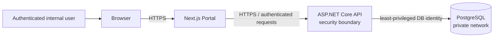

# Internal Apps Platform — Security Standard

| Attribute | Value |
|---|---|
| Status | Implementation standard |
| Governing document | [`../PROJECT_INSTRUCTIONS.md`](../PROJECT_INSTRUCTIONS.md) |
| Related architecture | [`ARCHITECTURE.md`](ARCHITECTURE.md) |
| Related data model | [`DATABASE.md`](DATABASE.md) |
| Applies to | Portal, API, PostgreSQL, Docker deployment, operations, and AI-assisted work |

> This document translates the governing security rules into implementation-ready controls. It does not replace `PROJECT_INSTRUCTIONS.md`.

## 1. Security Model

The platform is an internal company system hosted on a controlled local or internal network. The network location reduces public exposure but is **not** a trust boundary. Browsers, user input, client state, internal devices, and network traffic remain untrusted.

The required boundary rules are:

- Users and browsers never access PostgreSQL directly.
- The Portal never contains database credentials or executes database queries.
- The API is the only application boundary for reading or changing platform data.
- PostgreSQL is reachable only from approved application and operational hosts.
- All API requests are authenticated unless the endpoint is explicitly documented as anonymous.
- All protected operations are authorized by the API.
- Internal hosting does not justify HTTP, shared accounts, weak passwords, broad database permissions, or disabled audit.

## 2. Authentication

### 2.1 Passwords

Passwords must be processed with a current password-hashing algorithm intended for password storage. The selected .NET password hasher or approved equivalent must:

- generate a unique salt automatically;
- store only the encoded hash and required algorithm parameters;
- use a configurable work factor;
- support rehashing after security parameters change;
- compare hashes using the library’s safe verification function.

Plaintext, reversible encryption, general-purpose hashes, custom hashing, and logged passwords are prohibited. Password-reset tokens are short-lived, single-use, stored securely, and invalidated after success.

Authentication responses must not reveal whether an account exists. Login attempts are rate-limited and recorded in `identity.login_history` with only the metadata needed for security review.

### 2.2 JWT access tokens

The API uses short-lived JWT access tokens. It validates:

- signature and expected signing algorithm;
- issuer and audience;
- expiration and not-before time;
- required subject/session claims;
- account and session state where applicable.

JWT claims identify the authenticated session; they are not trusted when unsigned, expired, client-created, or issued by another authority. Tokens must not contain secrets or unnecessary personal data.

Access tokens are never:

- written to application or audit logs;
- placed in URLs;
- returned in error messages;
- committed to source control;
- exposed to module code that does not need them.

The API converts a valid token into a shared actor context. Modules consume that context rather than parsing JWTs.

### 2.3 Refresh tokens

Refresh tokens provide session renewal and are:

- cryptographically random;
- stored only as a one-way hash in `identity.refresh_tokens`;
- bound to a user and session lineage;
- rotated after every successful use;
- expired after a defined absolute lifetime;
- revoked on logout, password/security change, account disablement, or detected reuse.

Reuse of a rotated or revoked refresh token is a security event. The affected token family is revoked and the event is logged for investigation.

Secure, `HttpOnly`, `Secure`, and appropriate `SameSite` cookies are preferred for browser refresh-token handling. If the final session design uses cookies for state-changing requests, CSRF protection is required. Browser `localStorage` must not be used for refresh tokens.

## 3. Authorization

The authorization model combines roles, permissions, and resource-level rules:

| Concept | Purpose | Example |
|---|---|---|
| Role | Manageable bundle of permissions | `Vacation Manager` |
| Permission | Stable capability enforced by the API | `vacation.requests.approve` |
| Resource rule | Determines access to one record | Approver is assigned to this request |

Roles are administration conveniences. Backend code checks permissions and resource scope, not hard-coded role names.

Current module permission:

| Permission | Read access | Initial role assignment |
|---|---|---|
| `vacation.leave-types.manage` | Leave Type reads remain available to authenticated users | Seeded only to the existing `Administrator` role by migration 007 |
| `organization.employees.manage` | Employee directory reads remain available to authenticated users | Seeded only to the existing `Administrator` role by migration 008 |
| `organization.user-employee-links.manage` | A user may read only their own employee relationship without this permission | Seeded only to the existing `Administrator` role by migration 009 |
| `identity.users.manage` | Users cannot list or manage other accounts without this permission | Seeded only to the existing `Administrator` role by migration 010 |
| `vacation.requests.manage` | Vacation request administration is unavailable without this permission; employee self-service remains linked-active-employee scoped | Seeded only to the existing `Administrator` role by migration 031 |

After migration 008, existing Administrator access tokens must be refreshed or
reissued before the new employee-management permission claim is available.
The same refresh or reissue requirement applies after migration 009 for
user–employee link management.
After migration 010, Administrator tokens likewise require refresh or reissue
before the user-management permission is present.
After migration 031, Administrator tokens likewise require refresh or reissue
before the Vacation request-administration permission is present.

Vacation employee self-service requires an authenticated user explicitly
linked to an active Organization employee. The employee is never accepted from
the request body. Vacation request administration requires the dedicated
`vacation.requests.manage` policy. It remains a permission-claim check and
does not hard-code a role name or username at runtime. Leave Policies, Leave
Balances, and Business Calendar administration continue to use
`identity.users.manage`.

Request creation and each status transition write the business record,
required balance mutation, append-only transition history, and platform audit
inside one transaction. Runtime grants do not permit physical deletion of
Vacation requests, balances, or history, or updates to transition history.

Minimal user administration creates an immutable username, display name,
BCrypt password hash, active state, and exactly the base `User` role. Plaintext
initial passwords exist only in the incoming request and short-lived server
memory; they are never returned, logged, seeded, or audited. Administrators
communicate initial credentials through an approved out-of-band channel.

The permission's `vacation` namespace associates it with the Vacation
application under the current RBAC model. Application assignment and
permissions remain separate controls; assignment to Vacation does not imply
Leave Type administration.

### 3.1 Endpoint enforcement

Every protected endpoint must:

1. require authentication;
2. declare the required permission;
3. check resource scope in the Application Layer;
4. reject access before returning or changing sensitive data;
5. test allowed, unauthenticated, unauthorized, and wrong-resource cases.

Example: `vacation.requests.approve` allows the approval capability, but the use case must also verify that the actor is an eligible approver for the requested leave request and that the request is in an approvable state.

The API must not trust client-provided:

- user, company, owner, or approver identity;
- role or permission lists;
- workflow status;
- calculated balances;
- audit metadata;
- flags claiming administrative access.

### 3.2 Frontend permissions

Frontend permission checks improve user experience only. They may:

- hide navigation items;
- hide unavailable actions;
- show a permission explanation;
- prevent an obviously unavailable form from opening.

They do not authorize anything. Direct URL access and manually constructed API calls must still be rejected by the API. The Portal handles `401` by starting the approved session recovery/login flow and `403` by showing an access-denied state.

Administrative pages remain inside the single Portal and appear only when the user has the relevant permission. There is no separate administrator application.

## 4. Input, Output, and Web Controls

All route values, query parameters, headers, JSON, uploads, configuration, and external responses are untrusted.

The API must:

- validate type, format, length, range, allowed values, and cross-field rules;
- reject attempts to set server-owned fields;
- use parameterized Dapper queries only;
- limit collection sizes, uploads, and expensive operations;
- return safe Problem Details without stack traces, SQL, or internal identifiers;
- encode output for its destination context.

The Portal must:

- render untrusted text as text, not raw HTML;
- avoid dangerous HTML rendering unless an approved sanitizer is used;
- keep server secrets out of client bundles;
- use the shared API client instead of scattered raw requests.

Production and internal deployments use HTTPS for browser-to-Portal and Portal/browser-to-API traffic. TLS termination and certificate renewal must be documented. Security headers include a restrictive Content Security Policy, frame protection, MIME-sniffing protection, and an appropriate referrer policy. CORS permits only documented Portal origins.

## 5. Database Security

PostgreSQL runs on a private network and is not exposed as a user-facing service. Every database identity follows least privilege.

Use separate identities for:

| Identity | Minimum access |
|---|---|
| API runtime | Required reads/writes and execution for normal application behavior; no schema ownership |
| Migration process | Schema change rights needed by approved migrations |
| Backup process | Rights required to create encrypted backups |
| Restore/operations | Time-bounded, approved operational access |

Rules:

- The API runtime user must not be a PostgreSQL superuser or database owner.
- Migration credentials must not be available to the Portal or normal API request code.
- Shared developer credentials are prohibited outside disposable local development.
- Production access by a person requires an approved, auditable procedure.
- Database credentials are rotated after exposure, role changes, or according to company policy.
- Module ownership is enforced in code and reviewed database permissions where practical.
- The normal runtime path cannot update or delete append-only audit records.

Database errors returned to clients are mapped to safe application errors. Connection strings and query parameters containing sensitive values are never logged.

## 6. Secrets and Configuration

Secrets include database passwords, JWT signing keys, refresh-token secrets, email credentials, AI-provider keys, and future integration credentials.

Secrets must:

- enter processes through environment variables or an approved secret mechanism;
- never be committed, copied into Markdown, placed in `.env.example`, or baked into images;
- never be included in frontend environment variables or bundles;
- have an owner and rotation procedure;
- be different between development, test, and production;
- cause clear startup failure when required but missing.

`.env.example` contains variable names and safe placeholders only. Real `.env` files remain untracked. Configuration dumps, health endpoints, exceptions, screenshots, and support bundles must redact secret values.

JWT signing material must be long, random, environment-specific, and rotatable. Verification of previously issued tokens during rotation must follow the approved session design.

## 7. Audit and Security Events

Every consequential write creates an append-only audit event through the shared Audit service. Required audit and business writes occur in the same transaction.

Audit coverage includes:

- create, update, soft delete, restore, and state transition;
- approval, rejection, cancellation, and delegation;
- user, role, permission, and assignment changes;
- security-sensitive setting and feature changes;
- attachment/comment actions where required by policy;
- exports and access to especially sensitive records where specified.

Security events include:

- login success/failure and account lockout;
- refresh-token reuse or revocation;
- repeated authentication/authorization failures;
- suspicious rate-limit activity;
- account disablement and session revocation;
- secret/key rotation and privileged operational access.

Audit and security records must not contain passwords, token values, secrets, raw headers, unrestricted request bodies, or unnecessary personal data. Access to audit data requires its own permission and is audited.

## 8. Backups and Operational Security

The complete PostgreSQL database is backed up as one consistent system of record. Minimum expectations are:

- automated backups on a documented schedule;
- encrypted backup transport and storage;
- access limited to backup and recovery operators;
- storage separated from the primary database failure domain;
- retention matching approved business requirements;
- alerts on missed or failed backups;
- periodic restore tests into an isolated environment;
- documented recovery point and recovery time objectives before production.

Backups contain sensitive data and receive production-equivalent protection. They must not be copied into developer machines or AI tools. Restore testing must verify identity, Core, audit, and module consistency.

Security updates for .NET, Node.js, PostgreSQL, base images, and approved dependencies are reviewed regularly. Critical fixes are prioritized through the normal controlled deployment process.

## 9. AI Tool Rules

ChatGPT, Codex, and other AI tools operate under these restrictions:

- Never provide passwords, tokens, signing keys, connection strings, production `.env` files, or secret values.
- Never provide production database dumps, backups, logs containing sensitive data, or real confidential documents.
- Use synthetic or explicitly approved anonymized examples.
- Do not ask an AI tool to weaken authentication, authorization, TLS, audit, or database controls to simplify implementation.
- Treat generated security code and configuration as untrusted until reviewed and tested.
- Do not let AI introduce libraries, providers, tables, or architecture not approved by canonical documentation.
- Immediately rotate any secret accidentally exposed to an AI service; deletion from chat history is not sufficient remediation.

## 10. Implementation Checklist

- [ ] PostgreSQL is private and reachable only by approved services.
- [ ] The API is the only application data boundary.
- [ ] Passwords use an approved adaptive password hasher.
- [ ] JWT issuer, audience, signature, algorithm, and lifetime are validated.
- [ ] Refresh tokens are hashed, rotated, revocable, and reuse-detectable.
- [ ] Every protected endpoint declares a permission and checks resource scope.
- [ ] Frontend permission checks are treated as UX only.
- [ ] Runtime, migration, backup, and operational database rights are separated.
- [ ] Secrets are injected and absent from Git, logs, docs, images, and browser bundles.
- [ ] Internal production traffic uses HTTPS and approved security headers.
- [ ] Every consequential write and security event is auditable.
- [ ] Backups are encrypted, monitored, retained, and restore-tested.
- [ ] Tests cover authentication, authorization, cross-resource access, and token failure.
- [ ] AI inputs contain no secrets or production data.
